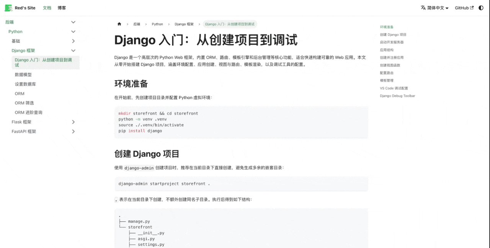
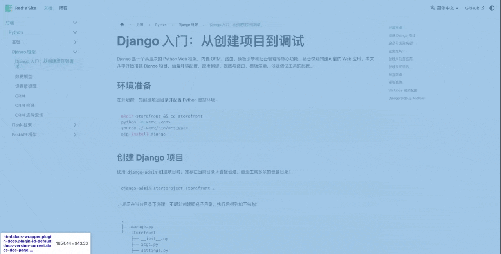

# Docusaurus 图片缩放

本篇记录为个人 Docusaurus 站点添加图片点击缩放功能的完整过程，包括插件安装、基础配置，以及顺手开启导航栏自动隐藏，最后解决了一个缩放图片被导航栏遮挡的 z-index 问题。

<!--truncate-->

## 缘起

文档中经常需要插入截图或流程图，这类图片在页面上为了不影响排版往往显示得比较小，读者想看清细节时只能另开标签页或右键保存查看，体验很糟糕。于是决定为站点添加点击放大功能，找到了社区广泛使用的 [docusaurus-plugin-image-zoom](https://github.com/gabrielcsapo/docusaurus-plugin-image-zoom)，它基于 [medium-zoom](https://github.com/francoischalifour/medium-zoom) 实现，效果简洁自然。

## 安装与配置

### 安装插件

```bash
npm install docusaurus-plugin-image-zoom
```

### 注册插件并添加主题配置

在 `docusaurus.config.ts` 中注册插件，并在 `themeConfig` 里添加 `zoom` 配置项：

```ts
const config: Config = {
  // ...
  plugins: ['docusaurus-plugin-image-zoom'],

  themeConfig: {
    // ...
    zoom: {
      selector: '.markdown :not(em) > img',
      background: {
        light: 'rgb(255, 255, 255)',
        dark: 'rgb(50, 50, 50)',
      },
    },
  },
};
```

`selector` 限定只对 markdown 正文中非斜体包裹的图片生效，这样可以避免 logo 等装饰性图片被误触发缩放。`background` 分别为亮色/暗色模式配置遮罩背景色。

## 开启导航栏自动隐藏

在配置缩放的同时，顺手处理了另一个体验问题：阅读长文档时，顶部固定导航栏会一直占据屏幕空间，尤其影响图片的可视区域。Docusaurus 提供了内置的 `hideOnScroll` 选项，在 `navbar` 配置中加上一行即可：

```ts
navbar: {
  hideOnScroll: true,
  // ...
}
```

开启后，向下滚动时导航栏自动隐藏，向上滚动时重新出现，阅读体验明显提升。

## 踩坑：缩放图片被导航栏遮挡

### 问题现象

在包含大图的文档页面中，先向下滚动找到大图并放大，此时显示正常：



如果先向下滚动使大图滑出视口（此时导航栏因 `hideOnScroll` 自动隐藏），然后向上滚动回到大图位置（导航栏重新出现），此时点击图片触发缩放，图片的顶部区域会被导航栏遮住。



### 原因分析

Docusaurus 导航栏的 `z-index` 默认为 `200`，而 `medium-zoom` 插件的遮罩层（`.medium-zoom-overlay`）和缩放图片（`.medium-zoom-image--opened`）的层级低于此值，导致导航栏始终叠在缩放图片的上方。

### 解决方案

在 `src/css/custom.css` 中覆盖这两个类的层级：

```css
/* Image zoom: ensure overlay and zoomed image appear above the navbar */
.medium-zoom-overlay,
.medium-zoom-image--opened {
  z-index: 9999;
}
```

将层级提升至 `9999`，高于导航栏的 `200`，问题解决。


这个改动非常安全——这两个类只在点击触发缩放时才激活，平时完全不影响页面上的任何交互，也不会与 Docusaurus 内置组件产生冲突。
