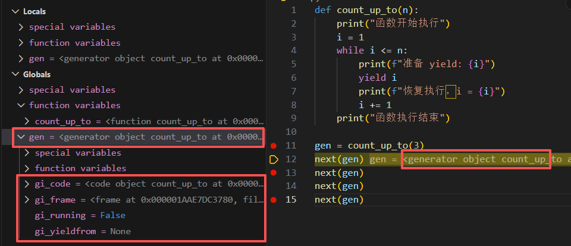
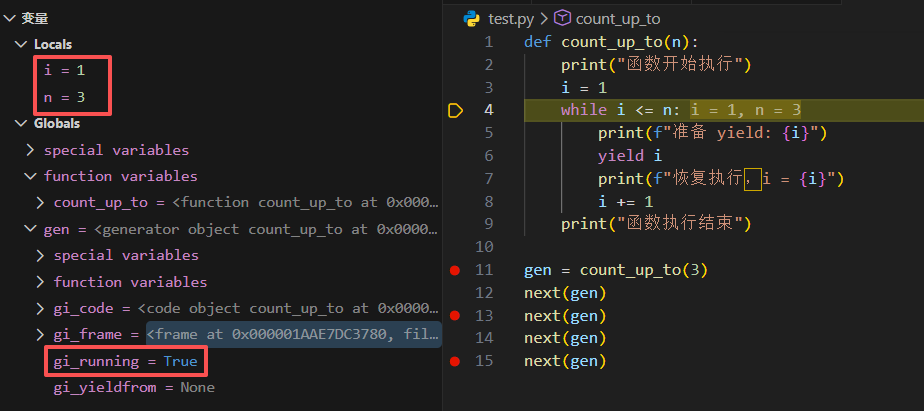
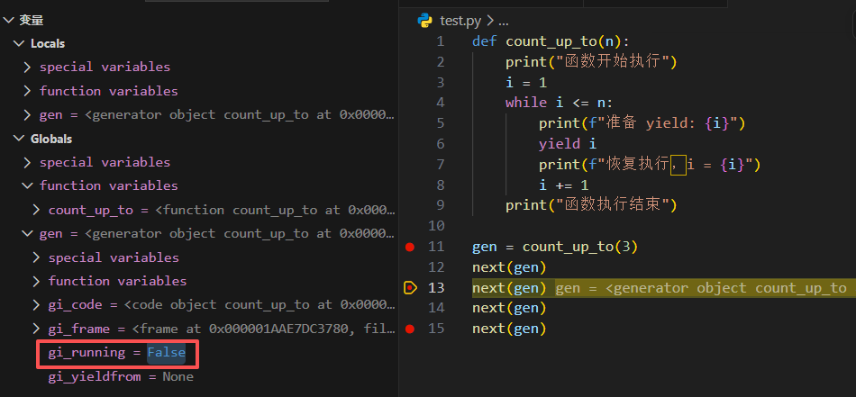
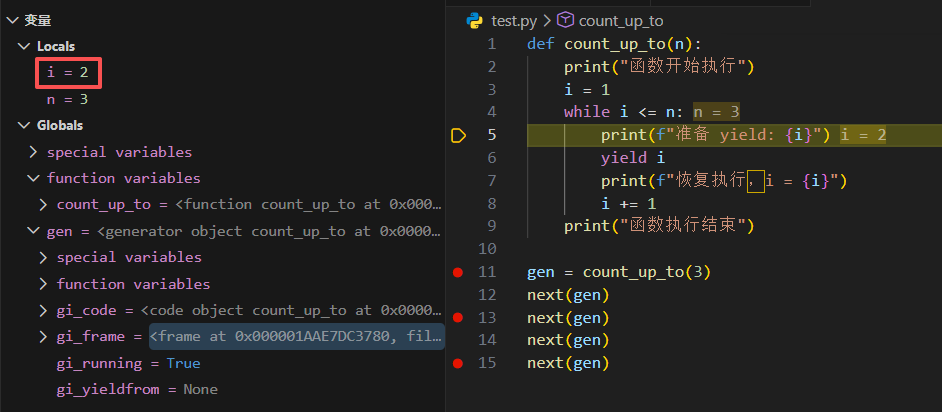

# 生成器 (Generator)

当我们需要处理大量数据时，以下列代码为例：

```python
def first_n(n):
    '''Build and return a list'''
    num, nums = 0, []
    while num < n:
        nums.append(num)
        num += 1
    return nums
     
sum_of_first_n = sum(first_n(1000000))
```

上述代码会一次性生成一个包含 100 万个整数的列表，这可能会占用大量内存，甚至导致程序崩溃。**生成器**提供了一种解决方案，它可以**按需逐个生成结果，而不是一次性返回整个序列**，这使得生成器非常适合处理大数据、流式数据或无限序列。

根据定义，你可能会产生如下疑问：

1. 为什么普通函数不能按需生成结果？
2. 生成器是如何“暂停执行并返回结果”，然后在下一次继续执行的？

要解答这些问题，我们需要先理解 Python 中函数的一个重要特性：**迭代器协议**。它定义了按需获取数据的标准方式，也是生成器能够实现“暂停/恢复”机制的基础。

### 普通函数的执行机制

普通函数被调用时，Python 会为它创建一个独立的执行环境（包含局部变量等），然后从第一行代码开始连续执行，直到遇到 `return` 或函数结束。一旦函数返回，这个执行环境就会被彻底销毁，**所有局部变量和当前执行位置都会丢失，无法恢复**。

这里我们可以回答第一个问题：这种机制决定了普通函数只能一次性返回所有结果，不能按需生成结果。普通函数一旦结束，执行现场就不复存在了，无法做到“先返回一个结果，然后记住当前位置，下次继续”。

如果要实现按需生成结果，就需要一种新的机制来保存函数的执行状态：**迭代器协议**。

## 迭代器协议

**迭代器协议（Iterator Protocol）** 是 Python 定义的一套接口规范，用于统一“逐个产生数据”的行为。Python 将“能产生迭代器的对象”和“真正执行迭代的对象”进行了区分，因此引入了两类相关对象：可迭代对象和迭代器。

### 可迭代对象和迭代器

**可迭代对象**：能产生迭代器的对象
- 实现了 `__iter__()` 方法，或者实现了从 0 开始索引访问的 `__getitem__()` 方法
  - 对于 `__getitem__` 方式，Python 要求索引必须从 0 开始连续递增，直到抛出 `IndexError`
- 可以通过 `iter()` 函数获取一个迭代器
- 常见的可迭代对象：list / tuple / str / dict / set

**迭代器**：执行迭代的对象
- 实现了 `__iter__()` 且 `__iter__()` 返回自身
- 实现了 `__next__()` 方法，每次返回一个元素，直到抛出 `StopIteration`

举例如下：

```python
s = "abc"       
it = iter(s)    

print(next(it))  # a
# 这里可以执行其他操作
print("做点别的事情...")

print(next(it))  # b（仍然记得位置）
print(next(it))  # c
print(next(it))  # StopIteration
```

可以看到，迭代器在执行一次 `next()` 后会记住当前位置，下次调用时继续返回下一个元素。迭代器这种"记住位置、按需返回"的特性，正是生成器要实现的核心机制。

## 生成器定义

**生成器（Generator）** 是 Python 实现迭代器协议的"快捷方式"。它通过 `yield` 关键字自动创建符合迭代器协议的对象，并保存函数的执行状态。

## yield 定义生成器

只要函数体中出现了 `yield`，这个函数就不再是普通函数，而是一个生成器函数。

调用它时，不会执行函数体，而是返回一个生成器对象（generator）。这个生成器对象实现了迭代器协议，可以通过 `next()` 来获取下一个值。以下列代码为例：

```python
def gen():
    print("A")
    yield 1
    print("B")
    yield 2

g = gen()  # 创建生成器对象，不会打印任何内容
print(g)  # <generator object gen at 0x...>
```

可以看到，调用 `gen()` 时并没有执行函数体，而是返回了一个生成器对象 `g`。

此时调用 `next(g)`，才会执行到第一个 `yield`，打印 "A" 并返回 1。再次调用 `next(g)` 时，会继续执行到第二个 `yield`，打印 "B" 并返回 2。

```python
print(next(g))  # A \n 1
print(next(g))  # B \n 2
print(next(g))  # 没有yield了，打印C，抛出StopIteration异常
```

输出：

```
A
1
B
2
Traceback (most recent call last):
  File "<stdin>", line 1, in <module>
StopIteration
```

## 工作原理和执行过程解析

了解了生成器的基本用法后，让我们深入它的内部，看看 Python 是如何实现这种"暂停-继续"的执行过程的。以下列代码为例：

```python
def count_up_to(n):
    print("函数开始执行")
    i = 1
    while i <= n:
        print(f"准备 yield: {i}")
        yield i
        print(f"恢复执行，i = {i}")
        i += 1
    print("函数执行结束")
```

### 创建阶段

```python
gen = count_up_to(3)
```



此时不执行函数体，只是得到一个生成器对象，根据上图调试内容，不难发现其中包含：

- `gi_code`：指向生成器对应函数的 code object（代码对象）
- `gi_frame`：指向生成器的执行帧（frame object）
- `gi_running`：标记生成器是否正在执行，此时为 `False`
- `gi_yieldfrom`：指向当前正在 `yield from` 的生成器，由于本例程没有使用 `yield from`，因此为 `None`


控制台目前没有任何输出


### 启动执行

```python
next(gen)
```



此时函数从头开始执行，可以看到 `gi_running` 变为 True，局部变量 `i` 的值为 1；遇到 `yield` 时暂停，并返回 `yield` 后的值。然后 `gi_running` 变为 False，函数的执行状态（包括局部变量、当前执行位置等）被保存在生成器对象中。



函数没有结束，只是被“挂起”。控制台输出：

```bash
函数开始执行
准备 yield: 1
```

### 再次 next()

```python
next(gen)
```



此时函数从上次暂停的位置继续执行，`gi_running` 变为 True，局部变量 `i` 的值仍然是 1；继续执行，`i` 值变为 2，到下一个 `yield`，再次暂停并返回当前 `i` 的值。控制台输出：

```bash
恢复执行，i = 1
准备 yield: 2
```

### 继续执行直到结束

```python
next(gen)
next(gen)
```

对于这个例子，执行到第三次 `next(gen)` 时，函数继续执行，`i` 的值变为 3，继续执行到下一个 `yield`，再次暂停并返回当前 `i` 的值。第四次 `next(gen)` 时，函数执行完毕，抛出 `StopIteration` 异常。控制台输出：

```bash
恢复执行，i = 2
准备 yield: 3
恢复执行，i = 3
函数执行结束
Traceback (most recent call last):
  File "e:\0Projs\My-Website\test.py", line 15, in <module>
    next(gen)
StopIteration
```

### 拓展：yield from

上面的例子中，我们手动调用 next() 来驱动一个生成器。但在实际开发中，我们经常需要在一个生成器内部调用另一个生成器，比如遍历嵌套的数据结构：

```python
def sub_gen():
    for i in range(3):
        yield i

def main_gen():
    for value in sub_gen():  # 手动迭代子生成器
        yield value
```

这样写虽然没错，但代码显得有些冗余——我们只是想把子生成器的值“透传”出去，却不得不多写一层 for 循环。实际上 Python 提供了一个更简洁的语法：`yield from`。

<div className="alert alert--info"> 
    <span>`yield from` 的本质是生成器之间的“委托机制”</span> 
</div>
<br/>

当执行到 yield from 时，当前生成器会暂停执行，并将控制权完全交给子生成器，由其直接向调用者产出数据，同时自动处理值传递、异常传播以及返回值收集。

相比手动使用 `for` + `yield`，它不仅简化代码，更在执行模型上减少了中间层，实现了生成器之间的直接协作。

## 优缺点

现在我们对生成器有了更深入的了解，可以来盘点一下它的利与弊。

### 优点

* **节省内存**：按需生成数据
* **惰性计算**：避免不必要计算
* **可迭代**：自然支持循环和 `next()`
* **可生成无限序列**：适合流式处理

### 缺点

* **只能单向迭代**：生成器用完就不可重用
* **调试困难**：状态分步执行，不易跟踪
* **一次性访问**：不能随机访问元素
