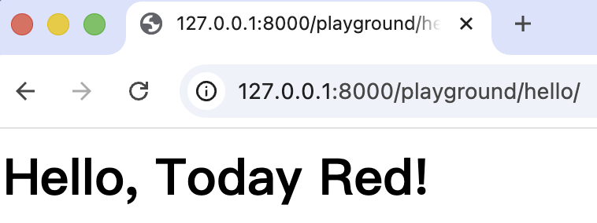
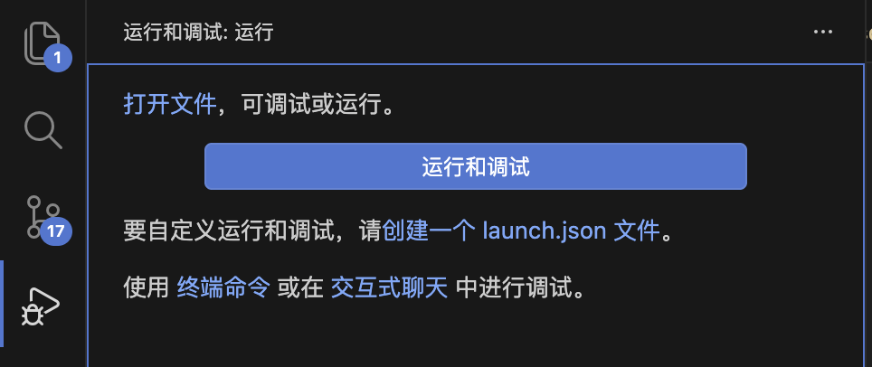
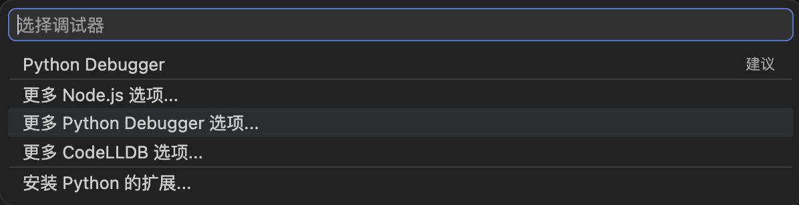
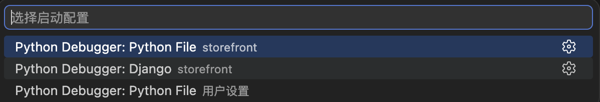
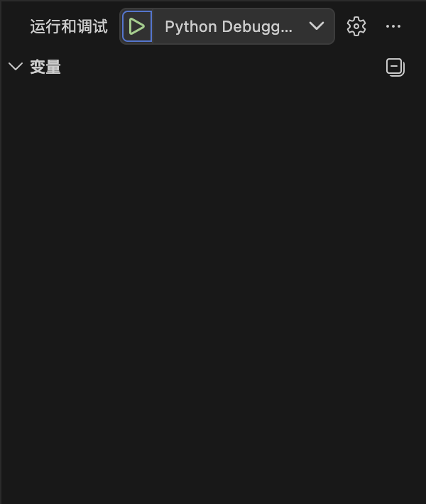

# Django 入门：从创建项目到调试

Django 是一个高层次的 Python Web 框架，内置 ORM、路由、模板引擎和后台管理等核心功能，适合快速构建可靠的 Web 应用。本文从零开始搭建 Django 项目，涵盖环境配置、应用创建、视图与路由、模板渲染，以及调试工具的配置。

## 环境准备

在开始前，先创建项目目录并配置 Python 虚拟环境：

```bash
mkdir storefront && cd storefront
python -m venv .venv
source ./.venv/bin/activate
pip install django
```

## 创建 Django 项目

使用 `django-admin` 创建项目时，推荐在当前目录下直接创建，避免生成多余的嵌套目录：

```bash
django-admin startproject storefront .
```

`.` 表示在当前目录下创建，不额外创建同名子目录。执行后得到如下结构：

```bash
.
├── manage.py
└── storefront
    ├── __init__.py
    ├── asgi.py
    ├── settings.py
    ├── urls.py
    └── wsgi.py
```

## 启动开发服务器

使用 `manage.py` 启动服务器（默认端口 `8000`）：

```bash
python manage.py runserver <port>
```

出现以下输出即表示运行成功：

```bash
Django version 4.2.30, using settings 'storefront.settings'
Starting development server at http://127.0.0.1:8000/
```

> 首次运行会提示有未应用的迁移，执行 `python manage.py migrate` 可消除警告，不影响开发。

访问 `http://localhost:8000`，可以看到 Django 欢迎页面：


项目成功运行后，我们来看 Django 的应用组织方式。

## 应用结构

Django 项目由一个或多个**应用（App）** 组成，每个应用负责特定的功能模块。`settings.py` 中的 `INSTALLED_APPS` 列出了当前已安装的应用：

```python
INSTALLED_APPS = [
    'django.contrib.admin',       # 内置 Admin 后台
    'django.contrib.auth',        # 用户认证系统
    'django.contrib.contenttypes',# 内容类型框架
    'django.contrib.sessions',    # 会话管理（已较少使用，可删除）
    'django.contrib.messages',    # 一次性通知消息
    'django.contrib.staticfiles', # 静态文件管理
]
```

## 创建并注册应用

使用 `startapp` 命令新建一个应用：

```bash
python manage.py startapp playground
```

生成如下目录结构：

```bash
├── playground
│   ├── migrations/       # 数据库迁移文件
│   ├── __init__.py
│   ├── admin.py          # 管理界面配置
│   ├── apps.py           # 应用配置
│   ├── models.py         # 数据模型
│   ├── tests.py          # 测试用例
│   └── views.py          # 视图函数
```

创建后需在 `settings.py` 的 `INSTALLED_APPS` 中注册：

```python
INSTALLED_APPS = [
    # ...
    'playground',
]
```

应用注册完成后，接下来为其编写视图和路由。

## 创建视图函数

在 `playground/views.py` 中定义视图函数，接收请求并返回响应：

```python
from django.http import HttpResponse

def say_hello(request):
    return HttpResponse("Hello, World!")
```

## 配置路由

在 `playground/` 目录下新建 `urls.py`，将 URL 映射到视图函数：

```python
from django.urls import path
from . import views

urlpatterns = [
    path('hello/', views.say_hello),
]
```

然后在 `storefront/urls.py` 中通过 `include` 引入应用路由：

```python
from django.contrib import admin
from django.urls import include, path

urlpatterns = [
    path('admin/', admin.site.urls),
    path('playground/', include('playground.urls')),
]
```

此后所有以 `playground/` 开头的请求，都会转发到 `playground/urls.py` 中匹配。访问地址为 `http://localhost:<port>/playground/hello/`。

> URL 路由名称必须以 `/` 结尾，否则会自动重定向，可能导致访问异常。

## 模板管理

在 `playground/` 下新建 `templates/hello.html`：

```html

    <h1>Hello, {{ name }}!</h1>

    <h1>Hello, World</h1>

```

模板语法采用 Jinja2 风格：`{{ name }}` 为变量占位符，`...` 为条件块。

修改视图函数，使用 `render` 渲染模板并传入上下文数据：

```python
from django.shortcuts import render

def say_hello(request):
    return render(request, 'hello.html', {'name': 'Today Red'})
```

访问效果如下：



视图与模板搭建完毕，开发阶段还需掌握调试技巧。

## VS Code 调试配置

打开调试侧边栏，选择【创建 launch.json 文件】→【更多 Python Debugger 选项】：





选择【Django 模块】：



VS Code 会在 `.vscode/launch.json` 中生成如下配置：

```json
{
    "version": "0.2.0",
    "configurations": [
        {
            "name": "Python Debugger: Django",
            "type": "debugpy",
            "request": "launch",
            "program": "${workspaceFolder}/manage.py",
            "args": ["runserver"],
            "django": true
        }
    ]
}
```

可在 `args` 中指定端口以避免冲突：

```json
"args": ["runserver", "8001"]
```

配置完成后，点击绿色三角形即可启动调试：



## Django Debug Toolbar

[Django Debug Toolbar](https://django-debug-toolbar.readthedocs.io/en/latest/) 可在浏览器中展示 SQL 查询、模板渲染时间、请求头等调试信息。

**安装：**

```bash
pip install django-debug-toolbar
```

**配置 `settings.py`：**

```python
INSTALLED_APPS = [
    # ...
    'debug_toolbar',
]

MIDDLEWARE = [
    'debug_toolbar.middleware.DebugToolbarMiddleware',
    # ...
]

INTERNAL_IPS = ['127.0.0.1']
```

**配置 `storefront/urls.py`：**

```python
from django.urls import include, path

urlpatterns = [
    # ...
    path('__debug__/', include('debug_toolbar.urls')),
]
```

刷新浏览器即可看到侧边调试面板：


> 若 Toolbar 未显示，请检查：① `debug_toolbar` 已加入 `INSTALLED_APPS`；② 中间件配置正确；③ 页面包含完整 `<html>/<body>` 结构。
