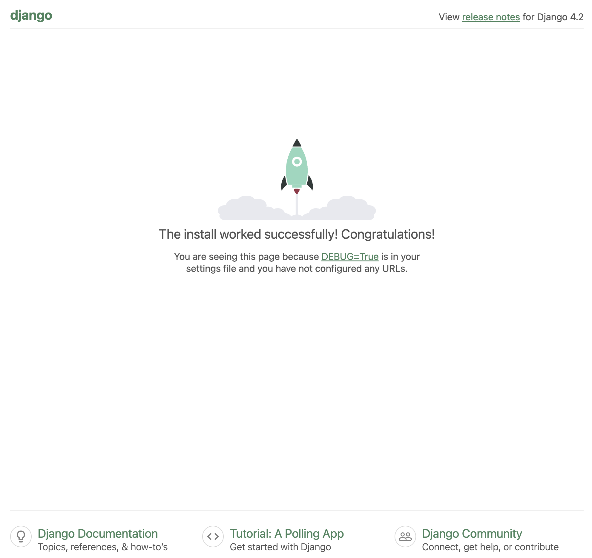

# 快速搭建一个 Django 项目

> **建议配置好 Python 虚拟环境后搭建 Django 项目**

## 设置存放 Django 项目的目录

```bash
mkdir storefront
cd storefront
```

## 配置虚拟环境

```bash
python -m venv .venv
source ./.venv/bin/activate
```

## 安装 Django 库

在终端中输入以下命令来安装 Django：

```bash
pip install django
```

## 创建 Django 项目

使用 Django 提供的命令行工具创建一个新项目。在终端中输入以下命令：

```bash
django-admin startproject storefront
```

创建后得到下列目录结构：

```bash
.
└── storefront
    ├── manage.py
    └── storefront
        ├── __init__.py
        ├── asgi.py
        ├── settings.py
        ├── urls.py
        └── wsgi.py
```

django 会自动根据项目名称创建一个子目录 `storefront`。其中包含 `manage.py` 和一个同名的 `storefront` 子目录，包含程序的核心内容。此时包括我们最开始创建的用于存放项目的 `storefront` 目录在内，整个项目的目录结构如下：

```bash
├── storefront
│   └── storefront
│       ├── manage.py
│       └── storefront
│           ├── __init__.py
│           ├── asgi.py
│           ├── settings.py
│           ├── urls.py
│           └── wsgi.py
```

这样显示起来可能有点混乱，可以将 Django 自动创建的 `storefront` 子目录（即第二层 `storefront`）去除，直接将 `manage.py` 和 `storefront` 子目录放在第一层。执行如下命令：

```bash
django-admin startproject storefront .
```

`.` 表示在当前目录下创建项目，不会额外创建目录。执行后得到下列目录结构：

```bash
.
├── manage.py
└── storefront
    ├── __init__.py
    ├── asgi.py
    ├── settings.py
    ├── urls.py
    └── wsgi.py
```

## 运行 Django 项目

此时运行如下内容：

```bash
django-admin runserver
```

出现报错，因为我们还没有操作任何设置：

```bash
...
django.core.exceptions.ImproperlyConfigured: Requested setting DEBUG, but settings are not configured.
You must either define the environment variable DJANGO_SETTINGS_MODULE or call settings.configure() before accessing settings.
```

可以使用如下命令启动程序：

```bash
python manage.py runserver <port>
```

`<port>` 是可选的，默认值为 `8000`。显示类似如下内容则说明运行成功：

```bash
Watching for file changes with StatReloader
Performing system checks...

System check identified no issues (0 silenced).

You have 18 unapplied migration(s). Your project may not work properly until you apply the migrations for app(s): admin, auth, contenttypes, sessions.
Run 'python manage.py migrate' to apply them.
April 20, 2026 - 12:28:04
Django version 4.2.30, using settings 'storefront.settings'
Starting development server at http://127.0.0.1:8000/
Quit the server with CONTROL-C.
```

访问 `http://localhost:<port>`（这里我使用的是 `8000` 端口），能看到如下页面：

