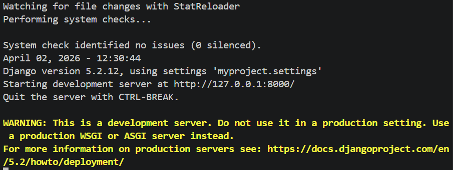
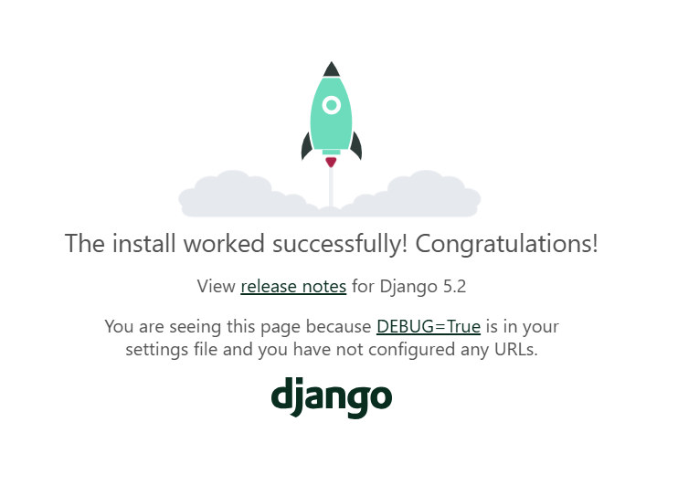

# 快速搭建一个 Django 项目

> **建议配置好 Python 虚拟环境后搭建 Django 项目**

## 安装 Django 库

在终端中输入以下命令来安装 Django：

```bash
pip install django
```

## 创建 Django 项目

使用 Django 提供的命令行工具创建一个新项目。在终端中输入以下命令：

```bash
django-admin startproject myproject
cd myproject
```

## 创建 Django 应用

Django 项目由多个应用组成。创建一个应用：

```bash
python manage.py startapp myapp
```

## 编写视图

在 `myapp/views.py` 中编写一个简单的视图：

```python
from django.http import JsonResponse
from django.views.decorators.http import require_http_methods

@require_http_methods(["GET"])
def hello_world(request):
    return JsonResponse({"message": "Hello, World!"})
```

## 配置路由

在 `myapp/` 目录下创建 `urls.py` 文件：

```python
from django.urls import path
from . import views

urlpatterns = [
    path("", views.hello_world, name="hello"),
]
```

然后在 `myproject/urls.py` 中包含应用的路由：

```python
from django.contrib import admin
from django.urls import path, include

urlpatterns = [
    path("admin/", admin.site.urls),
    path("api/", include("myapp.urls")),
]
```

## 运行项目

在终端中输入以下命令来运行 Django 开发服务器：

```bash
python manage.py migrate
python manage.py runserver
```

此时可以看到如下输出：



打开浏览器，访问 `http://localhost:8000`，能看到如下页面：



恭喜你，你已经成功搭建了一个 Django 项目！

## 创建超级用户

使用如下命令创建超级用户：

```bash
python manage.py createsuperuser
```

根据指引填写信息，创建完成后重新运行，即可使用该账号登录 Django Admin 后台。

访问 Admin 后台：`http://localhost:8000/admin/`
