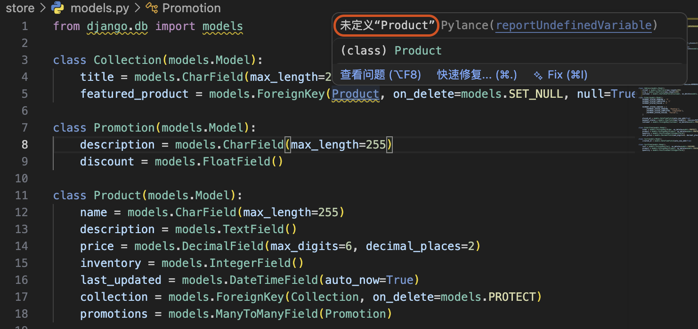

# 数据模型

在 Django 中，数据模型（Model）是与数据库交互的核心抽象层。本文以电商场景为例，从实体的识别与关系梳理，到模型管理方式的选择，再到一对一、一对多、多对多及泛化关系的具体实现，逐步介绍如何在 Django 中建立一套完整的数据模型。

## 设计数据模型

在电子商务领域，产品（product）是一个核心实体，一个产品可能包含以下属性：

- 产品名称
- 产品描述
- 产品价格
- 产品库存

而产品一般会进行归类，每个分类（collection）也有自己的属性，例如：

- 分类名称

现在这两个实体是独立的关系，需要连接起来。假设产品和分类之间是多对一的关系，即一个分类下可以有多个产品，但一个产品只能属于一个分类。

> 关系可以是一对一、一对多、多对多等，具体关系类型取决于业务需求。

现在还需要一个购物车（cart）实体：

- 创建时间（可以进行清理，例如超过30天仍未结算的购物车） 
  
由于购物车和产品之间是多对多的关系，即一个购物车可以包含多个产品，一个产品也可以出现在多个购物车中，因此需要一个关联实体（购物物品-cart item）来连接它们。

- 一个购物车包含多个购物物品，一个购物物品只属于一个购物车
- 一个购物物品对应一个产品，但一个产品可以对应多个购物物品

由于我们需要允许用户在未登录情况下也能使用购物车，因此购物车暂时不与用户进行关联。

一个用户（user）实体通常包括以下属性：

- 用户名
- 邮箱  
- ...

简单起见先保留用户名和邮箱属性。一个用户可以有多个订单（order），对于订单实体，目前只关心**下单时间**。

由于产品和订单之间也存在多对多的关系，因此需要一个关联实体（订单项-order item）来连接它们。

- 一个订单包含多个订单项，一个订单项只属于一个订单
- 一个订单项对应一个产品，但一个产品可以对应多个订单项
  
在此基础上，我们还可以添加一个标签（tag）实体，产品和标签之间是多对多的关系，在后续再详细展开说明。

## 管理数据模型

由于一个 django 项目下有多个应用，每个应用都可以定义自己的数据模型，这里将探究使用不同的方式来管理数据模型。

**方式一：使用一个 app 存放所有实体**

- 优点：django 中的应用程序可以进行分发，因此不需要重复定义相同的数据模型。
- 缺点：当项目变得庞大时，单个应用程序可能会变得臃肿，难以维护。

**方式二：使用多个 app 存放所有实体**

我们在设计时应当遵循一个原则：Do one thing and do it well。每个应用程序应该专注于一个特定的功能模块，这样可以提高代码的可维护性和可扩展性。

上述的数据实体中，可以分为四个 app：

- 应用：product，包含产品、分类和标签实体
- 用户：customer，包含用户实体
- 购物车：cart，包含购物车和购物物品实体
- 订单：order，包含订单和订单项实体

每个应用程序都专注于一个特定的功能模块，相比方案一代码更清晰，易于维护。

但这存在一个问题：由于这些实体之间存在关联关系，因此需要在不同应用程序之间进行引用和连接，这可能会增加代码的复杂性和耦合度。并且需要下载每一个 app。

**方式三：使用一个 app 存放所有实体，其他 app 进行引用**

由于tag实体不仅限于电子商务功能，其他功能模块也可能需要使用标签，因此可以将标签实体单独放在一个 app 中，其他 app 进行引用。

这样既能确保每个应用程序专注于一个特定的功能模块，又能避免过多的应用程序之间的耦合。

本文将采用方式三：以 `store` app 存放电商核心实体，`tags` app 独立管理标签实体，供其他 app 引用。

## 实操

### 创建 store 和 tags 应用

使用 `startapp` 命令创建一个新的应用：

```bash
python manage.py startapp store
python manage.py startapp tags
```

并更新 `settings.py` 中的 `INSTALLED_APPS`：

```python
INSTALLED_APPS = [
    'django.contrib.admin',
    'django.contrib.auth',
    'django.contrib.contenttypes',
    'django.contrib.sessions',
    'django.contrib.messages',
    'django.contrib.staticfiles',
    'debug_toolbar',
    'playground',
    # git-add-start
    'store',
    'tags'
    # git-add-end
]
```

### 创建应用的数据模型

在 `store/models.py` 文件中定义产品、分类、购物车、订单等实体，以下是 `Product` 和 `Customer` 的初始定义：

```python
from django.db import models

class Product(models.Model):
    title = models.CharField(max_length=255)     
    description = models.TextField()            
    price = models.DecimalField(max_digits=6, decimal_places=2)
    inventory = models.IntegerField()
    last_updated = models.DateTimeField(auto_now=True)

class Customer(models.Model):
    first_name = models.CharField(max_length=255)
    last_name = models.CharField(max_length=255)
    email = models.EmailField(unique=True)
    phone = models.CharField(max_length=255)
    birth_date = models.DateField(null=True)
```

> 注意：Django 会自动为每个模型类添加一个名为 `id` 的主键字段，类型为 `AutoField`，并且会自动递增。因此在定义模型类时不需要显式地定义主键字段，除非你想使用不同类型的主键或者自定义主键名称。

可用的字段类型有很多，例如 `CharField`、`TextField`、`DecimalField`、`IntegerField` 等等，具体使用哪种字段类型取决于数据的性质和需求。详细见[field-types](https://docs.djangoproject.com/en/6.0/ref/models/fields/#field-types)

字段类型特定的通用参数详见对应字段类型下的说明，以 `CharField` 为例，除了通用参数外，还有 `max_length`、`db_collection`。详细见[CharField](https://docs.djangoproject.com/en/6.0/ref/models/fields/#charfield)

不同的字段类型中有通用的可选参数，例如 `max_length`、`null`、`blank` 等等，具体使用哪些参数取决于数据的需求和约束。详细见[field-options](https://docs.djangoproject.com/en/6.0/ref/models/fields/#field-options)

其中 `choices` 参数可以用来限制字段的取值范围，以 `Customer` 模型为例：

```python
class Customer(models.Model):
    first_name = models.CharField(max_length=255)
    last_name = models.CharField(max_length=255)
    email = models.EmailField(unique=True)
    phone = models.CharField(max_length=255)
    birth_date = models.DateField(null=True)
    # git-add-start
    MEMBERSHIP_BRONZE = 'B'
    MEMBERSHIP_SILVER = 'S'
    MEMBERSHIP_GOLD = 'G'

    MEMBERSHIP_CHOICES = [
        (MEMBERSHIP_BRONZE, 'Bronze'),
        (MEMBERSHIP_SILVER, 'Silver'),
        (MEMBERSHIP_GOLD, 'Gold'),
    ]
    membership = models.CharField(max_length=1, choices=MEMBERSHIP_CHOICES, default=MEMBERSHIP_BRONZE)
    # git-add-end
```

> 为了维持代码的可读性和可维护性，建议将选项值定义为常量

`choices` 参数接受一个由二元组组成的列表，每个二元组包含两个元素：第一个元素是实际存储在数据库中的值，第二个元素是显示在 Django 管理界面中的人类可读的名称。在上述例子中，`membership` 字段只能取值 'B'、'S' 或 'G'，分别对应 Bronze、Silver 和 Gold 会员等级。

定义订单实体时，订单状态也是一个典型的使用 `choices` 参数的场景：

```python
class Order(models.Model):
    PAYMENT_STATUS_PENDING = 'P'
    PAYMENT_STATUS_COMPLETED = 'C'
    PAYMENT_STATUS_FAILED = 'F'

    PAYMENT_STATUS_CHOICES = [
        (PAYMENT_STATUS_PENDING, 'Pending'),
        (PAYMENT_STATUS_COMPLETED, 'Completed'),
        (PAYMENT_STATUS_FAILED, 'Failed'),
    ]

    placed_at = models.DateTimeField(auto_now_add=True)
    payment_status = models.CharField(max_length=1, choices=PAYMENT_STATUS_CHOICES, default=PAYMENT_STATUS_PENDING)
```

### 定义一对一关系

我们在 `store/models.py` 文件中定义一个新的模型 `Address`，并与 `Customer` 模型建立一对一关系：

```python
class Address(models.Model):
    street = models.CharField(max_length=255)
    city = models.CharField(max_length=255)
    customer = models.OneToOneField(Customer, on_delete=models.CASCADE, primary_key=True)
```

`OneToOneField` 用于定义一对一关系，参数解析如下：
1. 关联的模型类，这里是 `Customer`
2. `on_delete` 参数指定当关联的 `Customer` 被删除时，`Address` 应该如何处理，`models.CASCADE` 表示级联删除，即当 `Customer` 被删除时，关联的 `Address` 也会被删除。

删除时处理可选项：
- `models.CASCADE`：级联删除，当关联的对象被删除时，相关对象也会被删除。
- `models.SET_NULL`：设置为 NULL，当关联的对象被删除时，将相关对象的外键字段设置为 NULL（需要设置 `null=True`）。
- `models.SET_DEFAULT`：设置为默认值，当关联的对象被删除时，将相关对象的外键字段设置为默认值（需要设置 `default`）。
- `models.PROTECT`：保护，阻止删除关联的对象，如果尝试删除

那么是否需要在 `Customer` 模型中添加一个 `address` 字段来建立双向关系呢？答案是不需要，Django 会自动为我们创建一个反向关系，我们可以通过 `customer.address` 来访问关联的 `Address` 对象。

### 定义一对多关系

假设一个用户可以有多个地址，那么我们可以修改前面的 `Address` 模型来定义一对多关系：

```python
class Address(models.Model):
    street = models.CharField(max_length=255)
    city = models.CharField(max_length=255)
    # git-add-start
    customer = models.ForeignKey(Customer, on_delete=models.CASCADE)
    # git-add-end
```

以同样的方式，我们来建立其余几组一对多关系：

- 集合和产品
- 用户与订单
- 订单和订单项
- 购物车和购物物品

```python
# git-add-start
class Collection(models.Model):
    title = models.CharField(max_length=255)
# git-add-end

class Product(models.Model):
    title = models.CharField(max_length=255)
    description = models.TextField()
    price = models.DecimalField(max_digits=6, decimal_places=2)
    inventory = models.IntegerField()
    last_updated = models.DateTimeField(auto_now=True)
    # git-add-start
    collection = models.ForeignKey(Collection, on_delete=models.PROTECT)
    # git-add-end

class Order(models.Model):
    PAYMENT_STATUS_PENDING = 'P'
    PAYMENT_STATUS_COMPLETED = 'C'
    PAYMENT_STATUS_FAILED = 'F'

    PAYMENT_STATUS_CHOICES = [
        (PAYMENT_STATUS_PENDING, 'Pending'),
        (PAYMENT_STATUS_COMPLETED, 'Completed'),
        (PAYMENT_STATUS_FAILED, 'Failed'),
    ]

    placed_at = models.DateTimeField(auto_now_add=True)
    payment_status = models.CharField(max_length=1, choices=PAYMENT_STATUS_CHOICES, default=PAYMENT_STATUS_PENDING)
    # git-add-start
    customer = models.ForeignKey(Customer, on_delete=models.PROTECT)
    # git-add-end

# git-add-start
class OrderItem(models.Model):
    order = models.ForeignKey(Order, on_delete=models.PROTECT)
    product = models.ForeignKey(Product, on_delete=models.PROTECT)
    quantity = models.PositiveSmallIntegerField()
    unit_price = models.DecimalField(max_digits=6, decimal_places=2)

class Cart(models.Model):
    created_at = models.DateTimeField(auto_now_add=True)

class CartItem(models.Model):
    cart = models.ForeignKey(Cart, on_delete=models.CASCADE)
    product = models.ForeignKey(Product, on_delete=models.CASCADE)
    quantity = models.PositiveSmallIntegerField()
# git-add-end
```

这里总结一下如何定义一对多关系：
1. 在“多”的一方的模型中定义一个 `ForeignKey` 字段
2. `ForeignKey` 字段的第一个参数是关联的模型类
3. `on_delete` 参数指定当关联的对象被删除时，相关对象应该如何处理

### 定义多对多关系

结合前面的例子，这里我们定义一个新的实体促销（promotion），并与产品建立多对多关系：

- 一个促销可以适用于多个产品
- 一个产品也可以参与多个促销活动

```python
# git-add-start
class Promotion(models.Model):
    description = models.CharField(max_length=255)
    discount = models.FloatField()
# git-add-end

class Product(models.Model):
    title = models.CharField(max_length=255)
    description = models.TextField()
    price = models.DecimalField(max_digits=6, decimal_places=2)
    inventory = models.IntegerField()
    last_updated = models.DateTimeField(auto_now=True)
    collection = models.ForeignKey(Collection, on_delete=models.PROTECT)
    # git-add-start
    promotions = models.ManyToManyField(Promotion)
    # git-add-end
```

由于 Django 会自动创建反向关系，因此只需要在产品或者促销模型中定义一个 `ManyToManyField` 字段即可。

> 注意：`ManyToManyField` 可以定义在关系的任意一方，Django 会在另一方自动生成反向访问器（默认名为 `<model_name>_set`，如 `product_set`）。一旦确定了定义侧，不要轻易变更，否则所有依赖该自动生成名称的代码都需要同步修改。

### 处理循环依赖

目前，我们只实现了集合和产品的一对多关系，实际上还有一个关系尚未处理。一个集合可以有一个主产品（featured product），而这个主产品必须属于这个集合，这就在集合和产品之间引入了循环依赖。

如果直接修改已有模型来实现这个关系：

```python
class Collection(models.Model):
    title = models.CharField(max_length=255)
    # git-add-start
    featured_product = models.ForeignKey(Product, on_delete=models.SET_NULL, null=True)
    # git-add-end

class Product(models.Model):
    title = models.CharField(max_length=255)
    description = models.TextField()
    price = models.DecimalField(max_digits=6, decimal_places=2)
    inventory = models.IntegerField()
    last_updated = models.DateTimeField(auto_now=True)
    collection = models.ForeignKey(Collection, on_delete=models.PROTECT)
```

此时 IDE 提示：



由于引用的模型必须在当前模型之前定义，因此直接这么写无解。我们可以使用字符串来引用模型：

```python
class Collection(models.Model):
    title = models.CharField(max_length=255)
    # git-delete-start
    featured_product = models.ForeignKey(Product, on_delete=models.SET_NULL, null=True)
    # git-delete-end
    # git-add-start
    featured_product = models.ForeignKey('Product', on_delete=models.SET_NULL, null=True)
    # git-add-end
```

这样确实能够解决未定义报错，但是回到运行终端，我们还能看到这样的错误：

```bash
ERRORS:
store.Collection.featured_product: (fields.E303) Reverse query name for 'store.Collection.featured_product' clashes with field name 'store.Product.collection'.
        HINT: Rename field 'store.Product.collection', or add/change a related_name argument to the definition for field 'store.Collection.featured_product'.
```

前面提到过，Django 会自动为我们创建反向关系，因此在 `Collection` 模型中定义了一个 `featured_product` 字段后，Django 会自动为我们创建一个反向关系 `collection_set`，但是由于 `Product` 模型中已经有一个 `collection` 字段了，因此会导致**反向关系名称冲突**。我们可以通过 `related_name` 参数来指定反向关系的名称：

```python
class Collection(models.Model):
    title = models.CharField(max_length=255)
    # git-delete-start
    featured_product = models.ForeignKey('Product', on_delete=models.SET_NULL, null=True)
    # git-delete-end
    # git-add-start
    featured_product = models.ForeignKey('Product', on_delete=models.SET_NULL, null=True, related_name='+')
    # git-add-end
```

将 `related_name` 设为 `'+'` 是 Django 的特殊约定，表示完全禁用该字段的反向访问器。由于 `featured_product` 只是一个从集合到产品的单向引用，不需要从 `Product` 侧反查其归属的集合，因此直接禁用比起自定义一个名称更为简洁。

### 泛化关系（generic relationships）

有时候我们需要定义一些关系，但又不想为这些关系创建一个新的模型类，这时可以使用 Django 的一般关系（generic relationships）来实现。

打开 `tags/models.py` 文件，添加以下代码：

```python

class Tag(models.Model):
    label = models.CharField(max_length=255)
    
class TaggedItem(models.Model):
    tag = models.ForeignKey(Tag, on_delete=models.CASCADE)
```

如果直接在 `TaggedItem` 模型中定义一个 `ForeignKey` 字段来关联 `Product` 模型：

```python
class TaggedItem(models.Model):
    tag = models.ForeignKey(Tag, on_delete=models.CASCADE)
    # git-add-start
    content_object = models.ForeignKey('Product', on_delete=models.CASCADE)
    # git-add-end
```

> 注意：如果需要使用当前未定义的模型，可以使用字符串来引用模型，例如 `'Product'`，Django 会在运行时解析这个字符串并找到对应的模型类。

此时我们只能将标签关联到产品上，如果想要将标签关联到订单或者客户上，就需要在 `TaggedItem` 模型中添加更多的 `ForeignKey` 字段，这样就会导致模型变得臃肿和难以维护。因此需要一个通用的解决方案来处理这种情况，这时就可以使用 Django 的泛化关系（generic relationships）来实现。

```python
# git-add-start
from django.contrib.contenttypes.models import ContentType
from django.contrib.contenttypes.fields import GenericForeignKey
# git-add-end

class TaggedItem(models.Model):
    tag = models.ForeignKey(Tag, on_delete=models.CASCADE)
    # git-delete-start
    content_object = models.ForeignKey('Product', on_delete=models.CASCADE)
    # git-delete-end
    # git-add-start
    content_type = models.ForeignKey(ContentType, on_delete=models.CASCADE)
    object_id = models.PositiveIntegerField()
    content_object = GenericForeignKey('content_type', 'object_id')
    # git-add-end
```

也就是说。如果我们要实现一个泛化关系，需要在模型中定义三个字段：
1. `content_type`：一个 `ForeignKey` 字段，关联到 `ContentType` 模型，表示关联对象的模型类型
2. `object_id`：一个 `PositiveIntegerField` 字段，表示关联对象的主键值
3. `content_object`：一个 `GenericForeignKey` 字段，表示关联对象的实例，参数是前面两个字段的名称

> 练习：创建一个新的 app 名为 `likes`，使用泛化关系实现喜欢项（LikedItem）：代表什么用户喜欢什么内容，用户模型源自 django.contrib.auth.models.User

```python
from django.contrib.auth.models import User

class LikedItem(models.Model):
    user = models.ForeignKey(User, on_delete=models.CASCADE)
    content_type = models.ForeignKey(ContentType, on_delete=models.CASCADE)
    object_id = models.PositiveIntegerField()
    content_object = GenericForeignKey('content_type', 'object_id')  
```