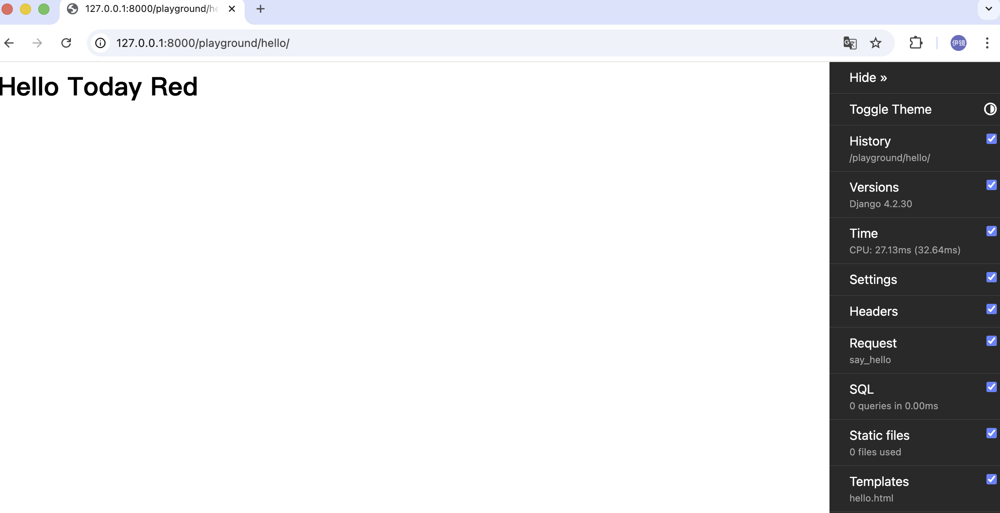

# 调试 Django 项目

在开发过程中，难免会遇到各种各样的错误和问题。Django 提供了多种调试工具和方法，帮助开发者快速定位和解决问题。

## VS Code 调试配置

打开程序侧边栏的调试选项卡，此时提示【要自定义运行和调试，请创建一个 launch.json 文件】。


此时弹出对话框，选择【更多 Python Debugger 选项】


选择【Django 模块】


点击后会在 `.vscode/launch.json` 文件中生成如下配置：

```json
{
    // 使用 IntelliSense 了解相关属性。 
    // 悬停以查看现有属性的描述。
    // 欲了解更多信息，请访问: https://go.microsoft.com/fwlink/?linkid=830387
    "version": "0.2.0",
    "configurations": [
    
        {
            "name": "Python Debugger: Django",
            "type": "debugpy",
            "request": "launch",
            "program": "${workspaceFolder}/manage.py",
            "args": [
                "runserver"
            ],
            "django": true
        }
    ]
}
```

我们可以在 `args` 中添加其他命令行参数，例如指定端口号：

```json
"args": [
    "runserver",
    "8001"
]
```

这样不会占用默认的 8000 端口，避免冲突。

配置完成后，点击调试选项卡中的绿色三角形按钮，即可启动调试模式。


更多调试细节不在此赘述，本篇章主要介绍如何配置调试环境。

## Django Debug Toolbar

[Django Debug Toolbar](https://django-debug-toolbar.readthedocs.io/en/latest/) 是一个强大的调试工具，可以在浏览器中显示各种调试信息，例如 SQL 查询、模板渲染时间、请求和响应头等。安装和配置 Django Debug Toolbar 非常简单。

首先安装 Django Debug Toolbar：

```bash
pip install django-debug-toolbar
```

然后在 `settings.py` 中添加以下配置：

```python
INSTALLED_APPS = [
    # ...
    'debug_toolbar',
]
```

紧接着在中间件中添加以下配置：

```python
MIDDLEWARE = [
    'debug_toolbar.middleware.DebugToolbarMiddleware',
    # ...
]
```

我们使用中间件来连接 Django 的请求响应处理

再配置 IP 地址，允许 Django Debug Toolbar 访问：

```python
INTERNAL_IPS = [
    # ...
    '127.0.0.1',
    # ...
]
```
Django settings.py 中默认不配置 `INTERNAL_IPS`，因此需要将全部内容复制粘贴到 `settings.py` 任意位置

在 `storefront/urls.py` 中添加以下配置：

```python
import debug_toolbar
from django.conf import settings
from django.conf.urls import include, url

urlpatterns = [
    # ...
    url('__debug__/', include('debug_toolbar.urls')),
]
```

现在我们完成了全部的配置，回到浏览器，刷新即可看到 Django Debug Toolbar：



> 如果未出现 Django Debug Toolbar，需要检查：
> 1. 是否正确安装了 Django Debug Toolbar
> 2. 是否正确配置 `settings.py` 和 `urls.py`
> 3. html 文件是否为完整的 HTML 结构，包含 `<html>`、`<body>` 等标签

