# 设置数据库

Django 默认使用 SQLite 数据库，这对于开发和测试来说非常方便，因为它不需要额外的配置和安装。但是在生产环境中，通常会使用更强大和可靠的数据库，例如 PostgreSQL、MySQL 或 Oracle。

本节课程先介绍如何使用 SQLite 数据库，后续课程会将重心逐渐转移到 MySQL 上。

## 创建 migration

Django 使用迁移（migration）来管理数据库模式的变化。当我们定义或修改模型时，需要创建迁移文件并应用它们来更新数据库结构。

使用如下命令来创建迁移文件：

```bash
python manage.py makemigrations
```

根据上一章内容，我们可以得到：

```bash
❯ python manage.py makemigrations
Migrations for 'store':
  store/migrations/0001_initial.py
    - Create model Cart
    - Create model Collection
    - Create model Customer
    - Create model Order
    - Create model Promotion
    - Create model Address
    - Create model Product
    - Create model OrderItem
    - Add field featured_product to collection
    - Create model CartItem
Migrations for 'tags':
  tags/migrations/0001_initial.py
    - Create model Tag
    - Create model TaggedItem
Migrations for 'likes':
  likes/migrations/0001_initial.py
    - Create model LikedItem
```

以 macOS 为例，迁移文件默认保存在 `migrations` 目录下，鼠标悬浮到文件名后摁住 command 并点击：

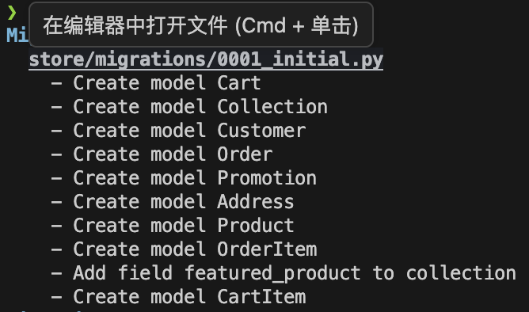

即可跳转到对应的迁移文件：

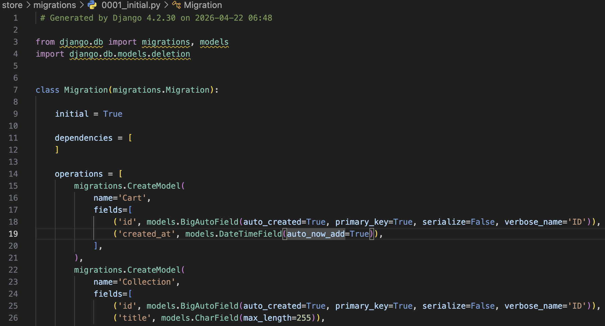

在上一章我们提到过，不需要额外给数据模型创建自增主键字段，Django 会自动为每个模型添加一个名为 `id` 的 `AutoField` 字段作为主键。

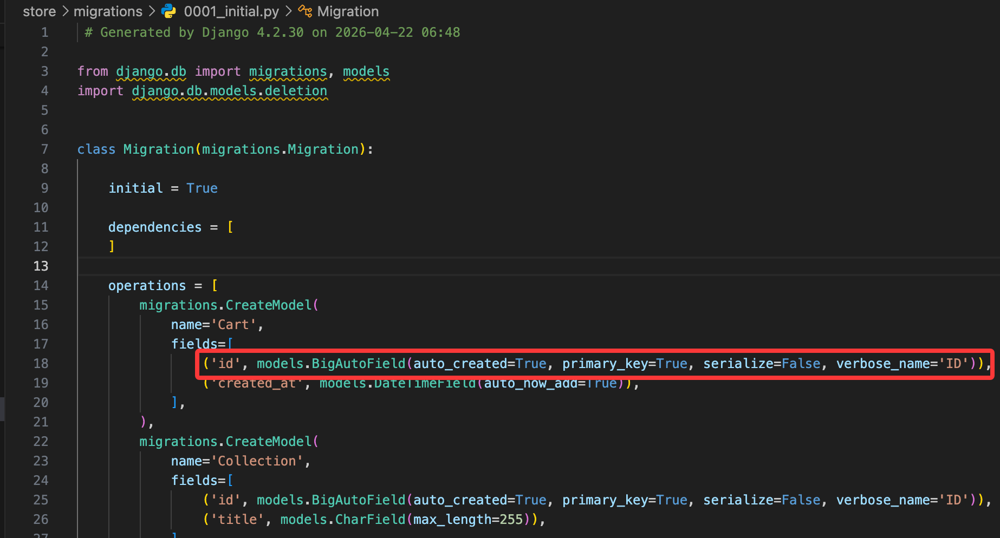

Django 会自动将这部分内容转换成SQL语句来运行。如果构建了新的模型或者修改了现有模型的字段，就需要重新运行 `makemigrations` 来生成新的迁移文件。

假设我们修改了 `Product` 模型，将字段 `price` 修改为 `unit_price`：

```python
class Product(models.Model):
    title = models.CharField(max_length=255)     
    description = models.TextField()            
    # git-delete-start
    price = models.DecimalField(max_digits=6, decimal_places=2)
    # git-delete-end
    # git-add-start
    unit_price = models.DecimalField(max_digits=6, decimal_places=2)
    # git-add-end
    inventory = models.IntegerField()
    last_updated = models.DateTimeField(auto_now=True)
    collection = models.ForeignKey(Collection, on_delete=models.PROTECT)
    promotions = models.ManyToManyField(Promotion)
```

保存并再次运行 `makemigrations`：

```bash
python manage.py makemigrations
Was product.price renamed to product.unit_price (a DecimalField)? [y/N] y
Migrations for 'store':
  store/migrations/0002_rename_price_product_unit_price.py
    - Rename field price on product to unit_price
```

此时 Django 会检测到 `price` 字段被删除了，同时又新增了一个 `unit_price` 字段，并且它们的类型相同，因此会询问我们是否将 `price` 字段重命名为 `unit_price`。确认后我们可以看到产生了一个新的迁移文件 `0002_rename_price_product_unit_price.py`，里面包含了重命名字段的操作：

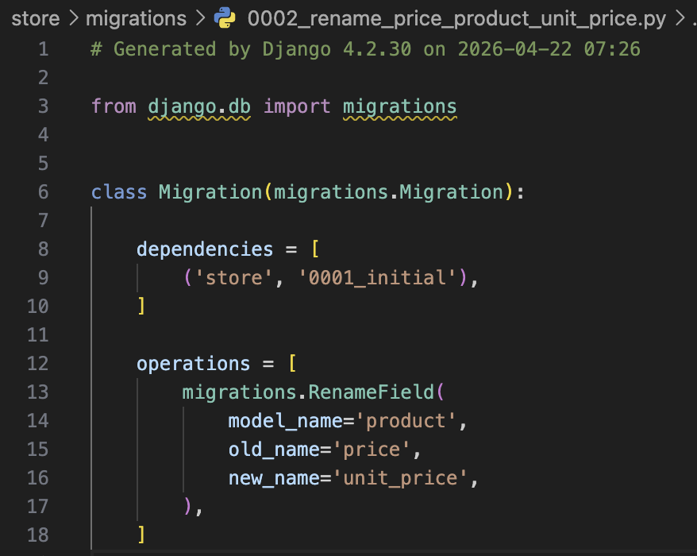

migration 文件名可以修改，但必须确保引用正确，以下图为例，如果要把 `0001_initial.py` 修改为 `0001_setup.py`，需要同时修改被引用的迁移文件中的 `dependencies`，否则迁移失败。

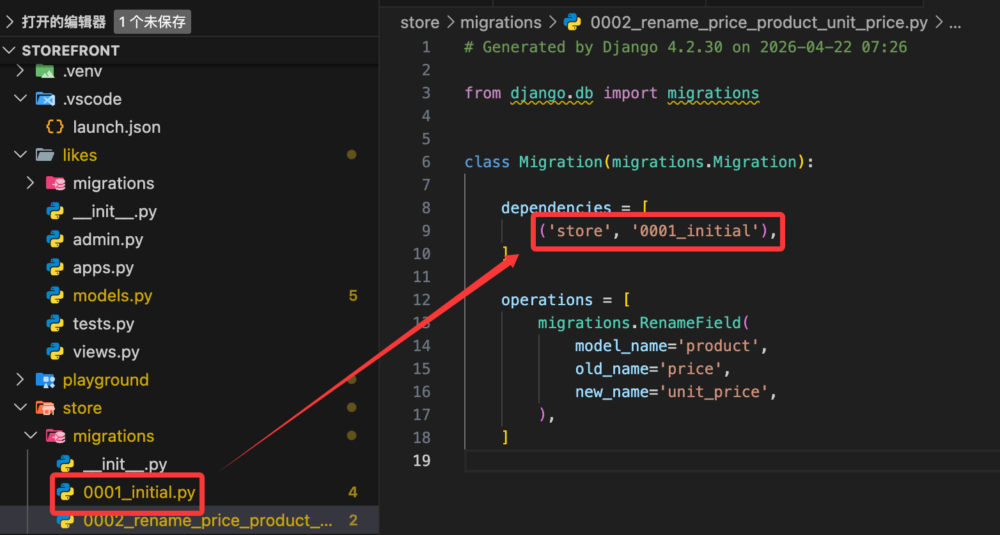

如果没有更改任何内容，执行 `makemigrations`：

```bash
python manage.py makemigrations
```

此时提示没有变化：

```bash
No changes detected
```

如果你发现自己有修改模型，执行 `makemigrations`，如果仍然提示没有变化，可能是因为：

- 没有保存更改内容
- 忘记添加应用程序

我们回到 `Product` 模型，添加一个新的字段 `slug`：

```python
class Product(models.Model):
    title = models.CharField(max_length=255)     
    # git-add-start
    slug = models.SlugField()
    # git-add-end
    description = models.TextField()            
    unit_price = models.DecimalField(max_digits=6, decimal_places=2)
    inventory = models.IntegerField()
    last_updated = models.DateTimeField(auto_now=True)
    collection = models.ForeignKey(Collection, on_delete=models.PROTECT)
    promotions = models.ManyToManyField(Promotion)
```

> slug 是一个简短的标签，通常用于 URL 中，表示资源的唯一标识符，例如 `my-awesome-product`。Django 提供了 `SlugField` 字段类型来存储 slug。

保存后执行 `makemigrations`：

```bash
python manage.py makemigrations
It is impossible to add a non-nullable field 'slug' to product without specifying a default. This is because the database needs something to populate existing rows.
Please select a fix:
 1) Provide a one-off default now (will be set on all existing rows with a null value for this column)
 2) Quit and manually define a default value in models.py.
```

由于我们添加了一个新的字段 `slug`，但是没有为现有的行提供默认值，因此 Django 无法确定如何填充这个字段。我们可以选择提供一个一次性的默认值，或者退出并在 `models.py` 中手动定义一个默认值。

如果选择了第一种方式，输入的内容必须使用引号括起来，例如`'-'`。操作完成迁移后，我们打开对应的迁移文件，可以看到：

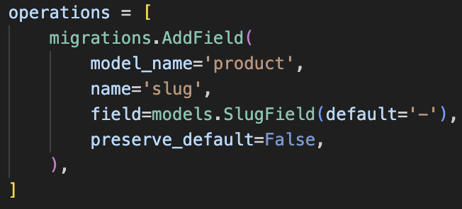

也就是说，如果选择第一种方式，这个default值只会出现在迁移文件中，而不会出现在模型定义中，并且只会使用一次。

## 运行 migration

每个 migration 就像一个版本控制系统中的提交一样，记录了数据库模式的变化。我们可以使用如下命令来应用迁移：

```bash
python manage.py migrate
```

这会将所有未应用的迁移文件按照顺序执行，更新数据库结构。执行完成后，我们可以看到类似如下的输出：

```bash
python manage.py migrate
Operations to perform:
  Apply all migrations: admin, auth, contenttypes, likes, sessions, store, tags
Running migrations:
  Applying contenttypes.0001_initial... OK
  Applying auth.0001_initial... OK
  Applying admin.0001_initial... OK
  Applying admin.0002_logentry_remove_auto_add... OK
  Applying admin.0003_logentry_add_action_flag_choices... OK
  Applying contenttypes.0002_remove_content_type_name... OK
  Applying auth.0002_alter_permission_name_max_length... OK
  Applying auth.0003_alter_user_email_max_length... OK
  Applying auth.0004_alter_user_username_opts... OK
  Applying auth.0005_alter_user_last_login_null... OK
  Applying auth.0006_require_contenttypes_0002... OK
  Applying auth.0007_alter_validators_add_error_messages... OK
  Applying auth.0008_alter_user_username_max_length... OK
  Applying auth.0009_alter_user_last_name_max_length... OK
  Applying auth.0010_alter_group_name_max_length... OK
  Applying auth.0011_update_proxy_permissions... OK
  Applying auth.0012_alter_user_first_name_max_length... OK
  Applying likes.0001_initial... OK
  Applying sessions.0001_initial... OK
  Applying store.0001_initial... OK
  Applying store.0002_rename_price_product_unit_price... OK
  Applying store.0003_rename_name_product_title... OK
  Applying store.0004_product_slug... OK
  Applying tags.0001_initial... OK
```

此时能看到项目下生成了一个新的文件 `db.sqlite3`，这就是 SQLite 数据库文件，里面存储了我们定义的模型对应的表结构和数据。我们可以在 VS Code 中安装 SQLite 插件来查看数据库内容：

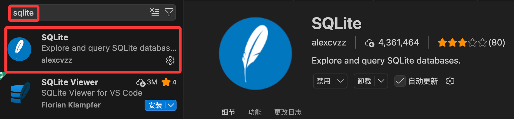

安装完成后选择要查看的数据库文件，右键点击【Open Database】

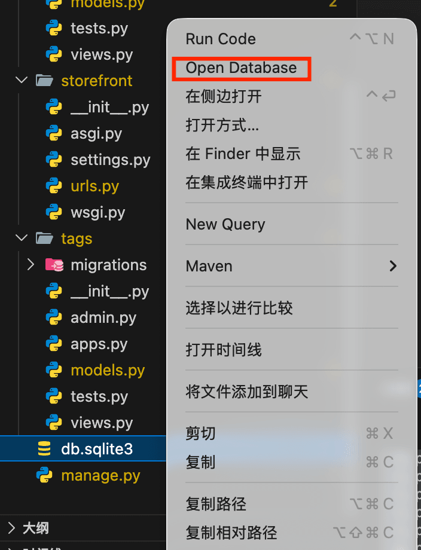

此时下方出现了一个【SQLITE EXPLORER】，可以看到数据库中的表结构：

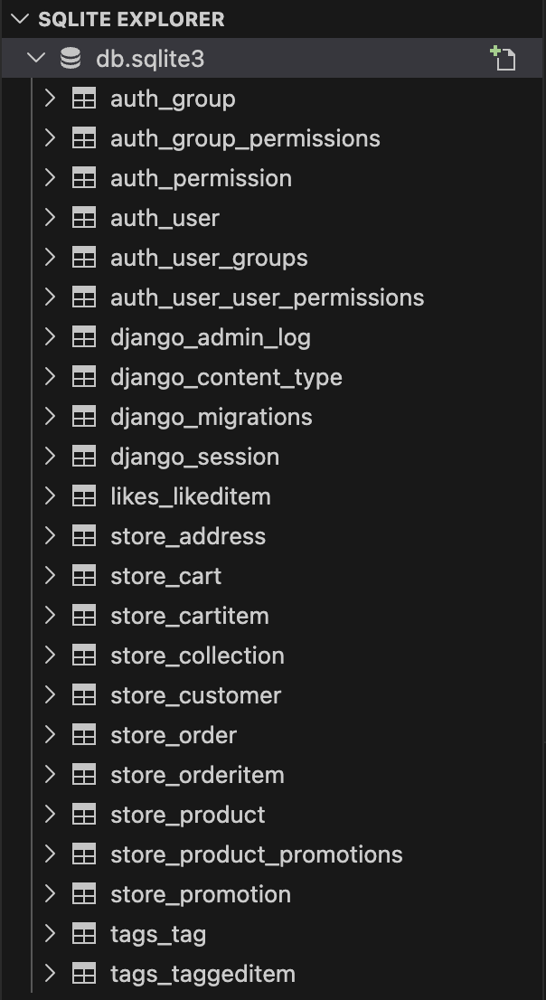

- auth - Django 内置的认证系统相关表
- contenttypes - Django 内置的内容类型系统相关表
- likes - 我们创建的 likes 应用相关表
- store - 我们创建的 store 应用相关表
- tags - 我们创建的 tags 应用相关表

可以点击 `django_migrations` 表来查看已经应用的迁移记录：

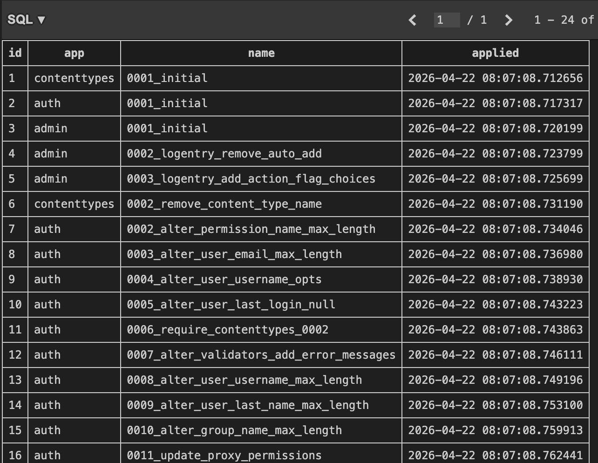

如果我们现在再执行一次 `python manage.py migrate`：

```bash
Operations to perform:
  Apply all migrations: admin, auth, contenttypes, likes, sessions, store, tags
Running migrations:
  No migrations to apply.
```

由于所有的迁移都已经应用了，因此提示没有迁移需要应用。

我们还可以通过如下命令来查看某次迁移时执行的具体 SQL 命令：

```bash
python manage.py sqlmigrate <app_name> <migration_name>
```

以命令 `python manage.py sqlmigrate store 0003` 为例：

```sql
BEGIN;
--
-- Add field slug to product
--
CREATE TABLE "new__store_product" ("id" integer NOT NULL PRIMARY KEY AUTOINCREMENT, "slug" varchar(50) NOT NULL, "title" varchar(255) NOT NULL, "description" text NOT NULL, "inventory" integer NOT NULL, "last_updated" datetime NOT NULL, "collection_id" bigint NOT NULL REFERENCES "store_collection" ("id") DEFERRABLE INITIALLY DEFERRED, "unit_price" decimal NOT NULL);
INSERT INTO "new__store_product" ("id", "title", "description", "inventory", "last_updated", "collection_id", "unit_price", "slug") SELECT "id", "title", "description", "inventory", "last_updated", "collection_id", "unit_price", '-' FROM "store_product";
DROP TABLE "store_product";
ALTER TABLE "new__store_product" RENAME TO "store_product";
CREATE INDEX "store_product_slug_6de8ee4b" ON "store_product" ("slug");
CREATE INDEX "store_product_collection_id_2914d2ba" ON "store_product" ("collection_id");
COMMIT;
```

> 小练习：
> 1. 在 `Address` 模型中添加一个新的字段 `zip`
> 2. 创建一次迁移并应用它
> 3. 查看迁移总表 `django_migrations`，确认迁移记录

```python
class Address(models.Model):
    street = models.CharField(max_length=255)
    city = models.CharField(max_length=255)
    customer = models.ForeignKey(Customer, on_delete=models.CASCADE, primary_key=True)
    # git-add-start
    zip = models.CharField(max_length=20, null=True)  # 新增字段
    # git-add-end
```

## 自定义架构

有时我们需要进一步操作数据库模式，比如覆写表或者添加索引等。先通过 `cmd + T` 或者 `ctrl + T`，输入 `Customer`，快捷跳转到 Customer 模型：

```python
class Customer(models.Model):
    first_name = models.CharField(max_length=255)
    last_name = models.CharField(max_length=255)
    email = models.EmailField(unique=True)
    phone = models.CharField(max_length=255)
    birth_date = models.DateField(null=True)
    
    MEMBERSHIP_BRONZE = 'B'
    MEMBERSHIP_SILVER = 'S'
    MEMBERSHIP_GOLD = 'G'

    MEMBERSHIP_CHOICES = [
        (MEMBERSHIP_BRONZE, 'Bronze'),
        (MEMBERSHIP_SILVER, 'Silver'),
        (MEMBERSHIP_GOLD, 'Gold'),
    ]
    membership = models.CharField(max_length=1, choices=MEMBERSHIP_CHOICES, default=MEMBERSHIP_BRONZE)
    # git-add-start
    class Meta:
        db_table = 'store_customers'  # 自定义表名
        indexes = [
            models.Index(fields=['last_name', 'first_name']),
        ]
    # git-add-end
```

详情请见[Meta](https://docs.djangoproject.com/en/6.0/ref/models/options/)

保存后执行 `makemigrations`：

```bash
Migrations for 'store':
  store/migrations/0004_customer_store_custo_last_na_e6a359_idx_and_more.py
    - Create index store_custo_last_na_e6a359_idx on field(s) last_name, first_name of model customer
    - Rename table for customer to store_customers
```

此时发现 Django 无法为这次迁移生成一个很好的名称，因为本次迁移混合了两种操作：重命名表和创建索引。

执行 `migrate` 后，查看 store 应用的 customer 表，此时名称已经变成了 `store_customers`。

## 撤销 migration

如果发现某次迁移有问题或者不需要了，可以使用如下命令来撤销迁移：

```bash
python manage.py migrate <app_name> <prev migration id>
```

以命令 `python manage.py migrate store 0003` 为例：

```bash
Operations to perform:
  Target specific migration: 0003_product_slug, from store
Running migrations:
  Rendering model states... DONE
  Unapplying store.0004_customer_store_custo_last_na_e6a359_idx_and_more... OK
```

此时在 `django_migrations` 表中可以看到 `0004_customer_store_custo_last_na_e6a359_idx_and_more` 这条迁移记录被撤销了，而在应用的 migration 子目录下仍能看到 `0004_customer_store_custo_last_na_e6a359_idx_and_more.py` 这个迁移文件。此时执行 `python manage.py migrate`，该迁移文件又会被重新应用。

但此时我们需要放弃这个迁移，因此需要删除这个迁移文件。

> 小练习：
> 1. 修改Customer模型，修改 `first_name` 字段为 `given_name`
> 2. 创建一次迁移并应用它
> 3. 撤销这次迁移并删除迁移文件

## 在 Django 中使用 MySQL

> 参考视频: [Using_MySQL_in_Django](https://www.bilibili.com/video/BV1eX4y1f7Pz?buvid=YE475CE25E5DEE6C4D489CF6BE7345D3A0FA&is_story_h5=false&mid=s7e7OMeFxsQ0%2BaceMEAs0g%3D%3D&plat_id=114&share_from=ugc&share_medium=iphone&share_plat=ios&share_source=COPY&share_tag=s_i&timestamp=1776864904&unique_k=33AN7Dk&up_id=35923455&vd_source=8e3f5b7e9cf313d9ea63238d28816b11&p=16&spm_id_from=333.788.videopod.episodes#:~:text=%E3%80%90Setting%20Up-,the,-Database%E3%80%91Using_MySQL_in_Django)

课程中虽然推荐安装 `mysqlclient` 来连接 MySQL 数据库，但在实际开发中，使用 `mysqlclient` 可能会遇到一些安装问题。一个更简单的替代方案是使用 `pymysql`，它是一个纯 Python 实现的 MySQL 客户端库，不需要编译 C 扩展。

使用如下命令，依据提示输入密码登录 MySQL：

```bash
mysql -u root -p
```

创建数据表：

```sql
CREATE DATABASE storefront;
```

创建完成后退出 MySQL：

```sql
exit
```

安装 `pymysql`：

```bash
pip install pymysql
```

安装完成后，找到 `storefront/settings.py` 文件，

在文件顶部添加以下代码来让 Django 使用 `pymysql` 作为 MySQL 的数据库引擎：

```python
import pymysql

pymysql.install_as_MySQLdb()
```

找到 `DATABASES` 配置变量：

```python
DATABASES = {
    'default': {
# git-delete-start
        'ENGINE': 'django.db.backends.sqlite3',
# git-delete-end
# git-add-start
        'ENGINE': 'django.db.backends.mysql',
# git-add-end
# git-delete-start
        'NAME': BASE_DIR / 'db.sqlite3',
# git-delete-end
# git-add-start
        'NAME': 'storefront',
        'HOST': 'localhost',
        'USER': 'root',
        'PASSWORD': 'your_mysql_password',
        'PORT': '3306', # MySQL 默认端口，如果使用了其他端口，请修改
# git-add-end
    }
}
```

执行如下命令让操作更新到数据库中：

```bash
python manage.py migrate
```

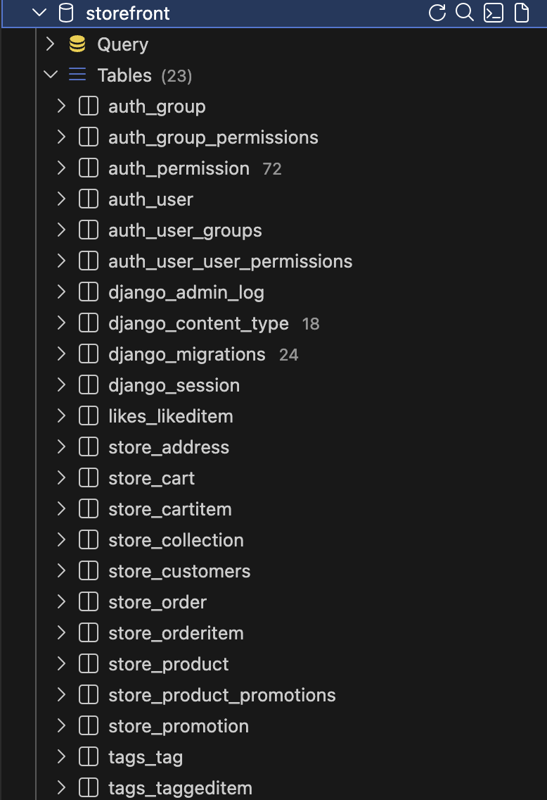