# ORM 进阶查询

## 数据排序

数据模型管理器中其实有一个非常有用的方法叫做 `order_by()`，它可以用来对查询结果进行排序。例如我们想要按照产品标题来排序：

```python
queryset = Product.objects.order_by('title')
```

保存并刷新，得到如下内容：

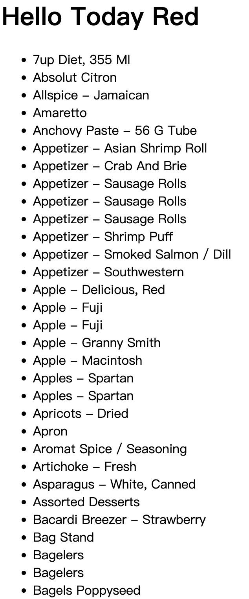

查看 SQL 执行情况：


如果我们想要降序排序，可以在字段名前加上 `-`：

```python
queryset = Product.objects.order_by('-title')
```

也可以按多个字段排序，比如在按单价升序排序，单价相同的情况下按标题降序排序：

```python
queryset = Product.objects.order_by('unit_price', '-title')
```

事实上 queryset 对象还有一个 `reverse()` 方法可以用来反转排序顺序，例如：

```python
queryset = Product.objects.order_by('unit_price', '-title').reverse()
```

也就意味着上述查询返回的是按单价降序排序，单价相同的情况下按标题升序排序的结果。

> order_by 返回的 queryset 可以做进一步处理，详情参考：[QuerySet API reference](https://docs.djangoproject.com/en/6.0/ref/models/querysets/#order-by)。

这里我们可以获取单一集合的产品，然后按单价进行排序：

```python
queryset = Product.objects.filter(collection__id=1).order_by('unit_price')
```

有时我们想在排序后只获取第一个对象：

```python
product = Product.objects.order_by('unit_price')[0]
```

也可以通过以下方式实现按升序排序并返回第一个对象：

```python
product = Product.objects.earliest('unit_price')
```

或者按降序排序并返回第一个对象：

```python
product = Product.objects.latest('unit_price')
```

## 限制结果返回

假设我们有很多数据需要返回，我们可以分页返回，每页只显示 5 个结果，可以使用切片来限制返回的结果数量：

```python
queryset = Product.objects.all()[:5]
```

保存并刷新，得到如下内容：

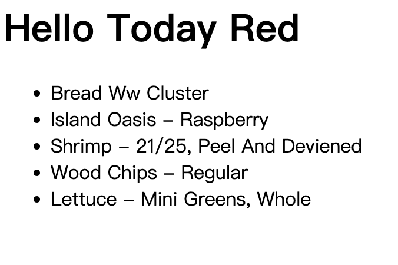

查看 SQL 执行情况：

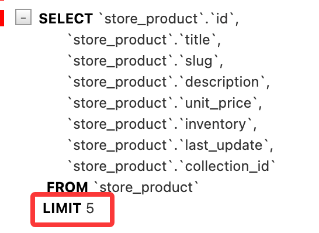

如果想要查看第二页的数据（第 6-10 个结果），可以使用：

```python
queryset = Product.objects.all()[5:10]
```

保存并刷新，查看 SQL 执行情况：


## 查询子集

从前面的例子中我们不难看出，查询默认返回全部字段数据，但是有时候我们可能只需要查询部分字段数据，这时可以使用 `values()` 方法：

```python
queryset = Product.objects.values('id', 'title')
```

保存并刷新，查看 SQL 执行情况：


同样的，我们也可以读取关联表中的字段：

```python
queryset = Product.objects.values('id', 'title', 'collection__title')
```

保存并刷新，查看 SQL 执行情况：

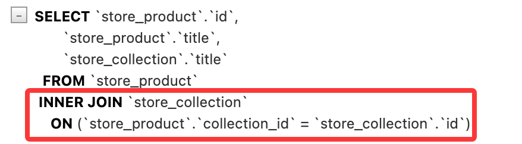

在前面我们使用筛选等方式返回的查询集是一个包含模型实例的查询集，如果我们使用 `values()` 方法返回的查询集则是一个包含**字典**的查询集，每个字典对应一个对象，字典的键是字段名称，值是字段值。修改 `playground/templates/hello.html` 代码如下：

```html
<html>
    <body>
        
        <h1>Hello {{ name }}</h1>
        
        <h1>Hello, World</h1>
        
        <ul>
            
            //git-delete-start
            <li>{{ product.title }}</li>
            //git-delete-end
            // git-add-start
            <li>{{ product }}</li>
            // git-add-end
            
        </ul>
    </body>
</html>
```

保存并刷新，得到如下内容：


如果将 python 代码中的 `values()` 方法替换成 `values_list()` 方法：

```python
queryset = Product.objects.values_list('id', 'title', 'collection__title')
```

保存并刷新，得到如下内容：


> 小练习：获取已订购的产品，并按标题进行排序

```python
from django.shortcuts import render
from store.models import Product, OrderItem

def say_hello(request): 
    queryset = Product.objects.filter(id__in=OrderItem.objects.values('product_id').distinct()).order_by('title')

    return render(request, 'hello.html', {'name': 'Today Red', 'products': list(queryset)})
```

## 延迟字段

django 中的查询集默认会返回所有字段数据，但有时候我们可能只需要查询部分字段数据，这时可以使用 `only()` 方法：

```python
queryset = Product.objects.only('id', 'title')
```

`only()` 函数与 `values()` 函数的区别在于，`only()` 返回的查询集仍然包含模型实例，但这些实例只有指定的字段被加载，其他字段是延迟加载的。当访问未加载的字段时，Django 会自动执行一个新的查询来获取该字段的数据。


使用这个方法的时候需要注意，如果访问了未加载的字段，Django 会执行一个新的查询来获取该字段的数据，这可能会导致 N+1 问题等性能相关问题。因此，在使用 `only()` 方法时，应该确保只访问那些被指定的字段，以避免不必要的数据库查询。

修改 `playground/templates/hello.html` 代码如下：

```html showLineNumbers
<html>
    <body>
        
        <h1>Hello {{ name }}</h1>
        
        <h1>Hello, World</h1>
        
        <ul>
            
            // git-delete-start
            <li>{{ product.title }}</li>
            // git-delete-end
            // git-add-start
            <li>{{ product.title }} - {{ product.unit_price }}</li>
            // git-add-end
            
        </ul>
    </body>
</html>
```

保存并刷新，查看 SQL 执行情况：


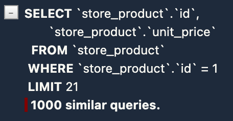

由于我们在查询集中使用了 `only()` 方法来指定只加载 `id` 和 `title` 字段，当我们在模板中额外访问 `unit_price` 字段时，Django 会自动执行新的查询来获取该字段的数据，因此产生大量的查询，进而导致耗时增加。

如果存在上述需求：也即在查询集中只加载部分字段，但又可能需要访问其他字段的数据，我们可以使用 `defer()` 方法来指定哪些字段不被加载。假设产品描述字段不需要立即加载：

```python
queryset = Product.objects.defer('description')
```

但同样需要注意的是，如果后续访问了被 `defer()` 方法指定的字段，Django 也会逐个执行新的查询来获取该字段的数据。

## 选择关联对象

有时我们需要预先加载一堆对象。修改 `playground/views.py` 代码如下：

```python
def say_hello(request):
    queryset = Product.objects.all()
    return render(request, 'hello.html', {'name': 'Today Red', 'products': list(queryset)})
```

修改 `playground/templates/hello.html` 代码如下：

```html
<html>
    <body>
        
        <h1>Hello {{ name }}</h1>
        
        <h1>Hello, World</h1>
        
        <ul>
            
            <li>{{ product.title }} - {{ product.collection.title }}</li>
            
        </ul>
    </body>
</html>
```

保存并刷新，查看 SQL 执行情况：

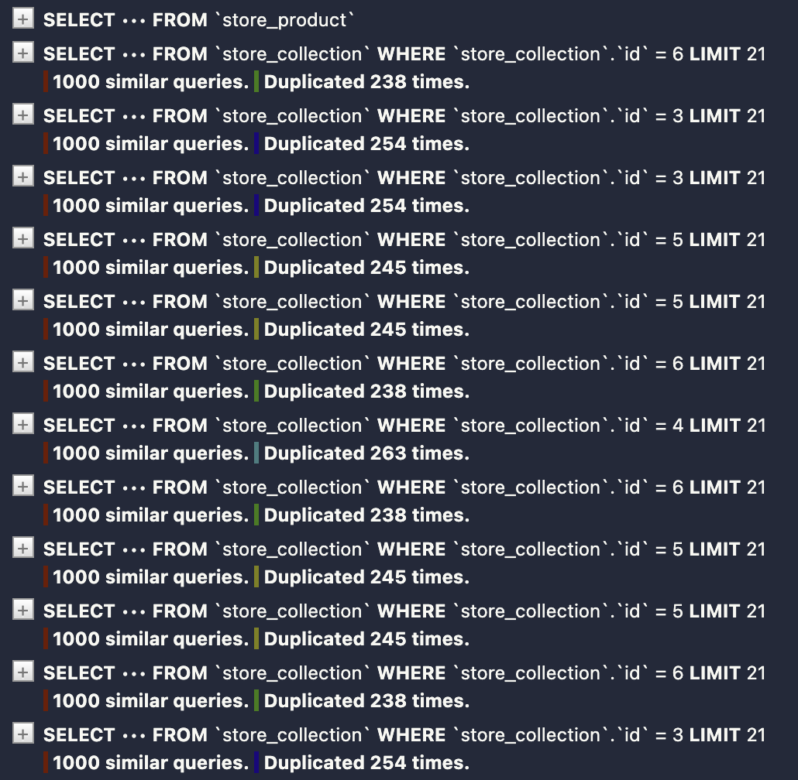

由于我们在模板中访问了 `product.collection.title`，Django 会为每个产品执行一个新的查询来获取其所属集合的标题，这可能会导致 N+1 查询问题。为了避免这个问题，我们可以使用 `select_related()` 方法来预加载关联对象：

```python
queryset = Product.objects.select_related('collection').all()
```

保存并刷新，查看 SQL 执行情况：

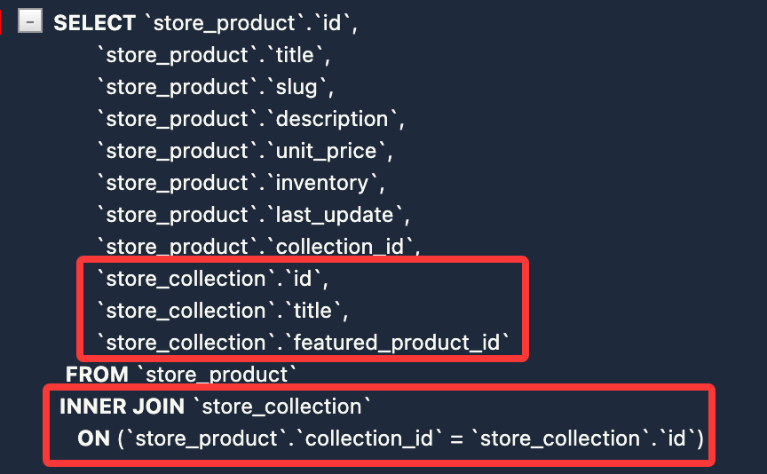

还有一种方式是使用 `prefetch_related()` 方法来预加载关联对象：

```python
queryset = Product.objects.prefetch_related('promotions').all()
```

修改 `playground/templates/hello.html` 代码如下：

```html
<html>
    <body>
        
        <h1>Hello {{ name }}</h1>
        
        <h1>Hello, World</h1>
        
        <ul>
            
            // git-delete-start
            <li>{{ product.title }} - {{ product.collection.title }}</li>
            // git-delete-end
            // git-add-start
            <li>{{ product.title }}</li>
            // git-add-end
            
        </ul>
    </body>
</html>
```

保存并刷新，查看 SQL 执行情况：


两者的区别在于，`select_related()` 使用 SQL 的 JOIN 来一次性获取相关对象的数据，而 `prefetch_related()` 则会执行两个独立的查询来获取相关对象的数据，并在 Python 代码中进行关联。`select_related()` 适用于多对一或一对一，`prefetch_related()` 适用于多对多或一对多。

如果同时需要获取一对一关系和多对多关系的数据，可以链式使用 `select_related()` 和 `prefetch_related()`，调用的先后顺序不会影响结果获取：

```python
queryset = Product.objects.select_related('collection').prefetch_related('promotions').all()
```

保存并刷新，查看 SQL 执行情况：

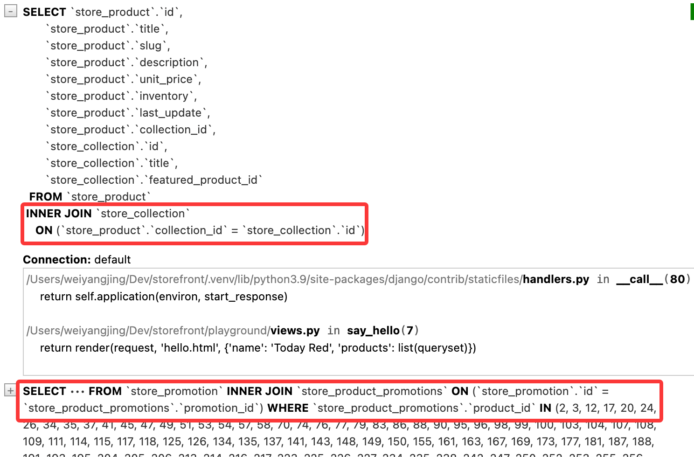

> 小练习：获取最近的 5 个订单和订单对应的用户，并获取对应的订单项和相关的产品数据：

```python
queryset = Order.objects.prefetch_related('orderitem_set__product').select_related('customer').order_by('-placed_at')[:5]
```

## 聚合

假设需要对产品进行计算，修改 `playground/views.py` 代码如下：

```python
from django.shortcuts import render
# git-add-start
from django.db.models import Count, Min, Max, Avg, Sum
# git-add-end
from store.models import Product

def say_hello(request): 
    result  = Product.objects.aggregate(Count('id'))
    
    # git-delete-start
    return render(request, 'hello.html', {'name': 'Today Red', 'products': list(queryset)})
    # git-delete-end
    # git-add-start
    return render(request, 'hello.html', {'name': 'Today Red', 'result': list(result)})
    # git-add-end
```

修改 `playground/templates/hello.html` 代码如下：

```html
<html>
    <body>
        
        <h1>Hello {{ name }}</h1>
        
        <h1>Hello, World</h1>
        
        // git-delete-start
        <ul>
            
            <li>{{ product.placed_at }} - {{ product.payment_status }}</li>
            
        </ul>
        // git-delete-end
        // git-add-start
        {{ result }}
        // git-delete-end
    </body>
</html>
```

保存并刷新网页：

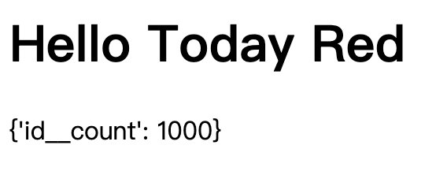

我们可以修改键名：

```python
result  = Product.objects.aggregate(count=Count('id'))
```

保存并刷新网页：


除此之外我们还可以进行其他的聚合计算，例如：

```python
result  = Product.objects.aggregate(count=Count('id'), min_price=Min('unit_price'))
```

保存并刷新网页：


可以看到 `min_price` 是具有值的十进制对象。

`aggregate()` 方法返回一个字典，并且可以在任何有查询集的地方调用。因此我们可以在筛选后的查询集上调用 `aggregate()` 方法来计算满足特定条件的对象的聚合值，例如：

```python
result  = Product.objects.filter(unit_price__gt=20).aggregate(count=Count('id'), min_price=Min('unit_price'))
```

## 注释

有时候我们希望在查询集中添加一些注释来帮助调试或者记录一些额外的信息，Django 提供了 `annotate()` 方法来实现这个功能。例如我们想要在查询集中添加一个注释字段来计算每个产品的订单数量：

```python
queryset = Customer.objects.annotate(is_new=True)
```

保存并刷新：

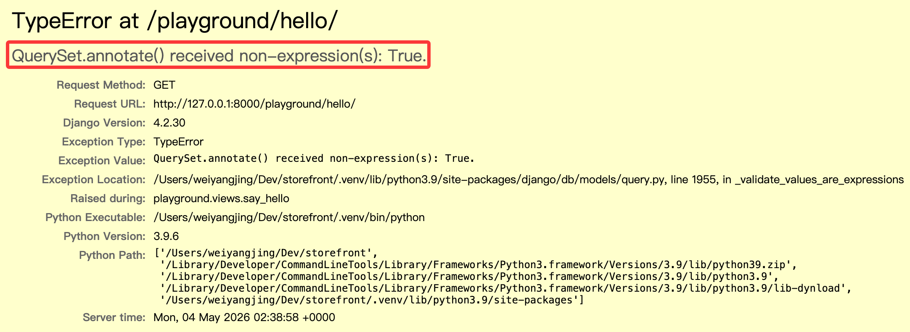

此时提示报错， `annotate()` 接受了非表达式类型的参数 `is_new`。

Django 中提供了一个表达式基类 `Expression`，该类派生出了一系列的表达式类，例如 `F()`、`Func()`、`Value()`、`Aggregate()` 等等，这些表达式类可以用来构建复杂的查询和注释。

也就是说我们不能直接传递布尔值，而是需要传递一个表达式对象。我们可以使用 `Value()` 函数来将其转换为表达式：

```python
from django.db.models import Value
# highlight-next-line
queryset = Customer.objects.annotate(is_new=Value(True))
```

保存并刷新，此时没有报错，查看 sql 执行情况：

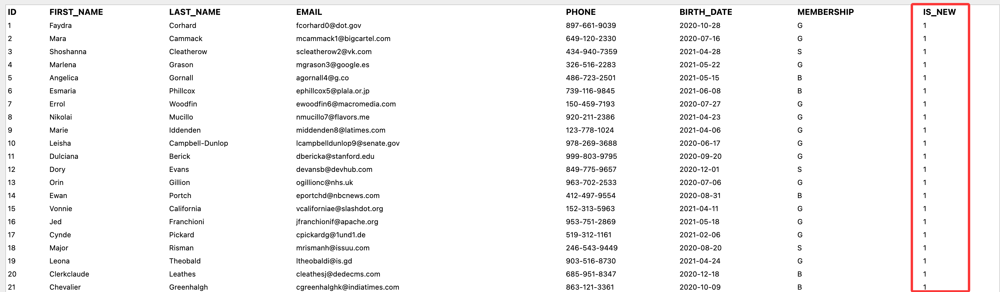

此时每个客户对象都会有一个名为 `is_new` 的新字段，并且值为 `True`。

还是以上面的例子为基础，我们可以使用 `F()` 函数来构造一个新 id 字段：

```python
from django.db.models import F
# highlight-next-line
queryset = Customer.objects.annotate(new_id=F('id'))
``` 

保存并刷新，查看 sql 执行情况：

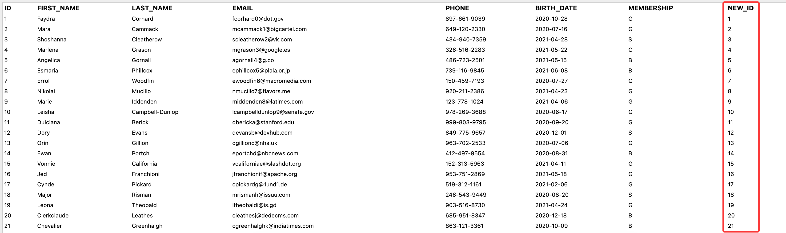

我们还可以在此基础上进行运算：

```python
from django.db.models import F
# highlight-next-line
queryset = Customer.objects.annotate(new_id=F('id') + 1000)
```

保存并刷新，查看 sql 执行情况：

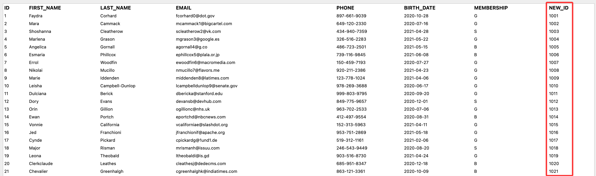

## 调用数据库函数

Django 提供了一个 `Func()` 函数来调用数据库函数，例如我们想要在查询集中添加一个注释字段来显示用户完整名称：

```python
from django.db.models import Func
# highlight-next-line
queryset = Customer.objects.annotate(full_name=Func(F('first_name'), Value(' '), F('last_name'), function='CONCAT'))
```

保存并刷新，查看 sql 执行情况：

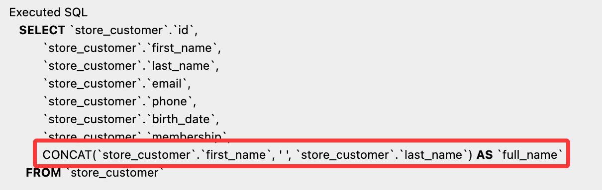

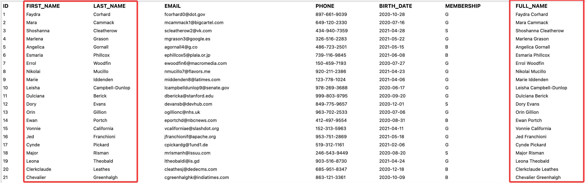

当然，由于 Django 已经内置了 `Concat()` 函数，我们也可以直接使用它来实现同样的功能：

```python
from django.db.models import Concat, Value
# highlight-next-line
queryset = Customer.objects.annotate(full_name=Concat('first_name', Value(' '), 'last_name'))
```

这里可以不使用 `F()` 函数来引用字段，因为 `Concat()` 函数已经内置了对字段的处理。但是还是需要使用 `Value()` 函数来将常量字符串转换为表达式，否则会将常量字符串识别成要拼接的字段。

> 完整的内置数据库函数列表可以参考：[Database Functions](https://docs.djangoproject.com/en/6.0/ref/models/database-functions/)。这里显示的函数是数据库通用函数，而每个数据库引擎会有特定的函数，需要使用 `Func()` 函数来调用。

## 数据分组

假设我们想要查看每个客户的订单数量，可以使用 `annotate()` 方法来实现：

```python
from django.db.models import Count
# highlight-next-line
queryset = Customer.objects.annotate(order_count=Count('order'))
```

虽然在 Order 模型中有一个外键指向 Customer 模型，Django 会自动为我们创建一个反向关系字段，默认命名为 `order_set`，但是这里需要使用 `order` 来引用这个关系。（具体原因未知，仅作使用提示）

保存后刷新，查看 sql 执行情况：

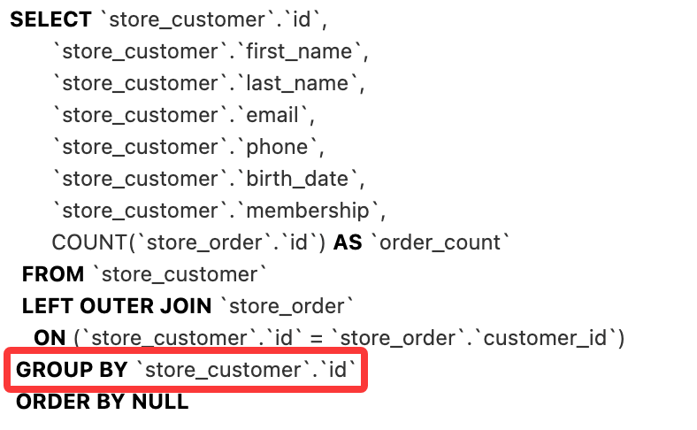

查看结果：

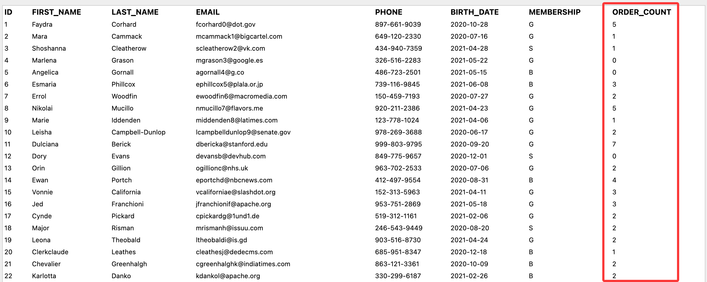

## 表达式装饰器

目前为止我们学习了很多表达式类，例如：

- `F()`：用于引用模型字段的值，可以进行字段之间的运算。
- `Value()`：用于将常量值转换为表达式。
- `Func()`：用于调用数据库函数，可以自定义函数名称和参数。
- `Aggregate()`：用于进行聚合计算，可以自定义聚合函数名称和参数。

这里主要介绍一个非常有用的装饰器 `ExpressionWrapper`，它可以将一个表达式包装成一个新的表达式，并且可以指定新的输出类型，非常适用于构建复杂查询。

如果我们想要在查询集中添加一个注释字段来显示折扣价格，假设折扣价格是单价的 80%：

```python
queryset = Product.objects.annotate(discount_price=F('unit_price') * 0.8)
```

如果直接这样书写，保存后刷新会出现报错

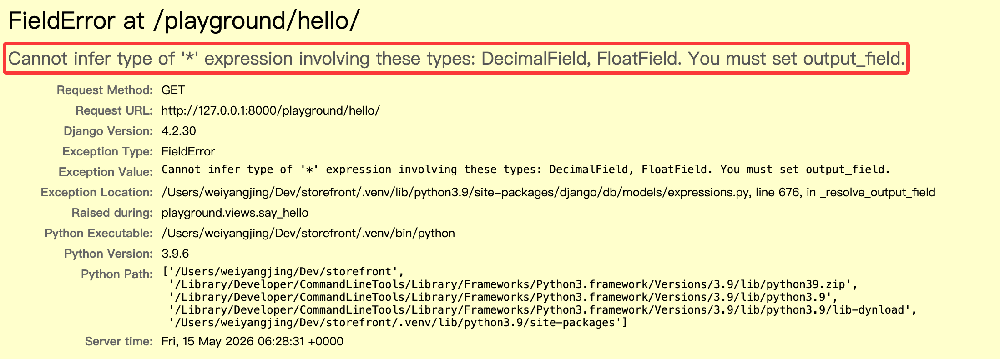

可以使用 `ExpressionWrapper` 来解决这个问题：

```python
from django.db.models import ExpressionWrapper, DecimalField
# highlight-next-line
discount_price = ExpressionWrapper(F('unit_price') * 0.8, output_field=DecimalField())
queryset = Product.objects.annotate(discount_price=discount_price)
```

这里我们选择使用 `DecimalField()` 作为输出类型，不使用 `FloatField()` 是因为浮点数会有精度问题。

保存后刷新，查看 sql 执行情况：

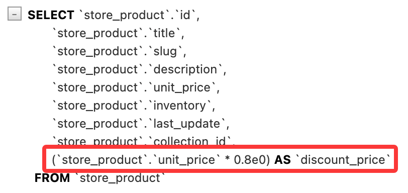

查看结果：

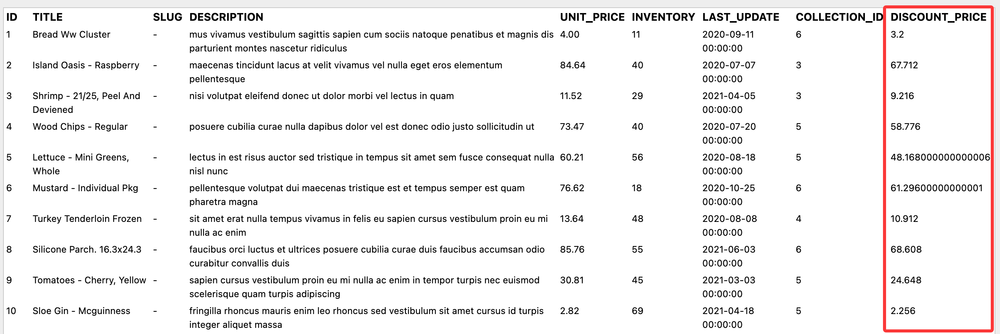

## 查询泛型关系

我们此前创建了一个 tags 应用，应用中有两个模型 `TaggedItem` 和 `Tag`。由于想要把内容类型与商店应用程序解耦，因此我们使用泛型外键，也就是说 content_type 不知道有 product 等模型，content_type 和 object_id 字段可以指向任何模型的实例。

换句话说，这个tag可以用于标记商品，也可以用户标记博客文章等等。现在让我们来看下tag怎么跟product模型进行关联的。

首先来到数据库，查看 `django_content_type` 表。这里边的部分条目由 Django 应用自动创建。

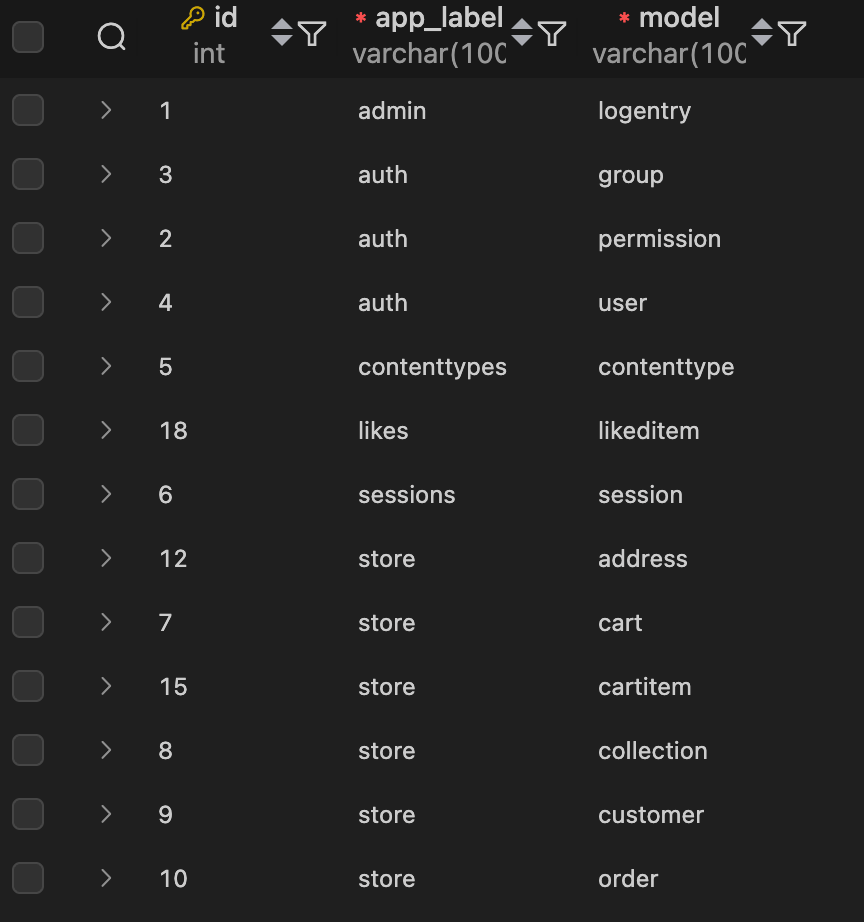

查看 `tags_taggeditem` 表，有内容类型ID和标记ID，以便查找给定产品的标签，也就是说，如果要建立tag和product之间的关系，我们需要知道 product 模型在 `django_content_type` 表中的 id。此时返回到 `django_content_type` 表，查看 product 模型的 id：

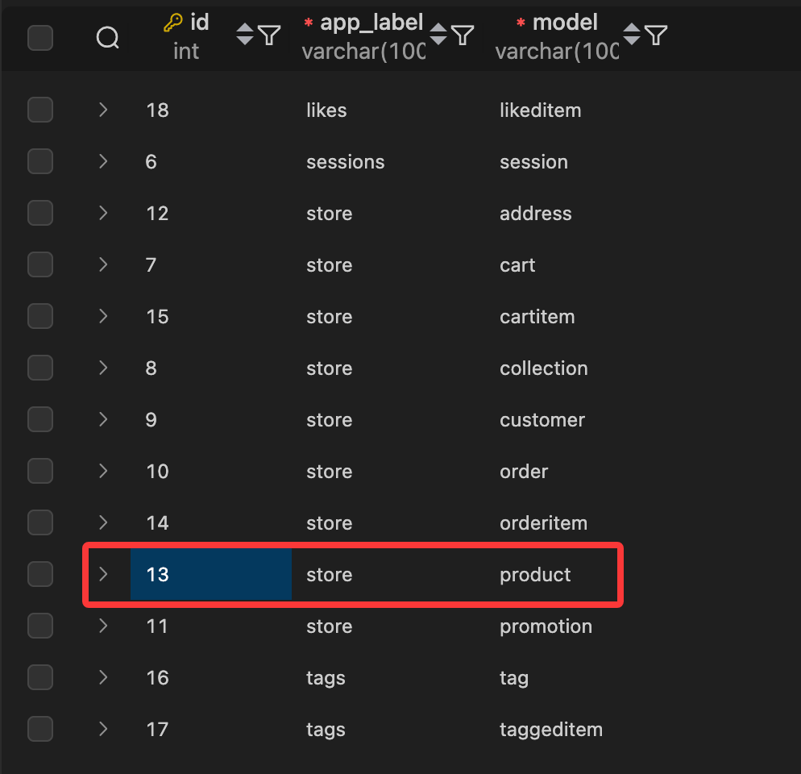

在当前数据库中，对应的ID是13。但是我们不建议直接使用这个ID，因为在不同的数据库中这个ID可能会不同。Django 提供了一个 `ContentType` 模型来帮助我们获取模型对应的 content type ID。

```python
from django.contrib.contenttypes.models import ContentType
from store.models import Product
from tags.models import TaggedItem

def say_hello(request):
    content_type = ContentType.objects.get_for_model(Product)
    queryset = TaggedItem.objects \ 
        .select_related('tag') \ 
        .filter(
            content_type=content_type, 
            object_id=1
        )

    return render(request, 'hello.html', {'name': 'Today Red', 'tags': list(queryset)})
```

content_type 的管理器有一个名为 `get_for_model()` 的方法，它接受一个模型类作为参数，并返回该模型对应的 content type 对象。也就是说`content_type = ContentType.objects.get_for_model(Product)` 实际上对象对应这一行


由于 `TaggedItem` 模型中的tag_id字段是一个外键指向 `Tag` 模型，所以实际标签存储在 `Tag` 模型中。因此需要使用 select_related 预加载，否则会导致 N+1 查询问题。

保存代码并刷新，查看 SQL 执行情况：

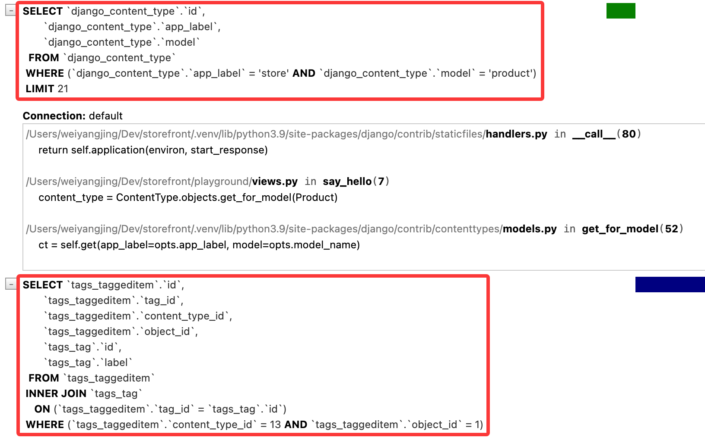

可以看到第一个查询是为产品获取 content type ID 的查询，第二个查询是获取标签数据的查询。

## 了解查询集缓存

Django 的查询集具有缓存机制，当我们第一次访问查询集时，Django 会执行数据库查询并将结果缓存起来。之后对同一个查询集的访问将直接使用缓存中的数据，而不会再次执行数据库查询。

举个例子，我们要获取全部产品数据：

```python
queryset = Product.objects.all()
list(queryset)  
```

此时 Django 会计算这个数据集，然后从数据库中获取结果，并将结果缓存。如果进行第二次查询：

```python
list(queryset)  
```

此时 Django 会直接使用缓存中的数据，而不会再次执行数据库查询。

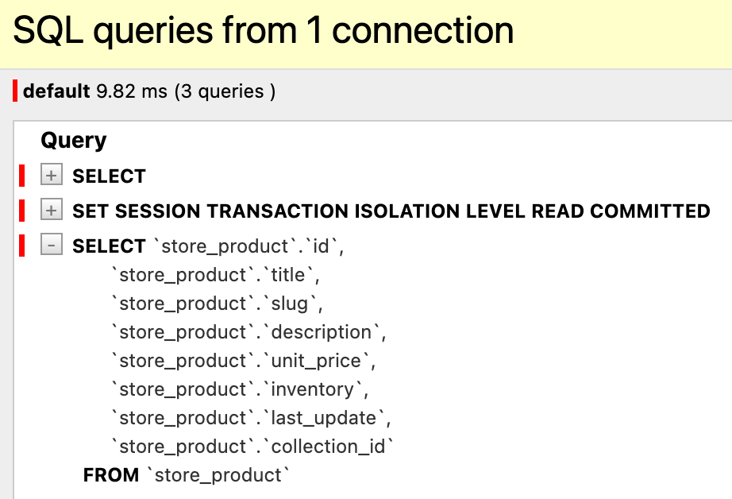

需要注意的是，只有第一次计算完整查询集时才会发生缓存，也就是说，如果按照如下代码顺序执行：

```python
queryset = Product.objects.all()
queryset[0]
list(queryset)  
```

此时会得到对数据库的两个查询

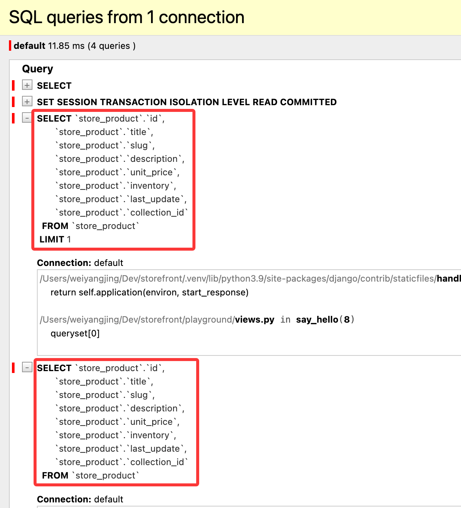

但如果执行顺序调换：

```python
queryset = Product.objects.all()
list(queryset)
queryset[0]
```

由于第一次访问查询集时已经计算了完整查询集并缓存了结果，因此第二次访问查询集时直接使用缓存中的数据，而不会再次执行数据库查询。

尽管缓存机制可以提高性能，如果代码结构不正确，可能会导致意外的数据库查询，从而影响性能。

## 创建对象

在上述的内容中，我们只对数据进行查询，但在实际开发中，我们还需要对数据进行创建等操作。Django 的 ORM 提供了非常方便的方法来实现这些功能。现在让我们创建一个集合对象，并将标题设置为 "Video Games"：

```python
collection = Collection()
collection.title = 'Video Games'
```

这里我们用多一行代码来设置集合对象标题，也可以直接在创建对象时设置标题：

```python
collection = Collection(title='Video Games')
```

只是分开写有以下好处：

- 后续如果集合模型变动时，代码更容易维护。
- 有对应的字段设置提示，减少输入错误的可能性。

集合中有一个可选字段 `featured_product`，这里有多种方法进行设置：

- `collection.featured_product = Product(pk=1)`：创建 Product 对象进行设置。
- `collection.featured_product_id = 1`：直接设置外键字段的值进行设置。

注意，由于 featured_product 是一个外键字段，因此在创建这个集合之前，必须确保数据库中已经存在一个主键为 1 的 Product 对象。

设置完成后，使用 `save()` 方法将集合对象保存到数据库中，完整创建代码如下：

```python
collection = Collection()
collection.title = 'Video Games'
collection.featured_product = Product(pk=1)
collection.save()
```

事实上，还有一种更简洁的方式来创建对象并保存到数据库中，那就是使用 `create()` 方法，以下代码等效于上面的4行代码：

```python
collection = Collection.objects.create(
    title='Video Games', 
    featured_product_id=1
)
```

这种方式简便，只是也会存在关键字问题，如果模型字段发生变动时，代码需要手动修改，无法自动更改。

此时回到传统方法，保存并查看sql执行情况：

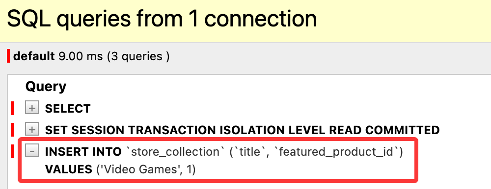

## 更新对象

假设我们想要更新之前创建的集合对象：

- 更新标题为 "Games"
- 将 featured_product 字段设置为 None

那么首先需要获取这个集合对象，由于我们之前创建的集合对象的主键是 11

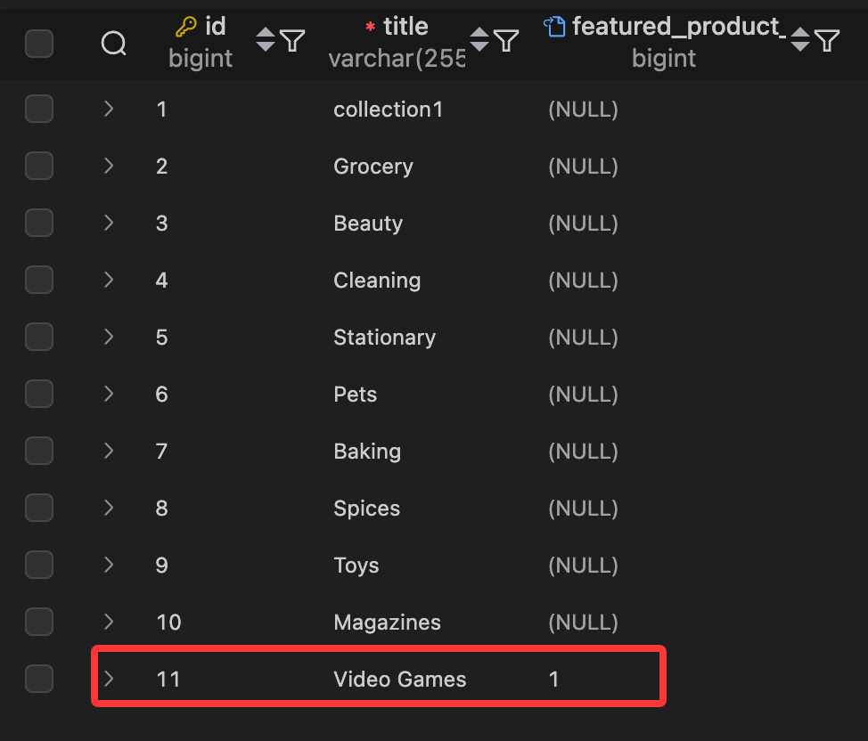

因此我们使用 `get()` 方法来获取这个对象，可以使用以下代码进行更新：

```python
collection = Collection(pk=11)
collection.title = 'Games'
collection.featured_product = None
collection.save()
```

保存并查看 sql 执行情况：

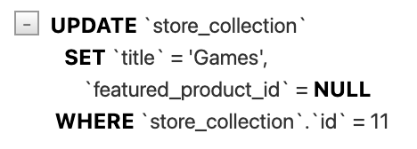

假如我们不修改标题，也即删除 `collection.title = 'Games'` 这一行代码，那么保存后查看 sql 执行情况：

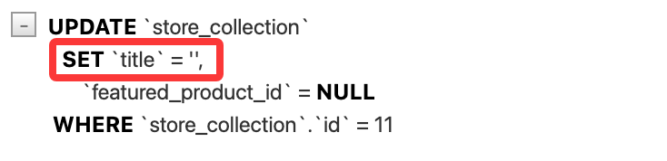

此时奇怪的事情发生了：虽然我们没有修改标题，但 Django 仍然执行了更新操作，并且将标题设置为了 NULL。在实际应用中会导致数据丢失。原理是Collection模型中的title默认值为`''`，即便我们不需要更新集合标题，如果没有显性调用`collection.title = 'Games'` 来设置标题，那么在执行 `save()` 方法时，Django 会将 title 字段的值设置为默认值 `''`，从而导致数据丢失。

因此在操作使用Django ORM进行更新时，应当把对应的数据对象获取回来，然后再进行修改并保存，这样就不会出现上述问题：

```python
collection = Collection.objects.get(pk=11)
collection.featured_product = None
collection.save()
```

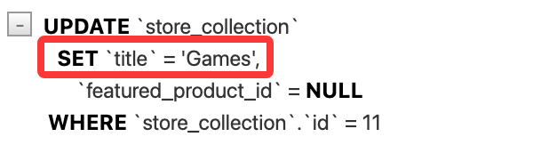

这种方式比起之前的方式多了一次查询，但可以避免数据丢失的问题。

> 注意：请不要在没出现性能问题时，就考虑优化，进而使用 Collection(pk=11) 而不是 Collection.objects.get(pk=11) 这种方式来更新对象，这样可能会导致数据丢失。

那么如果我们想要节省一次查询，且又不想冒数据丢失的风险，可以使用 `update()` 方法来直接更新数据库中的记录，例如：

```python
Collection.objects.update(featured_product=None)
```

此时会更新所有集合对象的 featured_product 字段为 None，如果只想更新特定的集合对象，可以使用筛选条件，例如：

```python
Collection.objects.filter(pk=11).update(featured_product=None)
```

保存并查看 sql 执行情况：

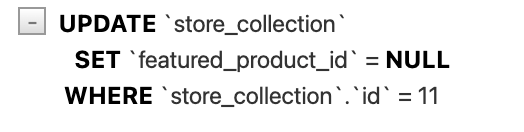

## 删除对象

我们可以删除查询集中的一个或者多个对象，假设我们要删除某个集合对象，可以使用 `delete()` 方法：

```python
collection = Collection(pk=11)
collection.delete()
```

删除多个对象时，需要获取一个查询集，然后调用 `delete()` 方法，例如删除所有集合对象：

```python
Collection.objects.filter(id__gt=5).delete()
```

## 事务

有的时候我们需要对数据库进行一系列操作，并且希望这些操作要么全部成功，要么全部失败，这时就需要使用数据库事务。Django 提供了一个 `transaction` 模块来帮助我们管理数据库事务。我们先创建一个订单对象：

```python
order = Order()
order.customer_id = 1
order.save()

item = OrderItem()
item.order = order
item.product_id = 1
item.quantity = 1
item.unit_price = 10
item.save()
```

假设在这一系列操作过程中出现了异常，此时部分操作可能已经操作成功，但是整个数据库处于不一致的状态。例如订单对象创建成功，但是没有任何订单项。为了避免这种情况，我们需要使用事务：

```python
from django.db import transaction

@transaction.atomic()
def say_hello(request):
    order = Order()
    order.customer_id = 1
    order.save()

    item = OrderItem()
    item.order = order
    item.product_id = 1
    item.quantity = 1
    item.unit_price = 10
    item.save()

    return render(request, 'hello.html', {'name': 'Today Red'})
```

有时候可能只需要一部分操作在事务中执行，可以使用 `with` 语句来管理事务，例如：

```python
from django.db import transaction

def say_hello(request):
    # ... 其他操作
    with transaction.atomic():
        order = Order()
        order.customer_id = 1
        order.save()

        item = OrderItem()
        item.order = order
        item.product_id = 1
        item.quantity = 1
        item.unit_price = 10
        item.save()

    return render(request, 'hello.html', {'name': 'Today Red'})
```

保存并刷新。此时打开数据库查询 `store_order` 和 `store_orderitem` 表，可以看到订单对象已经成功创建了：


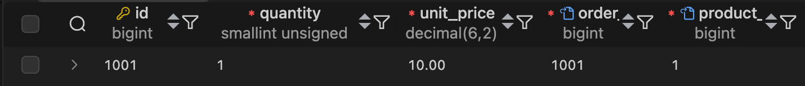

假如代码中出现了异常，例如把订单项的产品id设置为一个不存在的值：

```python
from django.db import transaction

def say_hello(request):
    # ... 其他操作
    with transaction.atomic():
        order = Order()
        order.customer_id = 1
        order.save()

        item = OrderItem()
        item.order = order
        # git-delete-start
        item.product_id = 1
        # git-delete-end
        # git-add-start
        item.product_id = -1  # 不存在的产品ID
        # git-add-end
        item.quantity = 1
        item.unit_price = 10
        item.save()

    return render(request, 'hello.html', {'name': 'Today Red'})
```

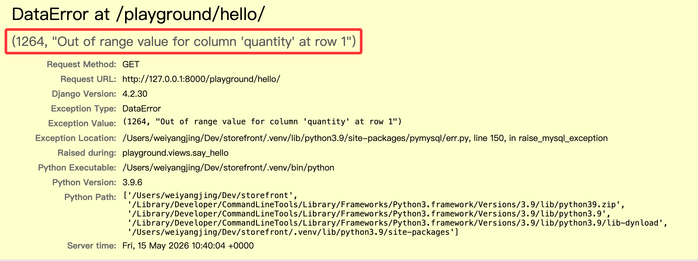

此时打开数据库查询 `store_order` 和 `store_orderitem` 表，没有心的订单对象和订单项对象被创建。

## 视频参考

- [Sorting](https://www.bilibili.com/video/BV1eX4y1f7Pz/?p=26)
- [Limiting Results](https://www.bilibili.com/video/BV1eX4y1f7Pz/?p=27)
- [Selecting Fields to Query](https://www.bilibili.com/video/BV1eX4y1f7Pz/?p=28)
- [Deferring Fields](https://www.bilibili.com/video/BV1eX4y1f7Pz/?p=29)
- [Selecting Related Objects](https://www.bilibili.com/video/BV1eX4y1f7Pz/?p=30)
- [Aggregating Objects](https://www.bilibili.com/video/BV1eX4y1f7Pz/?p=31)
- [Annotating Objects](https://www.bilibili.com/video/BV1eX4y1f7Pz/?p=32)
- [Calling Database Functions](https://www.bilibili.com/video/BV1eX4y1f7Pz/?p=33)
- [Grouping Data](https://www.bilibili.com/video/BV1eX4y1f7Pz/?p=34)
- [Working with Expression Wrappers](https://www.bilibili.com/video/BV1eX4y1f7Pz/?p=35)
- [Querying Generic Relationships](https://www.bilibili.com/video/BV1eX4y1f7Pz/?p=36)
- [Customer Managers](https://www.bilibili.com/video/BV1eX4y1f7Pz/?p=37)
- [Understanding Queryset Cache](https://www.bilibili.com/video/BV1eX4y1f7Pz/?p=38)
- [Creating Objects](https://www.bilibili.com/video/BV1eX4y1f7Pz/?p=39)
- [Updating Objects](https://www.bilibili.com/video/BV1eX4y1f7Pz/?p=40)
- [Deleting Objects](https://www.bilibili.com/video/BV1eX4y1f7Pz/?p=41)
- [Transactions](https://www.bilibili.com/video/BV1eX4y1f7Pz/?p=42)