# ORM 聚合与表达式

## 聚合

假设需要对产品进行计算，修改 `playground/views.py` 代码如下：

```python
from django.shortcuts import render
# git-add-start
from django.db.models import Count, Min, Max, Avg, Sum
# git-add-end
from store.models import Product

def say_hello(request): 
    result  = Product.objects.aggregate(Count('id'))
    
    # git-delete-start
    return render(request, 'hello.html', {'name': 'Today Red', 'products': list(queryset)})
    # git-delete-end
    # git-add-start
    return render(request, 'hello.html', {'name': 'Today Red', 'result': list(result)})
    # git-add-end
```

修改 `playground/templates/hello.html` 代码如下：

```html
<html>
    <body>
        
        <h1>Hello {{ name }}</h1>
        
        <h1>Hello, World</h1>
        
        // git-delete-start
        <ul>
            
            <li>{{ product.placed_at }} - {{ product.payment_status }}</li>
            
        </ul>
        // git-delete-end
        // git-add-start
        {{ result }}
        // git-delete-end
    </body>
</html>
```

保存并刷新网页：

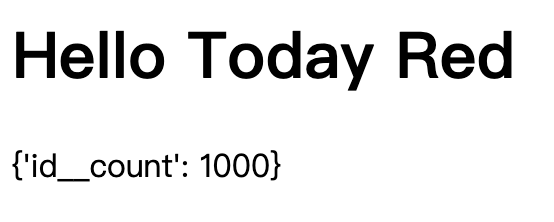

我们可以修改键名：

```python
result  = Product.objects.aggregate(count=Count('id'))
```

保存并刷新网页：

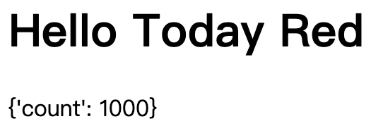

除此之外我们还可以进行其他的聚合计算，例如：

```python
result  = Product.objects.aggregate(count=Count('id'), min_price=Min('unit_price'))
```

保存并刷新网页：

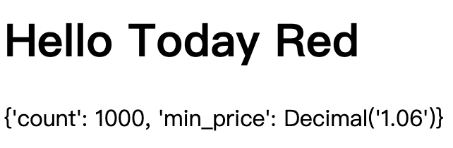

可以看到 `min_price` 是具有值的十进制对象。

`aggregate()` 方法返回一个字典，并且可以在任何有查询集的地方调用。因此我们可以在筛选后的查询集上调用 `aggregate()` 方法来计算满足特定条件的对象的聚合值，例如：

```python
result  = Product.objects.filter(unit_price__gt=20).aggregate(count=Count('id'), min_price=Min('unit_price'))
```

## 注释

有时候我们希望在查询集中添加一些注释来帮助调试或者记录一些额外的信息，Django 提供了 `annotate()` 方法来实现这个功能。例如我们想要在查询集中添加一个注释字段来计算每个产品的订单数量：

```python
queryset = Customer.objects.annotate(is_new=True)
```

保存并刷新：

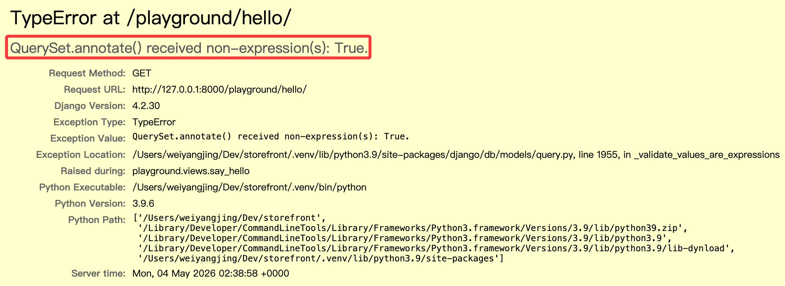

此时提示报错， `annotate()` 接受了非表达式类型的参数 `is_new`。

Django 中提供了一个表达式基类 `Expression`，该类派生出了一系列的表达式类，例如 `F()`、`Func()`、`Value()`、`Aggregate()` 等等，这些表达式类可以用来构建复杂的查询和注释。

也就是说我们不能直接传递布尔值，而是需要传递一个表达式对象。我们可以使用 `Value()` 函数来将其转换为表达式：

```python
from django.db.models import Value
# highlight-next-line
queryset = Customer.objects.annotate(is_new=Value(True))
```

保存并刷新，此时没有报错，查看 sql 执行情况：

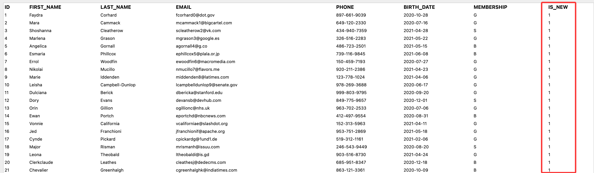

此时每个客户对象都会有一个名为 `is_new` 的新字段，并且值为 `True`。

还是以上面的例子为基础，我们可以使用 `F()` 函数来构造一个新 id 字段：

```python
from django.db.models import F
# highlight-next-line
queryset = Customer.objects.annotate(new_id=F('id'))
``` 

保存并刷新，查看 sql 执行情况：

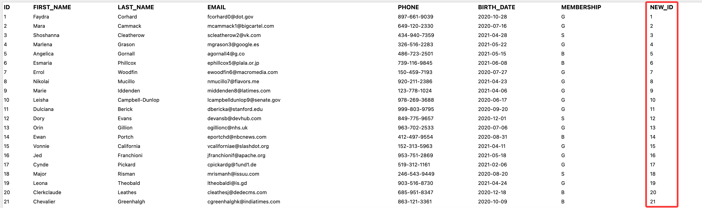

我们还可以在此基础上进行运算：

```python
from django.db.models import F
# highlight-next-line
queryset = Customer.objects.annotate(new_id=F('id') + 1000)
```

保存并刷新，查看 sql 执行情况：

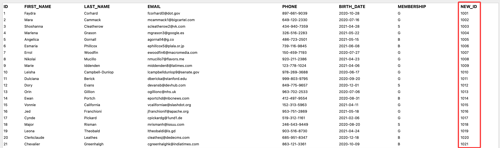

## 调用数据库函数

Django 提供了一个 `Func()` 函数来调用数据库函数，例如我们想要在查询集中添加一个注释字段来显示用户完整名称：

```python
from django.db.models import Func
# highlight-next-line
queryset = Customer.objects.annotate(full_name=Func(F('first_name'), Value(' '), F('last_name'), function='CONCAT'))
```

保存并刷新，查看 sql 执行情况：

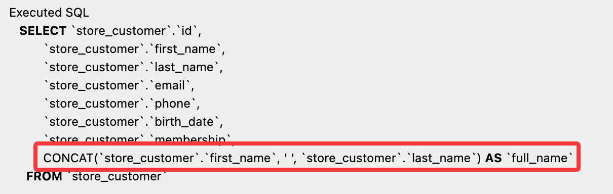

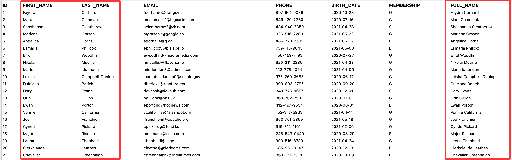

当然，由于 Django 已经内置了 `Concat()` 函数，我们也可以直接使用它来实现同样的功能：

```python
from django.db.models import Concat, Value
# highlight-next-line
queryset = Customer.objects.annotate(full_name=Concat('first_name', Value(' '), 'last_name'))
```

这里可以不使用 `F()` 函数来引用字段，因为 `Concat()` 函数已经内置了对字段的处理。但是还是需要使用 `Value()` 函数来将常量字符串转换为表达式，否则会将常量字符串识别成要拼接的字段。

> 完整的内置数据库函数列表可以参考：[Database Functions](https://docs.djangoproject.com/en/6.0/ref/models/database-functions/)。这里显示的函数是数据库通用函数，而每个数据库引擎会有特定的函数，需要使用 `Func()` 函数来调用。

## 数据分组

假设我们想要查看每个客户的订单数量，可以使用 `annotate()` 方法来实现：

```python
from django.db.models import Count
# highlight-next-line
queryset = Customer.objects.annotate(order_count=Count('order'))
```

虽然在 Order 模型中有一个外键指向 Customer 模型，Django 会自动为我们创建一个反向关系字段，默认命名为 `order_set`，但是这里需要使用 `order` 来引用这个关系。（具体原因未知，仅作使用提示）

保存后刷新，查看 sql 执行情况：

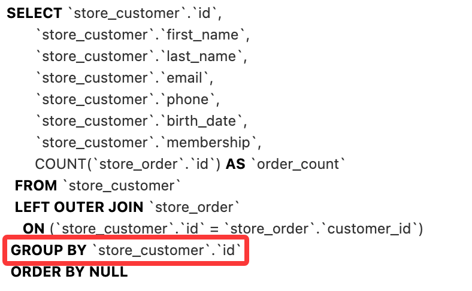

查看结果：

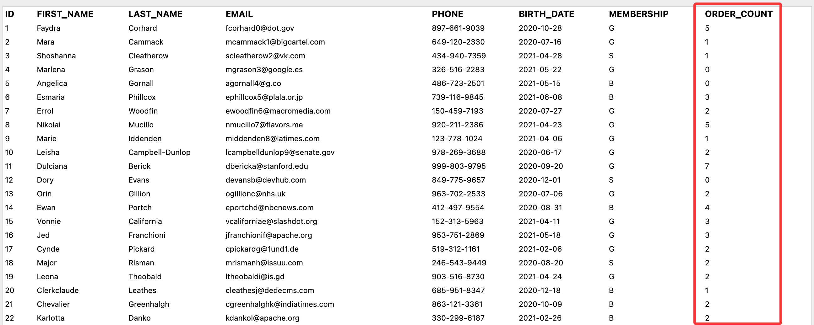

## 表达式装饰器

目前为止我们学习了很多表达式类，例如：

- `F()`：用于引用模型字段的值，可以进行字段之间的运算。
- `Value()`：用于将常量值转换为表达式。
- `Func()`：用于调用数据库函数，可以自定义函数名称和参数。
- `Aggregate()`：用于进行聚合计算，可以自定义聚合函数名称和参数。

这里主要介绍一个非常有用的装饰器 `ExpressionWrapper`，它可以将一个表达式包装成一个新的表达式，并且可以指定新的输出类型，非常适用于构建复杂查询。

如果我们想要在查询集中添加一个注释字段来显示折扣价格，假设折扣价格是单价的 80%：

```python
queryset = Product.objects.annotate(discount_price=F('unit_price') * 0.8)
```

如果直接这样书写，保存后刷新会出现报错

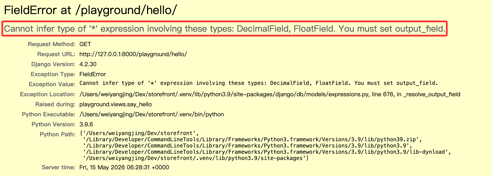

可以使用 `ExpressionWrapper` 来解决这个问题：

```python
from django.db.models import ExpressionWrapper, DecimalField
# highlight-next-line
discount_price = ExpressionWrapper(F('unit_price') * 0.8, output_field=DecimalField())
queryset = Product.objects.annotate(discount_price=discount_price)
```

这里我们选择使用 `DecimalField()` 作为输出类型，不使用 `FloatField()` 是因为浮点数会有精度问题。

保存后刷新，查看 sql 执行情况：

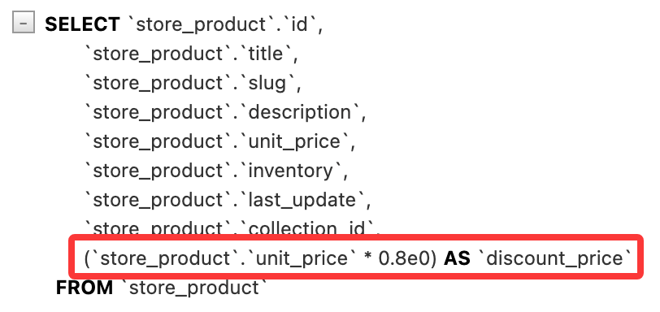

查看结果：

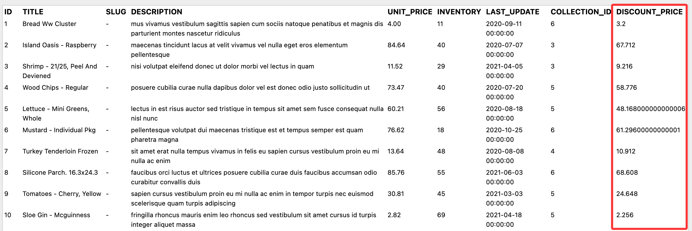

## 视频参考

- [Aggregating Objects](https://www.bilibili.com/video/BV1eX4y1f7Pz/?p=31)
- [Annotating Objects](https://www.bilibili.com/video/BV1eX4y1f7Pz/?p=32)
- [Calling Database Functions](https://www.bilibili.com/video/BV1eX4y1f7Pz/?p=33)
- [Grouping Data](https://www.bilibili.com/video/BV1eX4y1f7Pz/?p=34)
- [Working with Expression Wrappers](https://www.bilibili.com/video/BV1eX4y1f7Pz/?p=35)
