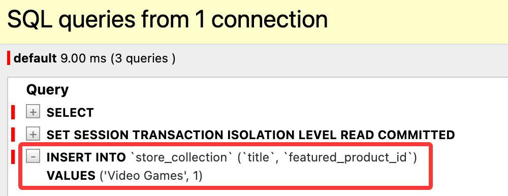
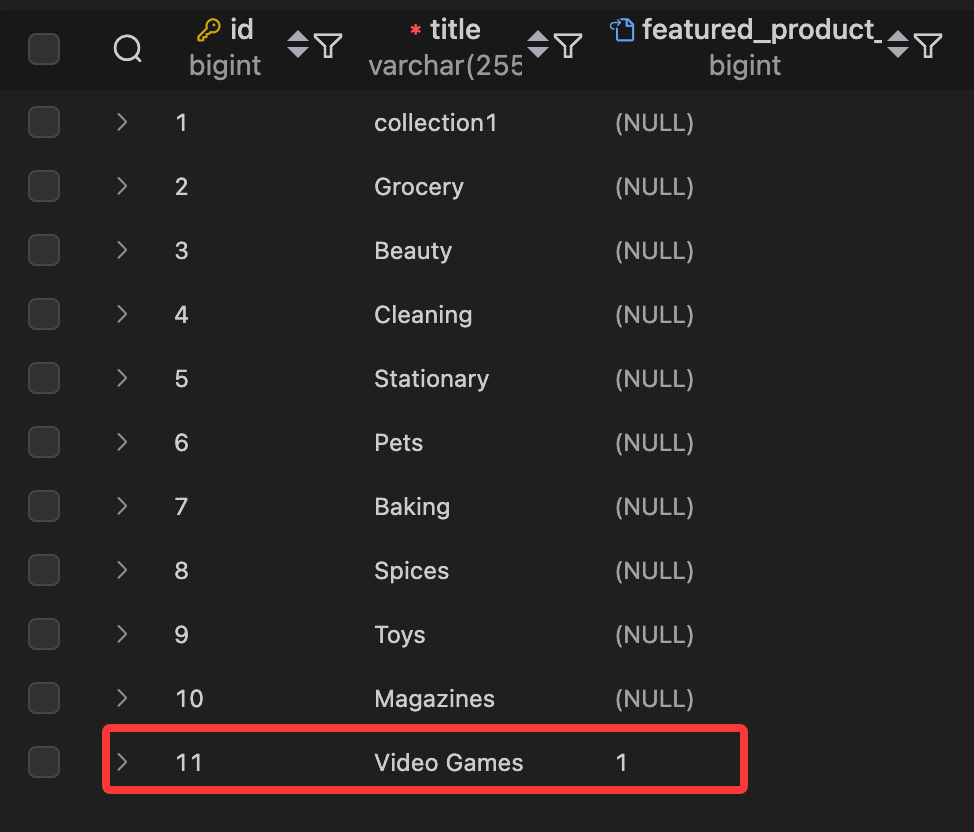
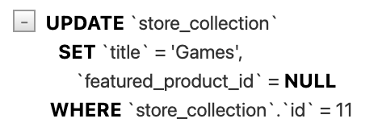
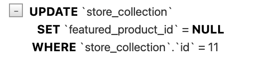
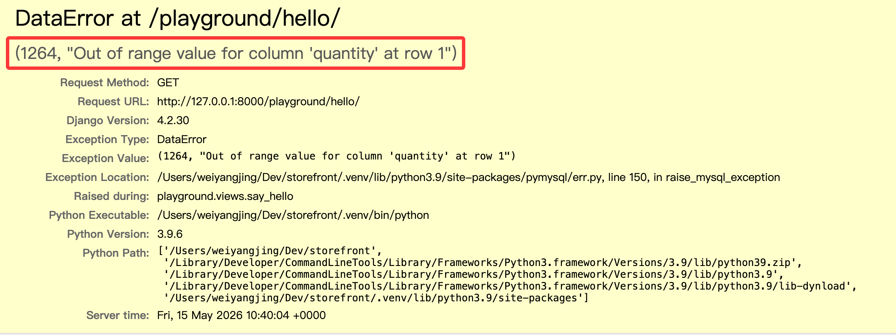

# ORM 增删改

## 创建对象

在上述的内容中，我们只对数据进行查询，但在实际开发中，我们还需要对数据进行创建等操作。Django 的 ORM 提供了非常方便的方法来实现这些功能。现在让我们创建一个集合对象，并将标题设置为 "Video Games"：

```python
collection = Collection()
collection.title = 'Video Games'
```

这里我们用多一行代码来设置集合对象标题，也可以直接在创建对象时设置标题：

```python
collection = Collection(title='Video Games')
```

只是分开写有以下好处：

- 后续如果集合模型变动时，代码更容易维护。
- 有对应的字段设置提示，减少输入错误的可能性。

集合中有一个可选字段 `featured_product`，这里有多种方法进行设置：

- `collection.featured_product = Product(pk=1)`：创建 Product 对象进行设置。
- `collection.featured_product_id = 1`：直接设置外键字段的值进行设置。

注意，由于 featured_product 是一个外键字段，因此在创建这个集合之前，必须确保数据库中已经存在一个主键为 1 的 Product 对象。

设置完成后，使用 `save()` 方法将集合对象保存到数据库中，完整创建代码如下：

```python
collection = Collection()
collection.title = 'Video Games'
collection.featured_product = Product(pk=1)
collection.save()
```

事实上，还有一种更简洁的方式来创建对象并保存到数据库中，那就是使用 `create()` 方法，以下代码等效于上面的4行代码：

```python
collection = Collection.objects.create(
    title='Video Games', 
    featured_product_id=1
)
```

这种方式简便，只是也会存在关键字问题，如果模型字段发生变动时，代码需要手动修改，无法自动更改。

此时回到传统方法，保存并查看sql执行情况：



## 更新对象

假设我们想要更新之前创建的集合对象：

- 更新标题为 "Games"
- 将 featured_product 字段设置为 None

那么首先需要获取这个集合对象，由于我们之前创建的集合对象的主键是 11



因此我们使用 `get()` 方法来获取这个对象，可以使用以下代码进行更新：

```python
collection = Collection(pk=11)
collection.title = 'Games'
collection.featured_product = None
collection.save()
```

保存并查看 sql 执行情况：



假如我们不修改标题，也即删除 `collection.title = 'Games'` 这一行代码，那么保存后查看 sql 执行情况：


此时奇怪的事情发生了：虽然我们没有修改标题，但 Django 仍然执行了更新操作，并且将标题设置为了 NULL。在实际应用中会导致数据丢失。原理是Collection模型中的title默认值为`''`，即便我们不需要更新集合标题，如果没有显性调用`collection.title = 'Games'` 来设置标题，那么在执行 `save()` 方法时，Django 会将 title 字段的值设置为默认值 `''`，从而导致数据丢失。

因此在操作使用Django ORM进行更新时，应当把对应的数据对象获取回来，然后再进行修改并保存，这样就不会出现上述问题：

```python
collection = Collection.objects.get(pk=11)
collection.featured_product = None
collection.save()
```


这种方式比起之前的方式多了一次查询，但可以避免数据丢失的问题。

> 注意：请不要在没出现性能问题时，就考虑优化，进而使用 Collection(pk=11) 而不是 Collection.objects.get(pk=11) 这种方式来更新对象，这样可能会导致数据丢失。

那么如果我们想要节省一次查询，且又不想冒数据丢失的风险，可以使用 `update()` 方法来直接更新数据库中的记录，例如：

```python
Collection.objects.update(featured_product=None)
```

此时会更新所有集合对象的 featured_product 字段为 None，如果只想更新特定的集合对象，可以使用筛选条件，例如：

```python
Collection.objects.filter(pk=11).update(featured_product=None)
```

保存并查看 sql 执行情况：



## 删除对象

我们可以删除查询集中的一个或者多个对象，假设我们要删除某个集合对象，可以使用 `delete()` 方法：

```python
collection = Collection(pk=11)
collection.delete()
```

删除多个对象时，需要获取一个查询集，然后调用 `delete()` 方法，例如删除所有集合对象：

```python
Collection.objects.filter(id__gt=5).delete()
```

## 事务

有的时候我们需要对数据库进行一系列操作，并且希望这些操作要么全部成功，要么全部失败，这时就需要使用数据库事务。Django 提供了一个 `transaction` 模块来帮助我们管理数据库事务。我们先创建一个订单对象：

```python
order = Order()
order.customer_id = 1
order.save()

item = OrderItem()
item.order = order
item.product_id = 1
item.quantity = 1
item.unit_price = 10
item.save()
```

假设在这一系列操作过程中出现了异常，此时部分操作可能已经操作成功，但是整个数据库处于不一致的状态。例如订单对象创建成功，但是没有任何订单项。为了避免这种情况，我们需要使用事务：

```python
from django.db import transaction

@transaction.atomic()
def say_hello(request):
    order = Order()
    order.customer_id = 1
    order.save()

    item = OrderItem()
    item.order = order
    item.product_id = 1
    item.quantity = 1
    item.unit_price = 10
    item.save()

    return render(request, 'hello.html', {'name': 'Today Red'})
```

有时候可能只需要一部分操作在事务中执行，可以使用 `with` 语句来管理事务，例如：

```python
from django.db import transaction

def say_hello(request):
    # ... 其他操作
    with transaction.atomic():
        order = Order()
        order.customer_id = 1
        order.save()

        item = OrderItem()
        item.order = order
        item.product_id = 1
        item.quantity = 1
        item.unit_price = 10
        item.save()

    return render(request, 'hello.html', {'name': 'Today Red'})
```

保存并刷新。此时打开数据库查询 `store_order` 和 `store_orderitem` 表，可以看到订单对象已经成功创建了：


假如代码中出现了异常，例如把订单项的产品id设置为一个不存在的值：

```python
from django.db import transaction

def say_hello(request):
    # ... 其他操作
    with transaction.atomic():
        order = Order()
        order.customer_id = 1
        order.save()

        item = OrderItem()
        item.order = order
        # git-delete-start
        item.product_id = 1
        # git-delete-end
        # git-add-start
        item.product_id = -1  # 不存在的产品ID
        # git-add-end
        item.quantity = 1
        item.unit_price = 10
        item.save()

    return render(request, 'hello.html', {'name': 'Today Red'})
```



此时打开数据库查询 `store_order` 和 `store_orderitem` 表，没有心的订单对象和订单项对象被创建。

## 视频参考

- [Creating Objects](https://www.bilibili.com/video/BV1eX4y1f7Pz/?p=39)
- [Updating Objects](https://www.bilibili.com/video/BV1eX4y1f7Pz/?p=40)
- [Deleting Objects](https://www.bilibili.com/video/BV1eX4y1f7Pz/?p=41)
- [Transactions](https://www.bilibili.com/video/BV1eX4y1f7Pz/?p=42)
