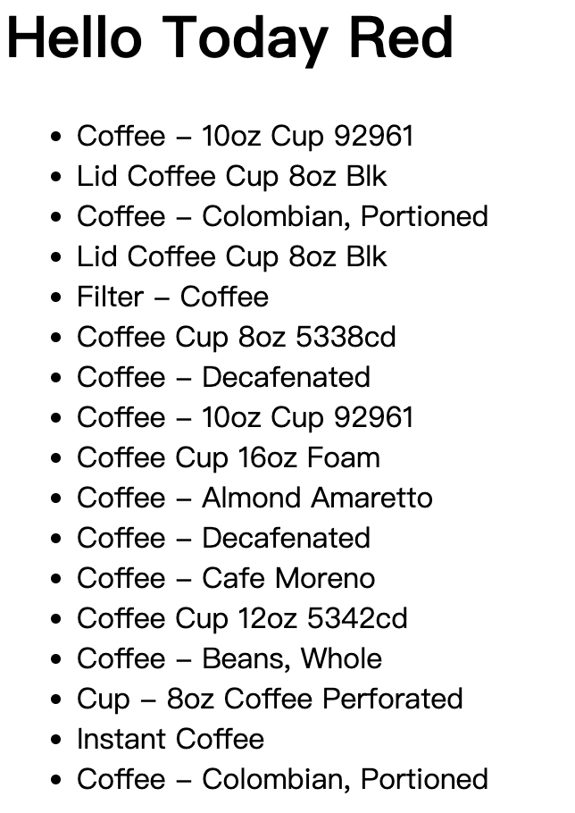
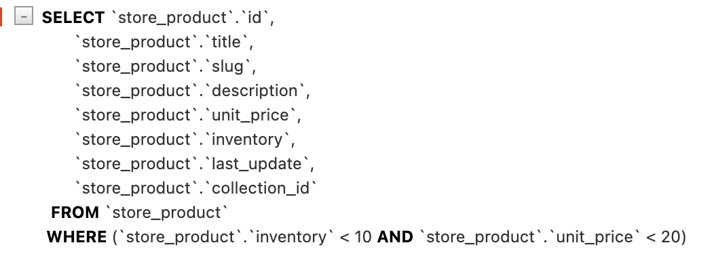

# ORM 筛选

## 筛选对象

### 字段和关系筛选

有时候我们需要根据特定条件来筛选对象，这时可以使用 `filter()` 方法。`filter()` 方法接受一个或多个条件参数，并返回一个新的查询集，包含满足条件的对象。例如现在需要找到所有单价为 20 美元的商品：

```python
queryset = Product.objects.filter(unit_price=20)
```

这非常的简单直接，但如果是要查询单价大于 20 美元的商品呢？如果直接使用 `unit_price > 20`，由于返回的是布尔值，而不是关键字传参，IDE 会提示语法错误：


Django 提供了一套特殊的查询表达式来解决这个问题，我们可以使用 `__gt` 来表示大于：

```python
queryset = Product.objects.filter(unit_price__gt=20)
```

除此之外，还有其他常用的查询表达式，例如：
- `__lt`：小于
- `__gte`：大于等于
- `__lte`：小于等于

这里再介绍一个比较有用的查找类型：范围查找。如果我们想要查询单价在 20 到 30 美元之间的商品，可以使用 `__range`：

```python
queryset = Product.objects.filter(unit_price__range=(20, 30))
```

我们修改 `storefront/views.py` 代码如下：

```python
def say_hello(request):
    # git-delete-start
    queryset = Product.objects.filter(unit_price__gt=20)
    for product in queryset:
        print(product.title, product.unit_price)
    # git-delete-end
    # git-add-start
    queryset = Product.objects.filter(unit_price__range=(20, 30))
    # git-add-end
    return render(request, 'hello.html', {
        'name': 'Today Red',
    # git-add-start
        'products': list(queryset),
    # git-add-end
    })
```

并修改 `storefront/templates/hello.html` 代码如下：

```html
<html>
    <body>
        
        <h1>Hello {{ name }}</h1>
        
        <h1>Hello, World</h1>
        
        <ul>
            
            <li>{{ product.title }}</li>
            
        </ul>
    </body>
</html>
```

保存并刷新浏览器页面，我们就可以看到单价在 20 到 30 美元之间的商品列表了：


> 如果想要查看全部的查询表达式，可以参考 Django 官方文档：[Field lookups](https://docs.djangoproject.com/en/6.0/ref/models/querysets/#field-lookups)。

除了字段筛选，Django ORM 还能进行关系筛选。假设我们想找到第一个集合中的所有产品：

```python
queryset = Product.objects.filter(collection__id=1)
```

把关键字切换成 `collection` 加双下划线 `__` 加上字段名称 `id`，就可以通过关系 id 来筛选了。事实上，在此基础上进一步拼接查询表达式，假设我们想要查找集合 id 为 1-3 之间的所有产品：

```python
queryset = Product.objects.filter(collection__id__range=(1, 3))
```

### 字符串相关的查询表达式

下面我们来看一个字符串相关的查询表达式，假设我们想要查找标题中包含 "coffee" 的所有产品：

```python
queryset = Product.objects.filter(title__contains="coffee")
```

保存并刷新，发现没有任何的产品，因为此时的查询是区分大小写的。


如果我们想要不区分大小写，可以使用 `icontains`：

```python
queryset = Product.objects.filter(title__icontains="coffee")
```



除此之外，还有：

- `startswith`：以指定字符串开头
- `istartswith`：以指定字符串开头（不区分大小写）
- `endswith`：以指定字符串结尾
- `iendswith`：以指定字符串结尾（不区分大小写）

### 日期相关的查询表达式

假设我们想要找到所有在2021年更新的产品：

```python
queryset = Product.objects.filter(last_update__year=2021)
```

保存并刷新得到如下内容：


除此之外，还有：

- `__date`：日期
- `__month`：月份
- `__hour`：小时
- `__minute`：分钟

### 空值查询和过滤

有时候我们需要查询某个字段是否为空值，这时可以使用 `__isnull`：

```python
queryset = Product.objects.filter(description__isnull=True)
```

保存后刷新没有返回任何内容，因为所有的产品描述都不为空。

### 使用Q对象构建复杂查询

有时候我们需要构建更复杂的查询，例如查找库存少于10种的所有产品，并且单价低于20美元。我们可以直接传参来构建这样的查询：

```python
queryset = Product.objects.filter(inventory__lt=10, unit_price__lt=20)
```

保存并查看执行情况：



也可以链式调用来构建这样的查询：

```python
queryset = Product.objects.filter(inventory__lt=10).filter(unit_price__lt=20)
```

这两种都是构建 `AND` 查询的方式，如果我们想要构建 `OR` 查询，可以使用 `Q` 对象：

```python
from django.shortcuts import render
# git-add-start
from django.db.models import Q
# git-add-end
from store.models import Product

def say_hello(request):
    # git-delete-start
    queryset = Product.objects.filter(inventory__lt=10).filter(unit_price__lt=20)
    # git-delete-end 
    # git-add-start
    queryset = Product.objects.filter(Q(inventory__lt=10) | Q(unit_price__lt=20))
    # git-add-end
    return render(request, 'hello.html', {'name': 'Today Red', 'products': list(queryset)})
```

`Q` 对象允许我们使用：
- `|` 来构建 `OR` 查询
- `&` 来构建 `AND` 查询
- `~` 来构建 `NOT` 查询

保存并查看执行情况：


### 使用F对象引用字段

有时候筛选数据时需要引用特定的字段，例如我们想要查找单价等于库存数量的所有产品（这里旨在对比两个字段，实际可能不会这样查找）：

```python
from django.shortcuts import render
# git-delete-start
from django.db.models import Q
# git-delete-end
# git-add-start
from django.db.models import F
# git-add-end
from store.models import Product

def say_hello(request):
    # git-delete-start
    queryset = Product.objects.filter(Q(inventory__lt=10) | Q(unit_price__lt=20))
    # git-delete-end 
    # git-add-start
    queryset = Product.objects.filter(inventory=F('unit_price'))
    # git-add-end
    return render(request, 'hello.html', {'name': 'Today Red', 'products': list(queryset)})
```

保存并查看 SQL 执行情况：


当然，F 对象也可以引用关联表中的字段。例如我们想要查找库存等于所属集合的 id 的所有产品：

```python
queryset = Product.objects.filter(inventory=F('collection__id'))
```


## 视频参考

- [Filtering Objects](https://www.bilibili.com/video/BV1eX4y1f7Pz/?buvid=YE475CE25E5DEE6C4D489CF6BE7345D3A0FA&is_story_h5=false&mid=s7e7OMeFxsQ0%2BaceMEAs0g%3D%3D&plat_id=114&share_from=ugc&share_medium=iphone&share_plat=ios&share_source=COPY&share_tag=s_i&timestamp=1776864904&unique_k=33AN7Dk&up_id=35923455&vd_source=8e3f5b7e9cf313d9ea63238d28816b11&spm_id_from=333.788.videopod.episodes&p=89#:~:text=%E3%80%90Django%20ORM%E3%80%91-,Filtering_Objects,-05%3A43)
- [Complex Lookups Using Q Objects](https://www.bilibili.com/video/BV1eX4y1f7Pz/?buvid=YE475CE25E5DEE6C4D489CF6BE7345D3A0FA&is_story_h5=false&mid=s7e7OMeFxsQ0%2BaceMEAs0g%3D%3D&plat_id=114&share_from=ugc&share_medium=iphone&share_plat=ios&share_source=COPY&share_tag=s_i&timestamp=1776864904&unique_k=33AN7Dk&up_id=35923455&vd_source=8e3f5b7e9cf313d9ea63238d28816b11&spm_id_from=333.788.videopod.episodes&p=89#:~:text=Complex_Lookups_Using_Q_Objects)
- [Referencing Fields using F Objects](https://www.bilibili.com/video/BV1eX4y1f7Pz/?buvid=YE475CE25E5DEE6C4D489CF6BE7345D3A0FA&is_story_h5=false&mid=s7e7OMeFxsQ0%2BaceMEAs0g%3D%3D&plat_id=114&share_from=ugc&share_medium=iphone&share_plat=ios&share_source=COPY&share_tag=s_i&timestamp=1776864904&unique_k=33AN7Dk&up_id=35923455&vd_source=8e3f5b7e9cf313d9ea63238d28816b11&spm_id_from=333.788.videopod.episodes&p=89#:~:text=Referencing_Fields_using_F_Objects)
