# ORM 查询

## 筛选对象

### 字段和关系筛选

有时候我们需要根据特定条件来筛选对象，这时可以使用 `filter()` 方法。`filter()` 方法接受一个或多个条件参数，并返回一个新的查询集，包含满足条件的对象。例如现在需要找到所有单价为 20 美元的商品：

```python
queryset = Product.objects.filter(unit_price=20)
```

这非常的简单直接，但如果是要查询单价大于 20 美元的商品呢？如果直接使用 `unit_price > 20`，由于返回的是布尔值，而不是关键字传参，IDE 会提示语法错误：

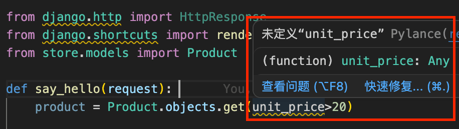

Django 提供了一套特殊的查询表达式来解决这个问题，我们可以使用 `__gt` 来表示大于：

```python
queryset = Product.objects.filter(unit_price__gt=20)
```

除此之外，还有其他常用的查询表达式，例如：
- `__lt`：小于
- `__gte`：大于等于
- `__lte`：小于等于

这里再介绍一个比较有用的查找类型：范围查找。如果我们想要查询单价在 20 到 30 美元之间的商品，可以使用 `__range`：

```python
queryset = Product.objects.filter(unit_price__range=(20, 30))
```

我们修改 `storefront/views.py` 代码如下：

```python
def say_hello(request):
    # git-delete-start
    queryset = Product.objects.filter(unit_price__gt=20)
    for product in queryset:
        print(product.title, product.unit_price)
    # git-delete-end
    # git-add-start
    queryset = Product.objects.filter(unit_price__range=(20, 30))
    # git-add-end
    return render(request, 'hello.html', {
        'name': 'Today Red',
    # git-add-start
        'products': list(queryset),
    # git-add-end
    })
```

并修改 `storefront/templates/hello.html` 代码如下：

```html
<html>
    <body>
        
        <h1>Hello {{ name }}</h1>
        
        <h1>Hello, World</h1>
        
        <ul>
            
            <li>{{ product.title }}</li>
            
        </ul>
    </body>
</html>
```

保存并刷新浏览器页面，我们就可以看到单价在 20 到 30 美元之间的商品列表了：

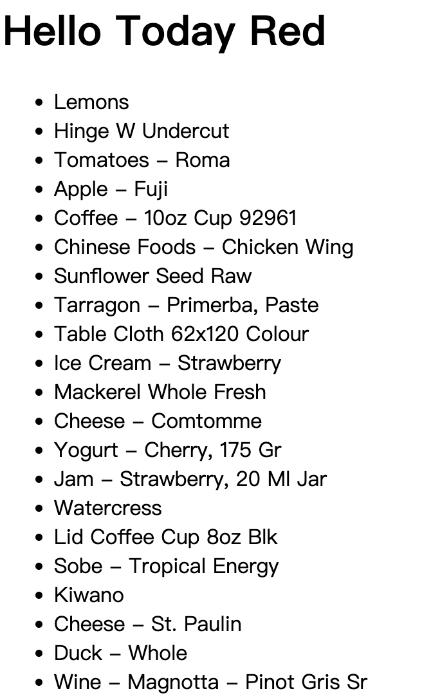

> 如果想要查看全部的查询表达式，可以参考 Django 官方文档：[Field lookups](https://docs.djangoproject.com/en/6.0/ref/models/querysets/#field-lookups)。

除了字段筛选，Django ORM 还能进行关系筛选。假设我们想找到第一个集合中的所有产品：

```python
queryset = Product.objects.filter(collection__id=1)
```

把关键字切换成 `collection` 加双下划线 `__` 加上字段名称 `id`，就可以通过关系 id 来筛选了。事实上，在此基础上进一步拼接查询表达式，假设我们想要查找集合 id 为 1-3 之间的所有产品：

```python
queryset = Product.objects.filter(collection__id__range=(1, 3))
```

### 字符串相关的查询表达式

下面我们来看一个字符串相关的查询表达式，假设我们想要查找标题中包含 "coffee" 的所有产品：

```python
queryset = Product.objects.filter(title__contains="coffee")
```

保存并刷新，发现没有任何的产品，因为此时的查询是区分大小写的。


如果我们想要不区分大小写，可以使用 `icontains`：

```python
queryset = Product.objects.filter(title__icontains="coffee")
```

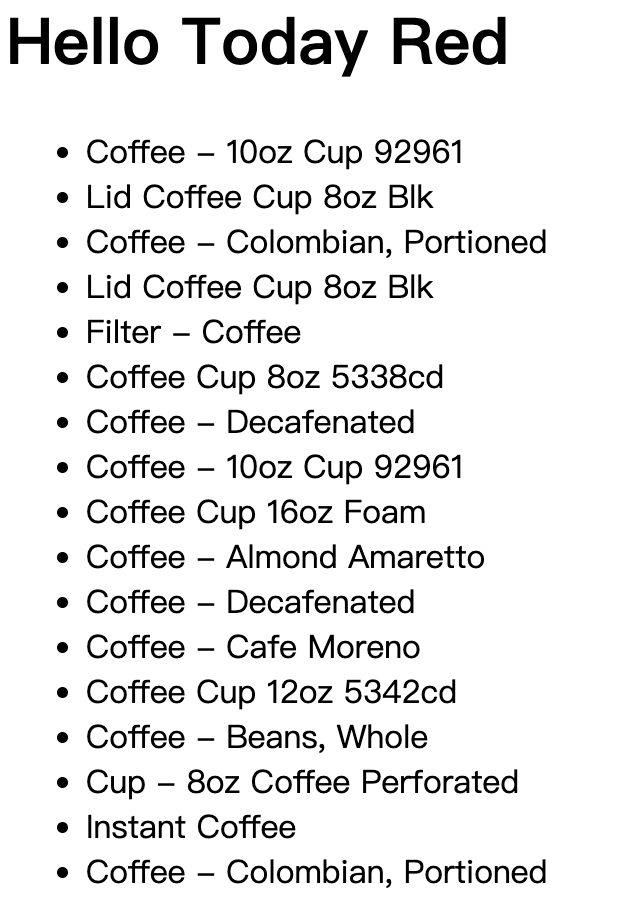

除此之外，还有：

- `startswith`：以指定字符串开头
- `istartswith`：以指定字符串开头（不区分大小写）
- `endswith`：以指定字符串结尾
- `iendswith`：以指定字符串结尾（不区分大小写）

### 日期相关的查询表达式

假设我们想要找到所有在2021年更新的产品：

```python
queryset = Product.objects.filter(last_update__year=2021)
```

保存并刷新得到如下内容：

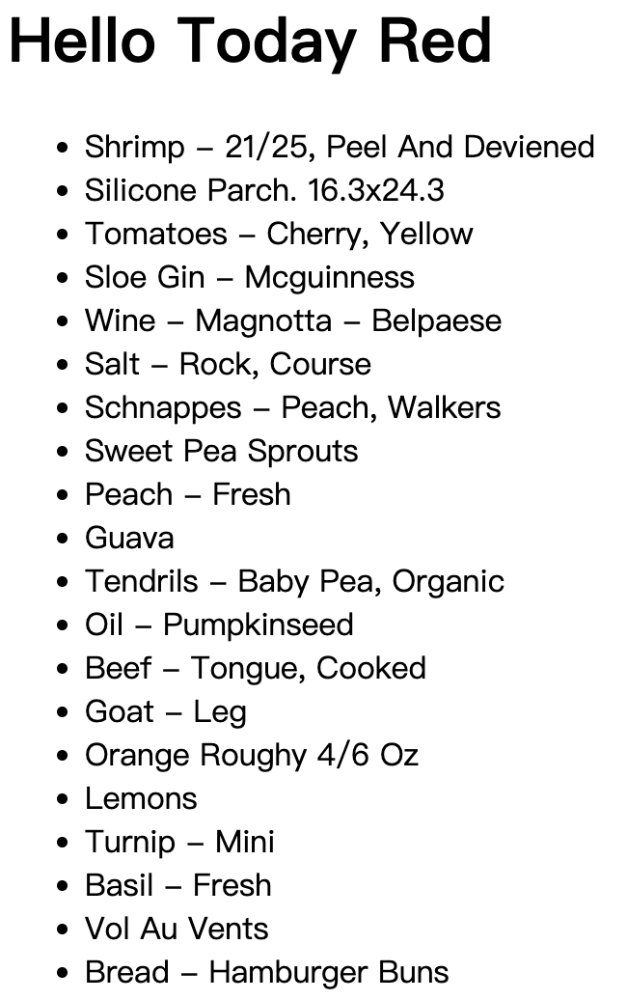

除此之外，还有：

- `__date`：日期
- `__month`：月份
- `__hour`：小时
- `__minute`：分钟

### 空值查询和过滤

有时候我们需要查询某个字段是否为空值，这时可以使用 `__isnull`：

```python
queryset = Product.objects.filter(description__isnull=True)
```

保存后刷新没有返回任何内容，因为所有的产品描述都不为空。

## 使用Q对象构建复杂查询

有时候我们需要构建更复杂的查询，例如查找库存少于10种的所有产品，并且单价低于20美元。我们可以直接传参来构建这样的查询：

```python
queryset = Product.objects.filter(inventory__lt=10, unit_price__lt=20)
```

保存并查看执行情况：

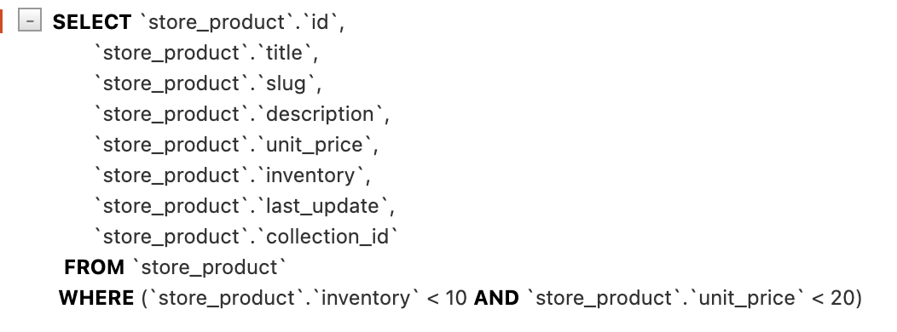

也可以链式调用来构建这样的查询：

```python
queryset = Product.objects.filter(inventory__lt=10).filter(unit_price__lt=20)
```

这两种都是构建 `AND` 查询的方式，如果我们想要构建 `OR` 查询，可以使用 `Q` 对象：

```python
from django.shortcuts import render
# git-add-start
from django.db.models import Q
# git-add-end
from store.models import Product

def say_hello(request):
    # git-delete-start
    queryset = Product.objects.filter(inventory__lt=10).filter(unit_price__lt=20)
    # git-delete-end 
    # git-add-start
    queryset = Product.objects.filter(Q(inventory__lt=10) | Q(unit_price__lt=20))
    # git-add-end
    return render(request, 'hello.html', {'name': 'Today Red', 'products': list(queryset)})
```

`Q` 对象允许我们使用：
- `|` 来构建 `OR` 查询
- `&` 来构建 `AND` 查询
- `~` 来构建 `NOT` 查询

保存并查看执行情况：

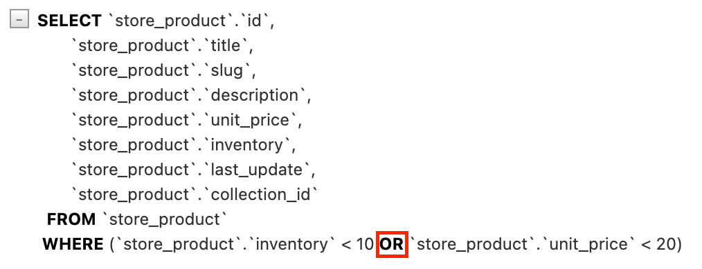

## 使用F对象引用字段

有时候筛选数据时需要引用特定的字段，例如我们想要查找单价等于库存数量的所有产品（这里旨在对比两个字段，实际可能不会这样查找）：

```python
from django.shortcuts import render
# git-delete-start
from django.db.models import Q
# git-delete-end
# git-add-start
from django.db.models import F
# git-add-end
from store.models import Product

def say_hello(request):
    # git-delete-start
    queryset = Product.objects.filter(Q(inventory__lt=10) | Q(unit_price__lt=20))
    # git-delete-end 
    # git-add-start
    queryset = Product.objects.filter(inventory=F('unit_price'))
    # git-add-end
    return render(request, 'hello.html', {'name': 'Today Red', 'products': list(queryset)})
```

保存并查看 SQL 执行情况：

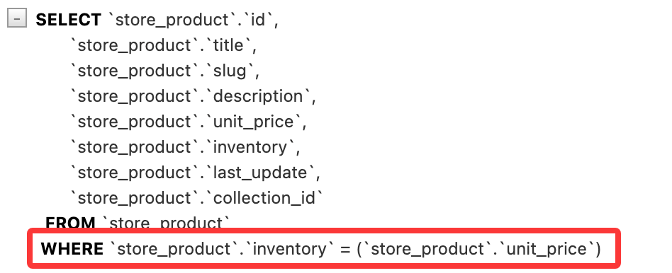

当然，F 对象也可以引用关联表中的字段。例如我们想要查找库存等于所属集合的 id 的所有产品：

```python
queryset = Product.objects.filter(inventory=F('collection__id'))
```

## 数据排序

数据模型管理器中其实有一个非常有用的方法叫做 `order_by()`，它可以用来对查询结果进行排序。例如我们想要按照产品标题来排序：

```python
queryset = Product.objects.order_by('title')
```

保存并刷新，得到如下内容：

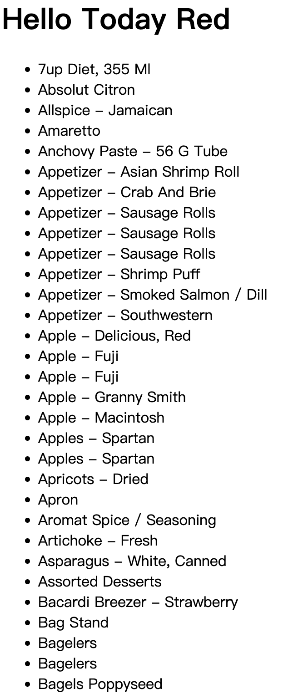

查看 SQL 执行情况：

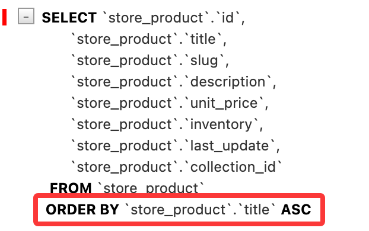

如果我们想要降序排序，可以在字段名前加上 `-`：

```python
queryset = Product.objects.order_by('-title')
```

也可以按多个字段排序，比如在按单价升序排序，单价相同的情况下按标题降序排序：

```python
queryset = Product.objects.order_by('unit_price', '-title')
```

事实上 queryset 对象还有一个 `reverse()` 方法可以用来反转排序顺序，例如：

```python
queryset = Product.objects.order_by('unit_price', '-title').reverse()
```

也就意味着上述查询返回的是按单价降序排序，单价相同的情况下按标题升序排序的结果。

> order_by 返回的 queryset 可以做进一步处理，详情参考：[QuerySet API reference](https://docs.djangoproject.com/en/6.0/ref/models/querysets/#order-by)。

这里我们可以获取单一集合的产品，然后按单价进行排序：

```python
queryset = Product.objects.filter(collection__id=1).order_by('unit_price')
```

有时我们想在排序后只获取第一个对象：

```python
product = Product.objects.order_by('unit_price')[0]
```

也可以通过以下方式实现按升序排序并返回第一个对象：

```python
product = Product.objects.earliest('unit_price')
```

或者按降序排序并返回第一个对象：

```python
product = Product.objects.latest('unit_price')
```

## 限制结果返回

假设我们有很多数据需要返回，我们可以分页返回，每页只显示 5 个结果，可以使用切片来限制返回的结果数量：

```python
queryset = Product.objects.all()[:5]
```

保存并刷新，得到如下内容：

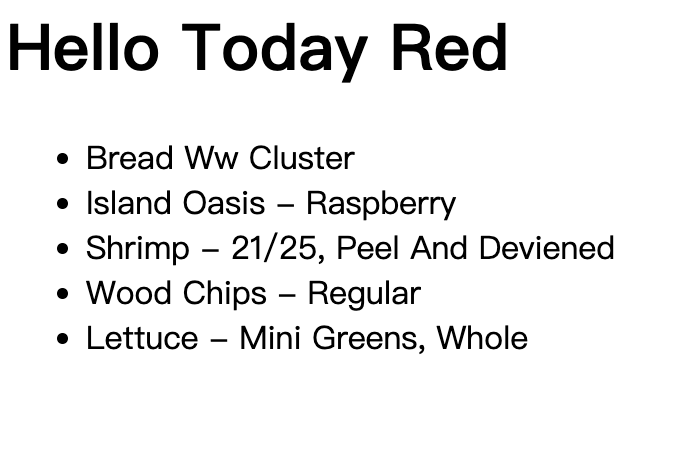

查看 SQL 执行情况：

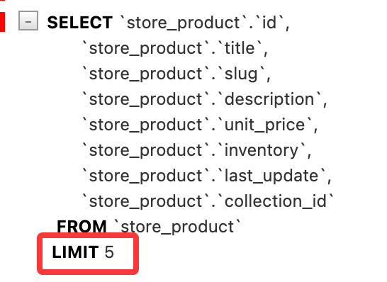

如果想要查看第二页的数据（第 6-10 个结果），可以使用：

```python
queryset = Product.objects.all()[5:10]
```

保存并刷新，查看 SQL 执行情况：

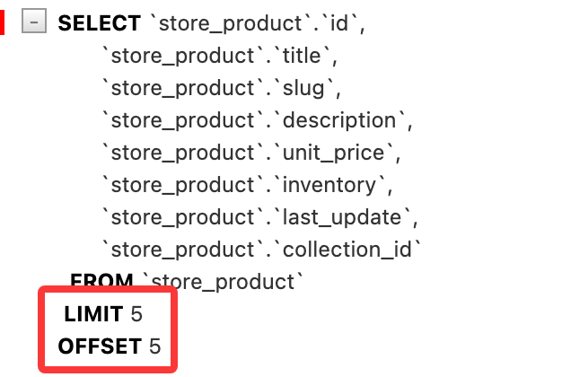

## 查询子集

从前面的例子中我们不难看出，查询默认返回全部字段数据，但是有时候我们可能只需要查询部分字段数据，这时可以使用 `values()` 方法：

```python
queryset = Product.objects.values('id', 'title')
```

保存并刷新，查看 SQL 执行情况：

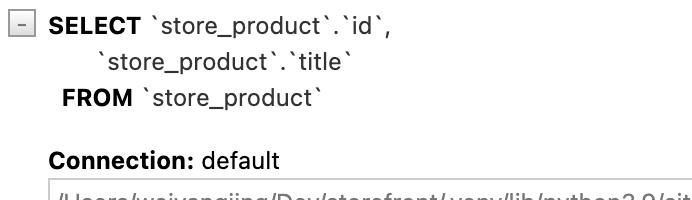

同样的，我们也可以读取关联表中的字段：

```python
queryset = Product.objects.values('id', 'title', 'collection__title')
```

保存并刷新，查看 SQL 执行情况：

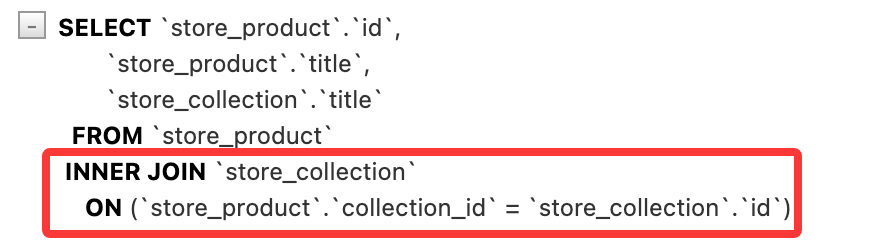

在前面我们使用筛选等方式返回的查询集是一个包含模型实例的查询集，如果我们使用 `values()` 方法返回的查询集则是一个包含**字典**的查询集，每个字典对应一个对象，字典的键是字段名称，值是字段值。修改 `playground/templates/hello.html` 代码如下：

```html
<html>
    <body>
        
        <h1>Hello {{ name }}</h1>
        
        <h1>Hello, World</h1>
        
        <ul>
            
            //git-delete-start
            <li>{{ product.title }}</li>
            //git-delete-end
            // git-add-start
            <li>{{ product }}</li>
            // git-add-end
            
        </ul>
    </body>
</html>
```

保存并刷新，得到如下内容：

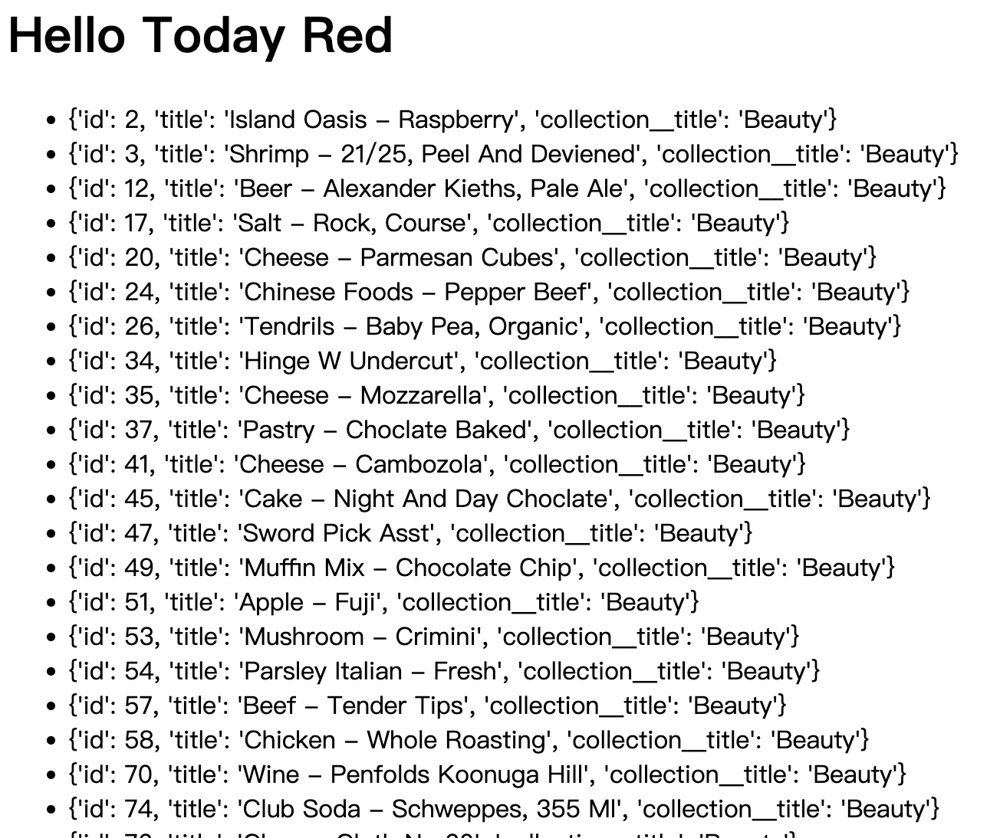

如果将 python 代码中的 `values()` 方法替换成 `values_list()` 方法：

```python
queryset = Product.objects.values_list('id', 'title', 'collection__title')
```

保存并刷新，得到如下内容：

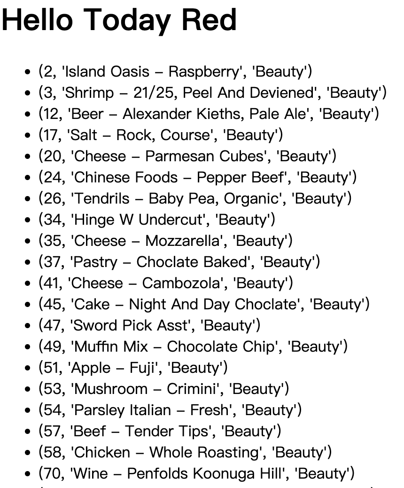

> 小练习：获取已订购的产品，并按标题进行排序

```python
from django.shortcuts import render
from store.models import Product, OrderItem

def say_hello(request): 
    queryset = Product.objects.filter(id__in=OrderItem.objects.values('product_id').distinct()).order_by('title')

    return render(request, 'hello.html', {'name': 'Today Red', 'products': list(queryset)})
```

## 延迟字段

django 中的查询集默认会返回所有字段数据，但有时候我们可能只需要查询部分字段数据，这时可以使用 `only()` 方法：

```python
queryset = Product.objects.only('id', 'title')
```

`only()` 函数与 `values()` 函数的区别在于，`only()` 返回的查询集仍然包含模型实例，但这些实例只有指定的字段被加载，其他字段是延迟加载的。当访问未加载的字段时，Django 会自动执行一个新的查询来获取该字段的数据。

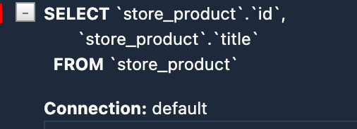

使用这个方法的时候需要注意，如果访问了未加载的字段，Django 会执行一个新的查询来获取该字段的数据，这可能会导致 N+1 问题等性能相关问题。因此，在使用 `only()` 方法时，应该确保只访问那些被指定的字段，以避免不必要的数据库查询。

修改 `playground/templates/hello.html` 代码如下：

```html showLineNumbers
<html>
    <body>
        
        <h1>Hello {{ name }}</h1>
        
        <h1>Hello, World</h1>
        
        <ul>
            
            // git-delete-start
            <li>{{ product.title }}</li>
            // git-delete-end
            // git-add-start
            <li>{{ product.title }} - {{ product.unit_price }}</li>
            // git-add-end
            
        </ul>
    </body>
</html>
```

保存并刷新，查看 SQL 执行情况：

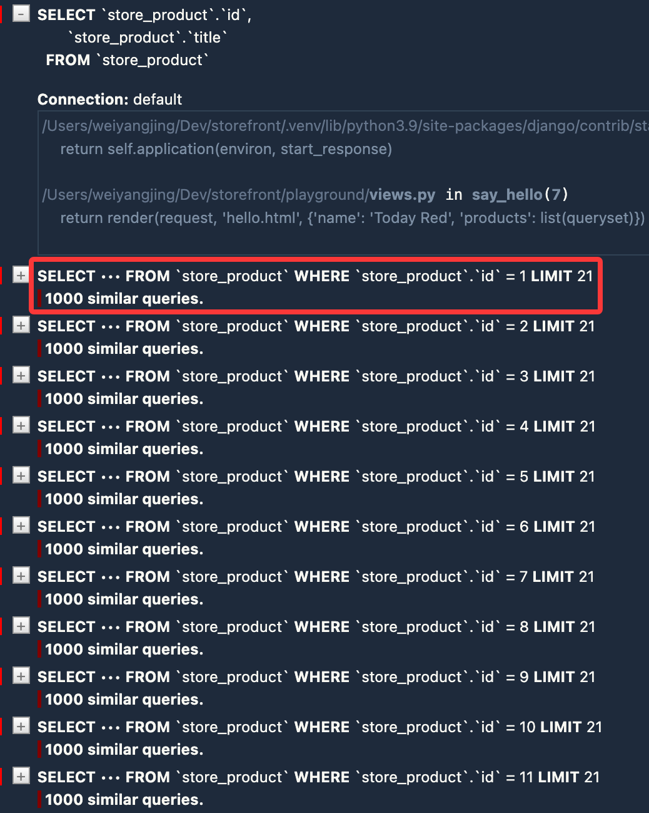

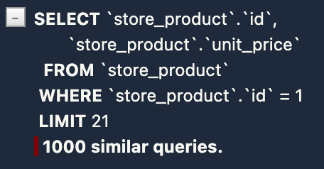

由于我们在查询集中使用了 `only()` 方法来指定只加载 `id` 和 `title` 字段，当我们在模板中额外访问 `unit_price` 字段时，Django 会自动执行新的查询来获取该字段的数据，因此产生大量的查询，进而导致耗时增加。

如果存在上述需求：也即在查询集中只加载部分字段，但又可能需要访问其他字段的数据，我们可以使用 `defer()` 方法来指定哪些字段不被加载。假设产品描述字段不需要立即加载：

```python
queryset = Product.objects.defer('description')
```

但同样需要注意的是，如果后续访问了被 `defer()` 方法指定的字段，Django 也会逐个执行新的查询来获取该字段的数据。

## 执行原生 SQL 语句

某些复杂查询可能需要冗长的 ORM 语句才能实现，或者 ORM 无法直接支持某些数据库特性，这时我们可以使用 `raw()` 方法来执行原始 SQL 语句。例如我们想要查找单价大于 20 美元的所有产品：

```python
queryset = Product.objects.raw('SELECT * FROM store_product')
```

与此前提到的 queryset 不同，使用 `raw()` 方法返回的查询集没有 `filter()`、`annotate()` 等方法。因为在这里没有意义，所有对查询集的操作都通过原始 SQL 语句来实现。

修改 `playground/views.py` 代码如下：

```python
def say_hello(request):
    queryset = Product.objects.raw('SELECT * FROM store_product')

    return render(request, 'hello.html', {'name': 'Today Red', 'result': list(queryset)})
```

保存并刷新浏览器，查看 SQL 执行情况：

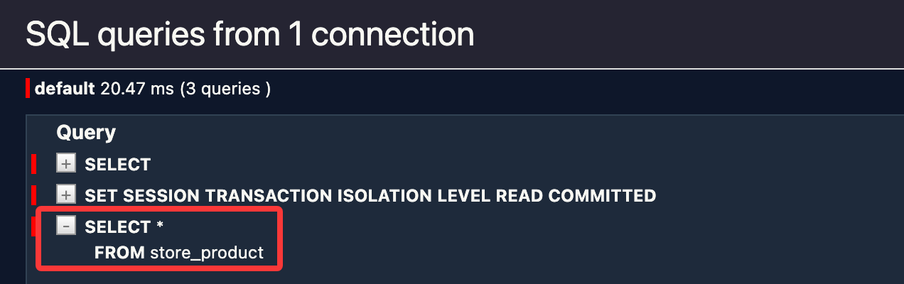

请注意，在以下情况下，考虑使用执行原生 SQL：

- ORM 执行性能不佳
- ORM 无法直接支持某些数据库特性
- ORM 语句相较于原生 SQL 过于冗长，难以维护

实际上我们甚至可以绕过模型层，直接访问数据库：

```python
from django.db import connection

def say_hello(request):
    with connection.cursor() as cursor:
        cursor.execute('SELECT * FROM store_product')
        result = cursor.fetchall()

    return render(request, 'hello.html', {'name': 'Today Red', 'result': result})
```

`cursor.execute()` 方法可以执行任何 SQL 语句，而 `cursor.fetchall()` 方法会返回所有查询结果。这里介绍另一种方法来执行存储过程：

```python
from django.db import connection

def say_hello(request):
    with connection.cursor() as cursor:
        cursor.callproc('get_products', [20])

    return render(request, 'hello.html', {'name': 'Today Red', 'result': result})
```

## 视频参考

- [Filtering Objects](https://www.bilibili.com/video/BV1eX4y1f7Pz/?p=23)
- [Complex Lookups Using Q Objects](https://www.bilibili.com/video/BV1eX4y1f7Pz/?p=24)
- [Referencing Fields using F Objects](https://www.bilibili.com/video/BV1eX4y1f7Pz/?p=25)
- [Sorting](https://www.bilibili.com/video/BV1eX4y1f7Pz/?p=26)
- [Limiting Results](https://www.bilibili.com/video/BV1eX4y1f7Pz/?p=27)
- [Selecting Fields to Query](https://www.bilibili.com/video/BV1eX4y1f7Pz/?p=28)
- [Deferring Fields](https://www.bilibili.com/video/BV1eX4y1f7Pz/?p=29)
- [Executing Custom SQL](https://www.bilibili.com/video/BV1eX4y1f7Pz/?p=43)