# ORM

## 简介

ORM（Object-Relational Mapping）是一种将关系型数据库中的数据表映射为面向对象编程语言中的类和对象的技术。它允许开发者使用面向对象的方式来操作数据库，而不需要直接编写 SQL 语句。

如果不使用 ORM，我们需要手动操作把数据库的行数据映射成对象，耗时且重复：

```python
sql = "SELECT * FROM product"
result = cursor.execute(sql)

for row in result:
    product = Product()
    product.title = row[1]
    product.price = row[2]
    # 其他字段...
```

而使用 ORM 后，我们可以直接通过类和对象来操作数据库：

```python
products = Product.objects.all()
for product in products:
    print(product.title, product.price)
```

但这并不意味着 ORM 是万能的，在某些复杂查询或性能要求较高的场景下，直接编写 SQL 可能更高效。因此，了解 ORM 的原理和使用场景非常重要。总体来说，ORM：

- 降低代码的复杂性，使其更易读和维护
- 提高开发效率，减少重复代码

> 过早的优化是万恶之源，先使用 ORM 来快速开发和迭代，等到性能成为瓶颈时再考虑直接编写 SQL 来优化特定查询。

Django 的 迁移（migration）就是很好的例子，我们执行迁移后，这些表格和字段的创建、修改等操作通过 ORM 来即刻实现，我们不需要关心底层 SQL 如何执行。实际上，迁移也是 ORM 的一部分。

也许你可能也注意到了，现有的数据模型都是通过继承 Django 的 `models.Model` 来定义的，这也是 ORM 的核心设计之一。通过继承 `models.Model`，我们可以利用 Django 提供的各种字段类型、查询接口和迁移工具来管理数据库中的数据模型。

## 管理器（manager）和查询集（queryset）

让我们回到 `playground/views.py` 中，删除无用代码并添加：

```python
from django.shortcuts import render
from django.http import HttpResponse
# git-add-start
from store.models import Product
# git-add-end

def say_hello(request):
    # git-add-start
    query_set = Product.objects.all()
    # git-add-end

    return render(request, 'hello.html', {
        'name': 'Today Red',
    })
```

每个数据模型类都会有一个名为 `objects`的属性。以 `Product` 为例，`Product.objects` 返回了一个管理器对象。管理器是数据库的接口，能让我们与数据库进行通信和操作。我们可以看到 `Product.objects` 下有很多查询和更新数据的方法，如 `all()`、`filter()`、`get()` 等等。

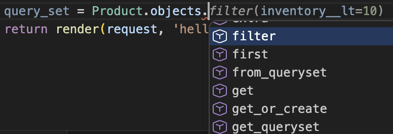

这些方法返回的结果通常是一个查询集（queryset），查询集是封装查询的对象.

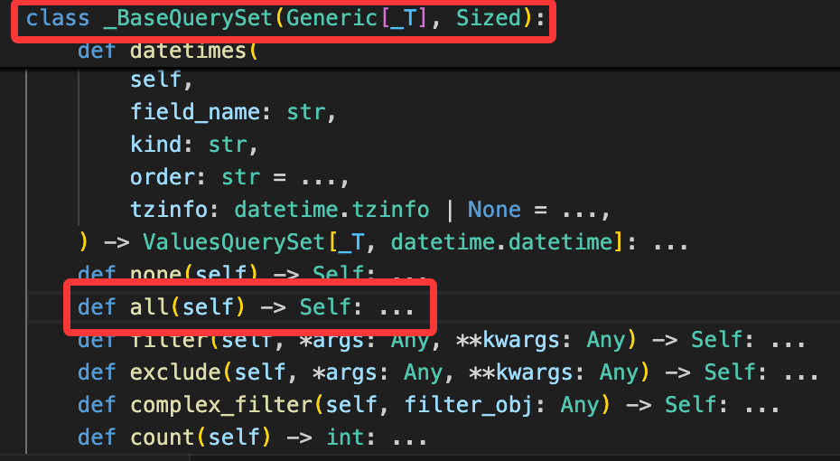

在特定条件下 Django 会计算这个查询集，此时 Django 会生成正确的 SQL 语句并发送到数据库。这里的特定条件主要是三种情况：迭代查询集、将查询集转换为列表、访问查询集的某个元素。

**迭代查询集**

更新 `playground/views.py` 中的 `say_hello` 视图函数：

```python
def say_hello(request):
    query_set = Product.objects.all()
    
    # git-add-start
    for product in query_set:
        print(product.title, product.unit_price)
    # git-add-end

    return render(request, 'hello.html', {
        'name': 'Today Red',
    })
```

我们保存并刷新浏览器页面，点击右侧的 SQL 选项卡，可以看到 SQL 语句 执行情况：

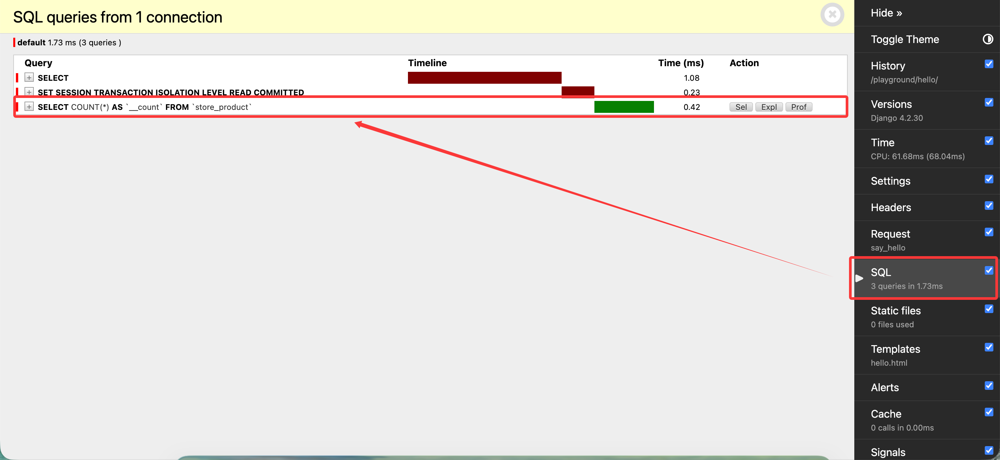

点击 `seql` 选项卡，我们可以看到 Django 生成的 SQL 语句：

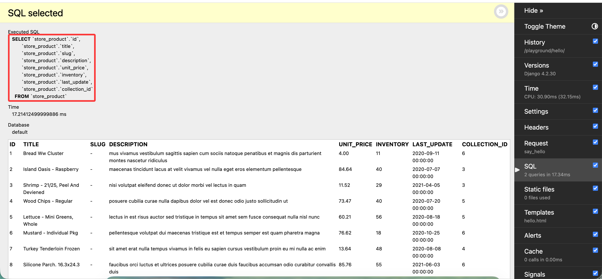

**将查询集转换为列表**

更新 `playground/views.py` 中的 `say_hello` 视图函数：

```python
def say_hello(request):
    query_set = Product.objects.all()
    
    # git-delete-start
    for product in query_set:
        print(product.title, product.unit_price)
    # git-delete-end
    # git-add-start
    list(query_set)
    # git-add-end

    return render(request, 'hello.html', {
        'name': 'Today Red',
    })
```

保存并刷新浏览器页面，点击右侧的 SQL 选项卡，同样可以看到 SQL 语句 执行情况。

**访问查询集的某个元素**

更新 `playground/views.py` 中的 `say_hello` 视图函数：

```python
def say_hello(request):
    query_set = Product.objects.all()
    
    # git-delete-start
    list(query_set)
    # git-delete-end
    # git-add-start
    print(query_set[0: 5])
    # git-add-end

    return render(request, 'hello.html', {
        'name': 'Today Red',
    })
```

保存并刷新浏览器页面，点击右侧的 SQL 选项卡，同样可以看到 SQL 语句 执行情况。

事实上我们还可以在返回的查询集上继续调用其他方法来构建更复杂的查询，例如：

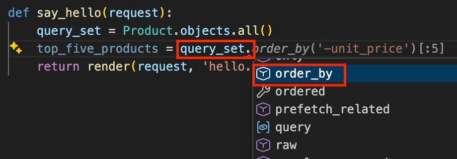

从上面的例子我们不难发现查询集是一个惰性对象，只有在特定条件下才会被计算并生成 SQL 语句发送到数据库。这种设计使得我们可以链式调用查询集的方法来构建复杂的查询，而不需要担心性能问题，因为只有在真正需要数据的时候才会执行查询。

当然，并不是所有的方法都会返回查询集，例如 `count()` 方法会直接返回一个整数，表示查询集中的对象数量，而不是返回一个新的查询集。

## 检索对象

这一节我们将讨论不同的检索对象，首先第一个是我们已经使用过的 `all()` 方法，它返回一个包含所有对象的查询集：

```python
query_set = Product.objects.all()
```

有时我们可能只需要查询集中的单一对象，这时可以使用 `get()` 方法，`get()` 方法会根据提供的条件来检索并返回单一对象，而不是查询集：

```python
def say_hello(request):
    # git-delete-start
    print(query_set[0: 5])
    # git-delete-end
    # git-add-start
    product = Product.objects.get(id=1)
    # git-add-end

    return render(request, 'hello.html', {
        'name': 'Today Red',
    })
```

> `get()` 方法可以接受一个特殊参数 `pk`，它是主键的缩写，等价于表中的主键，让我们免于记忆主键的名称。在 Product 表中等价于 `id` 字段。

保存并刷新浏览器页面，点击右侧的 SQL 选项卡，可以看到 SQL 语句 执行情况：

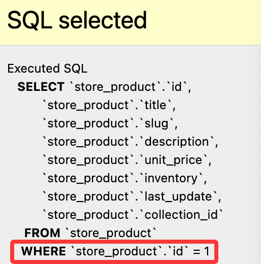

如果我们用 `get()` 方法来查询一个不存在的对象，或者查询到多个对象，Django 会抛出异常：

```python
def say_hello(request):
    # git-delete-start
    product = Product.objects.get(id=1)
    # git-delete-end
    # git-add-start
    product = Product.objects.get(id=0)
    # git-add-end
    return render(request, 'hello.html', {
        'name': 'Today Red',
    })
```

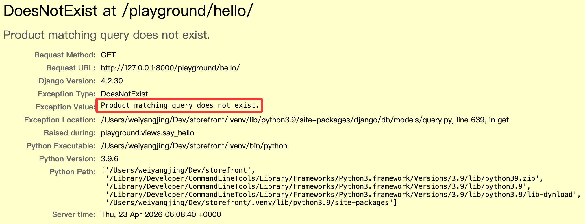

那么在代码中，我们应当使用 `try-except` 块来捕获这些异常：

```python
from django.shortcuts import render
# git-add-start
from django.core.exceptions import ObjectDoesNotExist
# git-add-end
from store.models import Product

def say_hello(request):
    # git-delete-start
    product = Product.objects.get(id=0)
    # git-delete-end
    # git-add-start
    try:
        product = Product.objects.get(id=0)
    except ObjectDoesNotExist:
        print("Product does not exist")
    # git-add-end

    return render(request, 'hello.html', {
        'name': 'Today Red',
    })
```

此时我们就可以安全地处理查询不到对象的情况了。只是这样处理非常麻烦，我们可以使用 `filter()` 方法来替代 `get()` 方法，`filter()` 方法会返回一个查询集，如果没有对象满足条件，则返回一个空的查询集：

```python
product = Product.objects.filter(id=0)
```

如果我们想要获取满足条件的第一个对象，可以使用 `first()` 方法：

```python
product = Product.objects.filter(id=0).first()
```

如果我们想要判断查询集是否为空，可以使用 `exists()` 方法：

```python
exists = Product.objects.filter(id=0).exists()
```

此时 `exists` 将会是一个布尔值，表示是否存在满足条件的对象。

## 筛选对象

### 字段和关系筛选

有时候我们需要根据特定条件来筛选对象，这时可以使用 `filter()` 方法。`filter()` 方法接受一个或多个条件参数，并返回一个新的查询集，包含满足条件的对象。例如现在需要找到所有单价为 20 美元的商品：

```python
queryset = Product.objects.filter(unit_price=20)
```

这非常的简单直接，但如果是要查询单价大于 20 美元的商品呢？如果直接使用 `unit_price > 20`，由于返回的是布尔值，而不是关键字传参，IDE 会提示语法错误：

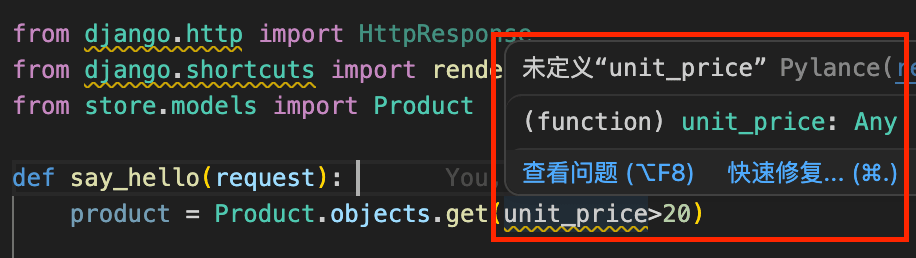

Django 提供了一套特殊的查询表达式来解决这个问题，我们可以使用 `__gt` 来表示大于：

```python
queryset = Product.objects.filter(unit_price__gt=20)
```

除此之外，还有其他常用的查询表达式，例如：
- `__lt`：小于
- `__gte`：大于等于
- `__lte`：小于等于

这里再介绍一个比较有用的查找类型：范围查找。如果我们想要查询单价在 20 到 30 美元之间的商品，可以使用 `__range`：

```python
queryset = Product.objects.filter(unit_price__range=(20, 30))
```

我们修改 `storefront/views.py` 代码如下：

```python
def say_hello(request):
    # git-delete-start
    queryset = Product.objects.filter(unit_price__gt=20)
    for product in queryset:
        print(product.title, product.unit_price)
    # git-delete-end
    # git-add-start
    queryset = Product.objects.filter(unit_price__range=(20, 30))
    # git-add-end
    return render(request, 'hello.html', {
        'name': 'Today Red',
    # git-add-start
        'products': list(queryset),
    # git-add-end
    })
```

并修改 `storefront/templates/hello.html` 代码如下：

```html
<html>
    <body>
        
        <h1>Hello {{ name }}</h1>
        
        <h1>Hello, World</h1>
        
        <ul>
            
            <li>{{ product.title }}</li>
            
        </ul>
    </body>
</html>
```

保存并刷新浏览器页面，我们就可以看到单价在 20 到 30 美元之间的商品列表了：

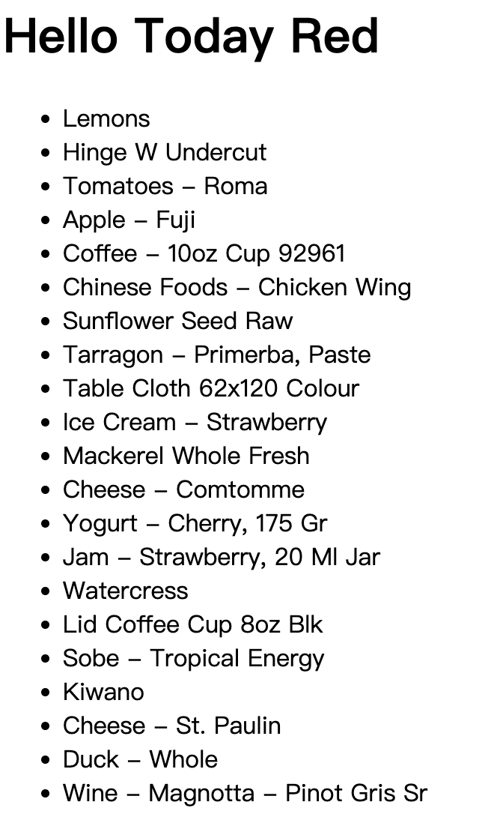

> 如果想要查看全部的查询表达式，可以参考 Django 官方文档：[Field lookups](https://docs.djangoproject.com/en/6.0/ref/models/querysets/#field-lookups)。

除了字段筛选，Django ORM 还能进行关系筛选。假设我们想找到第一个集合中的所有产品：

```python
queryset = Product.objects.filter(collection__id=1)
```

把关键字切换成 `collection` 加双下划线 `__` 加上字段名称 `id`，就可以通过关系 id 来筛选了。事实上，在此基础上进一步拼接查询表达式，假设我们想要查找集合 id 为 1-3 之间的所有产品：

```python
queryset = Product.objects.filter(collection__id__range=(1, 3))
```

### 字符串相关的查询表达式

下面我们来看一个字符串相关的查询表达式，假设我们想要查找标题中包含 "coffee" 的所有产品：

```python
queryset = Product.objects.filter(title__contains="coffee")
```

保存并刷新，发现没有任何的产品，因为此时的查询是区分大小写的。


如果我们想要不区分大小写，可以使用 `icontains`：

```python
queryset = Product.objects.filter(title__icontains="coffee")
```


除此之外，还有：

- `startswith`：以指定字符串开头
- `istartswith`：以指定字符串开头（不区分大小写）
- `endswith`：以指定字符串结尾
- `iendswith`：以指定字符串结尾（不区分大小写）

### 日期相关的查询表达式

假设我们想要找到所有在2021年更新的产品：

```python
queryset = Product.objects.filter(last_update__year=2021)
```

保存并刷新得到如下内容：

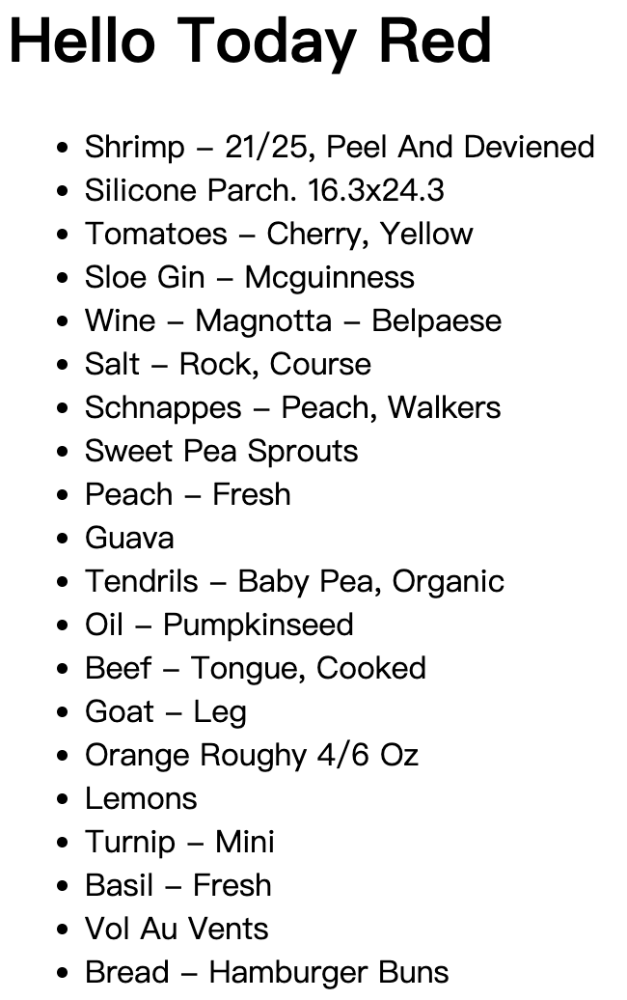

除此之外，还有：

- `__date`：日期
- `__month`：月份
- `__hour`：小时
- `__minute`：分钟

### 空值查询和过滤

有时候我们需要查询某个字段是否为空值，这时可以使用 `__isnull`：

```python
queryset = Product.objects.filter(description__isnull=True)
```

保存后刷新没有返回任何内容，因为所有的产品描述都不为空。

### 使用Q对象构建复杂查询

有时候我们需要构建更复杂的查询，例如查找库存少于10种的所有产品，并且单价低于20美元。我们可以直接传参来构建这样的查询：

```python
queryset = Product.objects.filter(inventory__lt=10, unit_price__lt=20)
```

保存并查看执行情况：


也可以链式调用来构建这样的查询：

```python
queryset = Product.objects.filter(inventory__lt=10).filter(unit_price__lt=20)
```

这两种都是构建 `AND` 查询的方式，如果我们想要构建 `OR` 查询，可以使用 `Q` 对象：

```python
from django.shortcuts import render
# git-add-start
from django.db.models import Q
# git-add-end
from store.models import Product

def say_hello(request):
    # git-delete-start
    queryset = Product.objects.filter(inventory__lt=10).filter(unit_price__lt=20)
    # git-delete-end 
    # git-add-start
    queryset = Product.objects.filter(Q(inventory__lt=10) | Q(unit_price__lt=20))
    # git-add-end
    return render(request, 'hello.html', {'name': 'Today Red', 'products': list(queryset)})
```

`Q` 对象允许我们使用：
- `|` 来构建 `OR` 查询
- `&` 来构建 `AND` 查询
- `~` 来构建 `NOT` 查询

保存并查看执行情况：

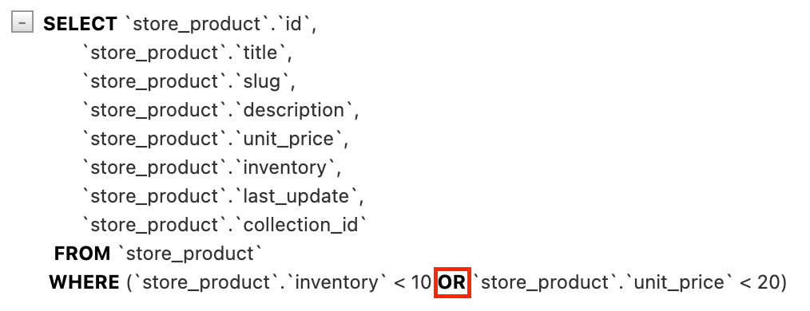

### 使用F对象引用字段

有时候筛选数据时需要引用特定的字段，例如我们想要查找单价等于库存数量的所有产品（这里旨在对比两个字段，实际可能不会这样查找）：

```python
from django.shortcuts import render
# git-delete-start
from django.db.models import Q
# git-delete-end
# git-add-start
from django.db.models import F
# git-add-end
from store.models import Product

def say_hello(request):
    # git-delete-start
    queryset = Product.objects.filter(Q(inventory__lt=10) | Q(unit_price__lt=20))
    # git-delete-end 
    # git-add-start
    queryset = Product.objects.filter(inventory=F('unit_price'))
    # git-add-end
    return render(request, 'hello.html', {'name': 'Today Red', 'products': list(queryset)})
```

保存并查看 SQL 执行情况：

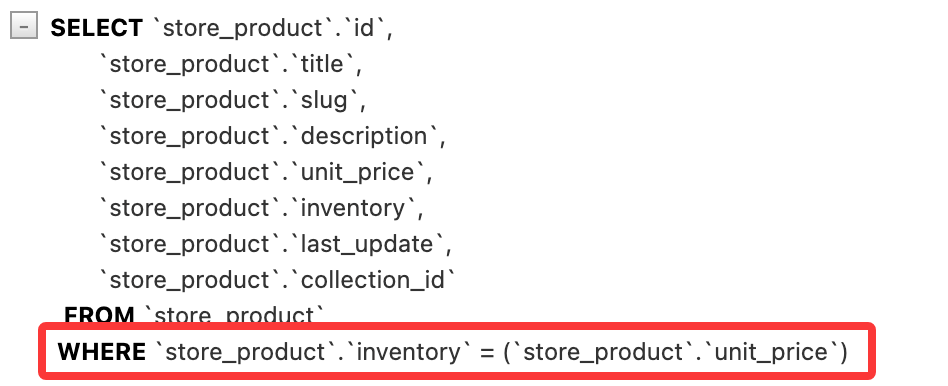

当然，F 对象也可以引用关联表中的字段。例如我们想要查找库存等于所属集合的 id 的所有产品：

```python
queryset = Product.objects.filter(inventory=F('collection__id'))
```

### 数据排序

数据模型管理器中其实有一个非常有用的方法叫做 `order_by()`，它可以用来对查询结果进行排序。例如我们想要按照产品标题来排序：

```python
queryset = Product.objects.order_by('title')
```

保存并刷新，得到如下内容：


查看 SQL 执行情况：

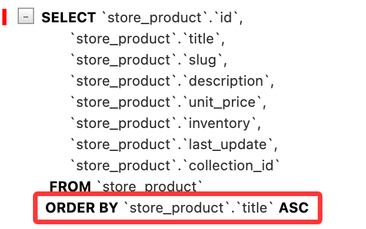

如果我们想要降序排序，可以在字段名前加上 `-`：

```python
queryset = Product.objects.order_by('-title')
```

也可以按多个字段排序，比如在按单价升序排序，单价相同的情况下按标题降序排序：

```python
queryset = Product.objects.order_by('unit_price', '-title')
```

事实上 queryset 对象还有一个 `reverse()` 方法可以用来反转排序顺序，例如：

```python
queryset = Product.objects.order_by('unit_price', '-title').reverse()
```

也就意味着上述查询返回的是按单价降序排序，单价相同的情况下按标题升序排序的结果。

> order_by 返回的 queryset 可以做进一步处理，详情参考：[QuerySet API reference](https://docs.djangoproject.com/en/6.0/ref/models/querysets/#order-by)。

这里我们可以获取单一集合的产品，然后按单价进行排序：

```python
queryset = Product.objects.filter(collection__id=1).order_by('unit_price')
```

有时我们想在排序后只获取第一个对象：

```python
product = Product.objects.order_by('unit_price')[0]
```

也可以通过以下方式实现按升序排序并返回第一个对象：

```python
product = Product.objects.earliest('unit_price')
```

或者按降序排序并返回第一个对象：

```python
product = Product.objects.latest('unit_price')
```

### 限制结果返回

假设我们有很多数据需要返回，我们可以分页返回，每页只显示 5 个结果，可以使用切片来限制返回的结果数量：

```python
queryset = Product.objects.all()[:5]
```

保存并刷新，得到如下内容：


查看 SQL 执行情况：


如果想要查看第二页的数据（第 6-10 个结果），可以使用：

```python
queryset = Product.objects.all()[5:10]
```

保存并刷新，查看 SQL 执行情况：

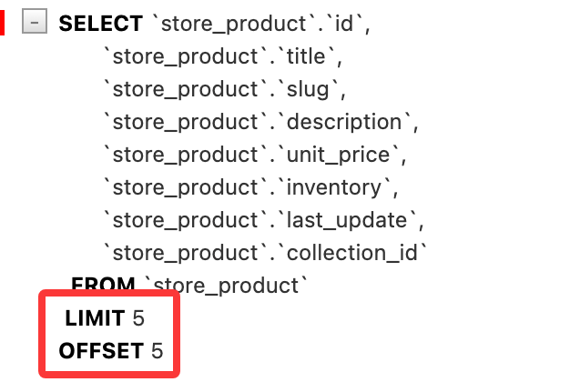

### 查询子集

从前面的例子中我们不难看出，查询默认返回全部字段数据，但是有时候我们可能只需要查询部分字段数据，这时可以使用 `values()` 方法：

```python
queryset = Product.objects.values('id', 'title')
```

保存并刷新，查看 SQL 执行情况：

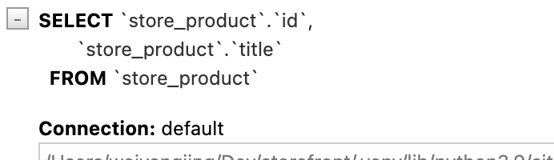

同样的，我们也可以读取关联表中的字段：

```python
queryset = Product.objects.values('id', 'title', 'collection__title')
```

保存并刷新，查看 SQL 执行情况：


在前面我们使用筛选等方式返回的查询集是一个包含模型实例的查询集，如果我们使用 `values()` 方法返回的查询集则是一个包含**字典**的查询集，每个字典对应一个对象，字典的键是字段名称，值是字段值。修改 `playground/templates/hello.html` 代码如下：

```html
<html>
    <body>
        
        <h1>Hello {{ name }}</h1>
        
        <h1>Hello, World</h1>
        
        <ul>
            
            //git-delete-start
            <li>{{ product.title }}</li>
            //git-delete-end
            // git-add-start
            <li>{{ product }}</li>
            // git-add-end
            
        </ul>
    </body>
</html>
```

保存并刷新，得到如下内容：

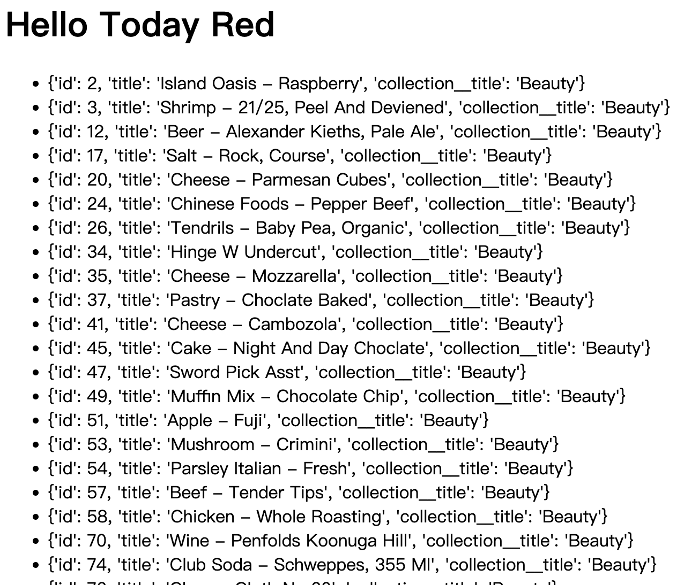

如果将 python 代码中的 `values()` 方法替换成 `values_list()` 方法：

```python
queryset = Product.objects.values_list('id', 'title', 'collection__title')
```

保存并刷新，得到如下内容：


> 小练习：获取已订购的产品，并按标题进行排序

```python
from django.shortcuts import render
from store.models import Product, OrderItem

def say_hello(request): 
    queryset = Product.objects.filter(id__in=OrderItem.objects.values('product_id').distinct()).order_by('title')

    return render(request, 'hello.html', {'name': 'Today Red', 'products': list(queryset)})
```

### 延迟字段

django 中的查询集默认会返回所有字段数据，但有时候我们可能只需要查询部分字段数据，这时可以使用 `only()` 方法：

```python
queryset = Product.objects.only('id', 'title')
```

`only()` 函数与 `values()` 函数的区别在于，`only()` 返回的查询集仍然包含模型实例，但这些实例只有指定的字段被加载，其他字段是延迟加载的。当访问未加载的字段时，Django 会自动执行一个新的查询来获取该字段的数据。

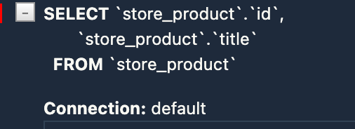

使用这个方法的时候需要注意，如果访问了未加载的字段，Django 会执行一个新的查询来获取该字段的数据，这可能会导致 N+1 问题等性能相关问题。因此，在使用 `only()` 方法时，应该确保只访问那些被指定的字段，以避免不必要的数据库查询。

修改 `playground/templates/hello.html` 代码如下：

```html showLineNumbers
<html>
    <body>
        
        <h1>Hello {{ name }}</h1>
        
        <h1>Hello, World</h1>
        
        <ul>
            
            // git-delete-start
            <li>{{ product.title }}</li>
            // git-delete-end
            // git-add-start
            <li>{{ product.title }} - {{ product.unit_price }}</li>
            // git-add-end
            
        </ul>
    </body>
</html>
```

保存并刷新，查看 SQL 执行情况：

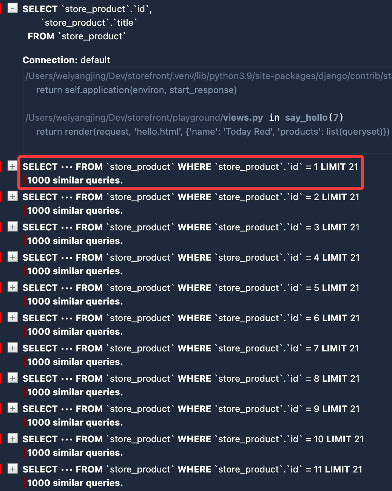


由于我们在查询集中使用了 `only()` 方法来指定只加载 `id` 和 `title` 字段，当我们在模板中额外访问 `unit_price` 字段时，Django 会自动执行新的查询来获取该字段的数据，因此产生大量的查询，进而导致耗时增加。

如果存在上述需求：也即在查询集中只加载部分字段，但又可能需要访问其他字段的数据，我们可以使用 `defer()` 方法来指定哪些字段不被加载。假设产品描述字段不需要立即加载：

```python
queryset = Product.objects.defer('description')
```

但同样需要注意的是，如果后续访问了被 `defer()` 方法指定的字段，Django 也会逐个执行新的查询来获取该字段的数据。

### 选择关联对象

有时我们需要预先加载一堆对象。修改 `playground/views.py` 代码如下：

```python
def say_hello(request):
    queryset = Product.objects.all()
    return render(request, 'hello.html', {'name': 'Today Red', 'products': list(queryset)})
```

修改 `playground/templates/hello.html` 代码如下：

```html
<html>
    <body>
        
        <h1>Hello {{ name }}</h1>
        
        <h1>Hello, World</h1>
        
        <ul>
            
            <li>{{ product.title }} - {{ product.collection.title }}</li>
            
        </ul>
    </body>
</html>
```

保存并刷新，查看 SQL 执行情况：


由于我们在模板中访问了 `product.collection.title`，Django 会为每个产品执行一个新的查询来获取其所属集合的标题，这可能会导致 N+1 查询问题。为了避免这个问题，我们可以使用 `select_related()` 方法来预加载关联对象：

```python
queryset = Product.objects.select_related('collection').all()
```

保存并刷新，查看 SQL 执行情况：


还有一种方式是使用 `prefetch_related()` 方法来预加载关联对象：

```python
queryset = Product.objects.prefetch_related('promotions').all()
```

修改 `playground/templates/hello.html` 代码如下：

```html
<html>
    <body>
        
        <h1>Hello {{ name }}</h1>
        
        <h1>Hello, World</h1>
        
        <ul>
            
            // git-delete-start
            <li>{{ product.title }} - {{ product.collection.title }}</li>
            // git-delete-end
            // git-add-start
            <li>{{ product.title }}</li>
            // git-add-end
            
        </ul>
    </body>
</html>
```

保存并刷新，查看 SQL 执行情况：

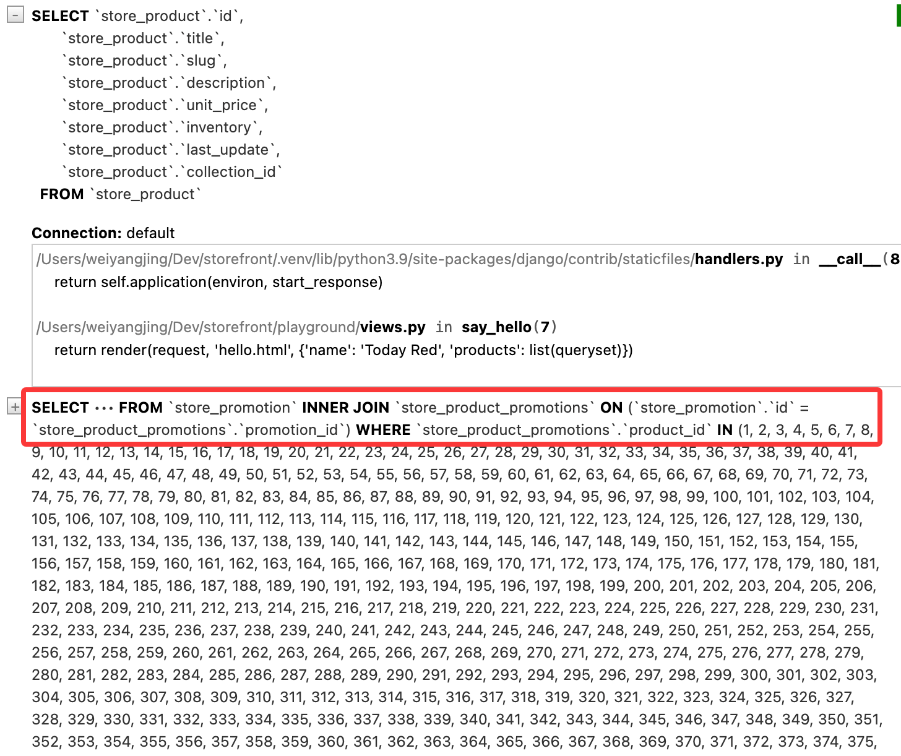

两者的区别在于，`select_related()` 使用 SQL 的 JOIN 来一次性获取相关对象的数据，而 `prefetch_related()` 则会执行两个独立的查询来获取相关对象的数据，并在 Python 代码中进行关联。`select_related()` 适用于多对一或一对一，`prefetch_related()` 适用于多对多或一对多。

如果同时需要获取一对一关系和多对多关系的数据，可以链式使用 `select_related()` 和 `prefetch_related()`，调用的先后顺序不会影响结果获取：

```python
queryset = Product.objects.select_related('collection').prefetch_related('promotions').all()
```

保存并刷新，查看 SQL 执行情况：


> 小练习：获取最近的 5 个订单和订单对应的用户，并获取对应的订单项和相关的产品数据：

```python
queryset = Order.objects.prefetch_related('orderitem_set__product').select_related('customer').order_by('-placed_at')[:5]
```

### 聚合

假设需要对产品进行计算，修改 `playground/views.py` 代码如下：

```python
from django.shortcuts import render
# git-add-start
from django.db.models import Count, Min, Max, Avg, Sum
# git-add-end
from store.models import Product

def say_hello(request): 
    result  = Product.objects.aggregate(Count('id'))
    
    # git-delete-start
    return render(request, 'hello.html', {'name': 'Today Red', 'products': list(queryset)})
    # git-delete-end
    # git-add-start
    return render(request, 'hello.html', {'name': 'Today Red', 'result': list(result)})
    # git-add-end
```

修改 `playground/templates/hello.html` 代码如下：

```html
<html>
    <body>
        
        <h1>Hello {{ name }}</h1>
        
        <h1>Hello, World</h1>
        
        // git-delete-start
        <ul>
            
            <li>{{ product.placed_at }} - {{ product.payment_status }}</li>
            
        </ul>
        // git-delete-end
        // git-add-start
        {{ result }}
        // git-delete-end
    </body>
</html>
```

保存并刷新网页：


我们可以修改键名：

```python
result  = Product.objects.aggregate(count=Count('id'))
```

保存并刷新网页：


除此之外我们还可以进行其他的聚合计算，例如：

```python
result  = Product.objects.aggregate(count=Count('id'), min_price=Min('unit_price'))
```

保存并刷新网页：

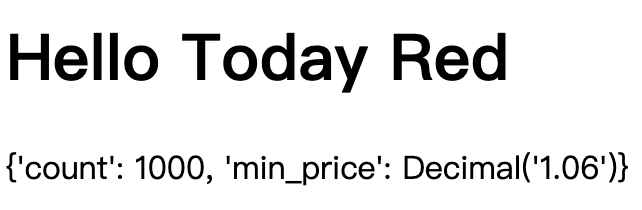

可以看到 `min_price` 是具有值的十进制对象。

`aggregate()` 方法返回一个字典，并且可以在任何有查询集的地方调用。因此我们可以在筛选后的查询集上调用 `aggregate()` 方法来计算满足特定条件的对象的聚合值，例如：

```python
result  = Product.objects.filter(unit_price__gt=20).aggregate(count=Count('id'), min_price=Min('unit_price'))
```


## 视频参考

- [Django ORM](https://www.bilibili.com/video/BV1eX4y1f7Pz/?buvid=YE475CE25E5DEE6C4D489CF6BE7345D3A0FA&is_story_h5=false&mid=s7e7OMeFxsQ0%2BaceMEAs0g%3D%3D&plat_id=114&share_from=ugc&share_medium=iphone&share_plat=ios&share_source=COPY&share_tag=s_i&timestamp=1776864904&unique_k=33AN7Dk&up_id=35923455&vd_source=8e3f5b7e9cf313d9ea63238d28816b11&spm_id_from=333.788.videopod.episodes&p=89#:~:text=%E3%80%90Django%20ORM%E3%80%91-,Django_ORM,-03%3A23)
- [Managers and QuerySets](https://www.bilibili.com/video/BV1eX4y1f7Pz/?buvid=YE475CE25E5DEE6C4D489CF6BE7345D3A0FA&is_story_h5=false&mid=s7e7OMeFxsQ0%2BaceMEAs0g%3D%3D&plat_id=114&share_from=ugc&share_medium=iphone&share_plat=ios&share_source=COPY&share_tag=s_i&timestamp=1776864904&unique_k=33AN7Dk&up_id=35923455&vd_source=8e3f5b7e9cf313d9ea63238d28816b11&spm_id_from=333.788.videopod.episodes&p=89#:~:text=Managers_and_QuerySets)
- [Retrieving Objects](https://www.bilibili.com/video/BV1eX4y1f7Pz/?buvid=YE475CE25E5DEE6C4D489CF6BE7345D3A0FA&is_story_h5=false&mid=s7e7OMeFxsQ0%2BaceMEAs0g%3D%3D&plat_id=114&share_from=ugc&share_medium=iphone&share_plat=ios&share_source=COPY&share_tag=s_i&timestamp=1776864904&unique_k=33AN7Dk&up_id=35923455&vd_source=8e3f5b7e9cf313d9ea63238d28816b11&spm_id_from=333.788.videopod.episodes&p=89#:~:text=%E3%80%90Django%20ORM%E3%80%91-,Retrieving_Objects,-05%3A02)
- [Filtering Objects](https://www.bilibili.com/video/BV1eX4y1f7Pz/?buvid=YE475CE25E5DEE6C4D489CF6BE7345D3A0FA&is_story_h5=false&mid=s7e7OMeFxsQ0%2BaceMEAs0g%3D%3D&plat_id=114&share_from=ugc&share_medium=iphone&share_plat=ios&share_source=COPY&share_tag=s_i&timestamp=1776864904&unique_k=33AN7Dk&up_id=35923455&vd_source=8e3f5b7e9cf313d9ea63238d28816b11&spm_id_from=333.788.videopod.episodes&p=89#:~:text=%E3%80%90Django%20ORM%E3%80%91-,Filtering_Objects,-05%3A43)
- [Complex Lookups Using Q Objects](https://www.bilibili.com/video/BV1eX4y1f7Pz/?buvid=YE475CE25E5DEE6C4D489CF6BE7345D3A0FA&is_story_h5=false&mid=s7e7OMeFxsQ0%2BaceMEAs0g%3D%3D&plat_id=114&share_from=ugc&share_medium=iphone&share_plat=ios&share_source=COPY&share_tag=s_i&timestamp=1776864904&unique_k=33AN7Dk&up_id=35923455&vd_source=8e3f5b7e9cf313d9ea63238d28816b11&spm_id_from=333.788.videopod.episodes&p=89#:~:text=Complex_Lookups_Using_Q_Objects)
- [Referencing Fields using F Objects](https://www.bilibili.com/video/BV1eX4y1f7Pz/?buvid=YE475CE25E5DEE6C4D489CF6BE7345D3A0FA&is_story_h5=false&mid=s7e7OMeFxsQ0%2BaceMEAs0g%3D%3D&plat_id=114&share_from=ugc&share_medium=iphone&share_plat=ios&share_source=COPY&share_tag=s_i&timestamp=1776864904&unique_k=33AN7Dk&up_id=35923455&vd_source=8e3f5b7e9cf313d9ea63238d28816b11&spm_id_from=333.788.videopod.episodes&p=89#:~:text=Referencing_Fields_using_F_Objects)
- [Sorting](https://www.bilibili.com/video/BV1eX4y1f7Pz/?buvid=YE475CE25E5DEE6C4D489CF6BE7345D3A0FA&is_story_h5=false&mid=s7e7OMeFxsQ0%2BaceMEAs0g%3D%3D&plat_id=114&share_from=ugc&share_medium=iphone&share_plat=ios&share_source=COPY&share_tag=s_i&timestamp=1776864904&unique_k=33AN7Dk&up_id=35923455&vd_source=8e3f5b7e9cf313d9ea63238d28816b11&spm_id_from=333.788.videopod.episodes&p=89#:~:text=%E3%80%90Django%20ORM%E3%80%91-,Sorting,-03%3A50)
- [Limiting Results](https://www.bilibili.com/video/BV1eX4y1f7Pz/?buvid=YE475CE25E5DEE6C4D489CF6BE7345D3A0FA&is_story_h5=false&mid=s7e7OMeFxsQ0%2BaceMEAs0g%3D%3D&plat_id=114&share_from=ugc&share_medium=iphone&share_plat=ios&share_source=COPY&share_tag=s_i&timestamp=1776864904&unique_k=33AN7Dk&up_id=35923455&vd_source=8e3f5b7e9cf313d9ea63238d28816b11&spm_id_from=333.788.videopod.episodes&p=89#:~:text=%E3%80%90Django%20ORM%E3%80%91-,Limiting_Results,-01%3A24)
- [Selecting Fields to Query](https://www.bilibili.com/video/BV1eX4y1f7Pz/?buvid=YE475CE25E5DEE6C4D489CF6BE7345D3A0FA&is_story_h5=false&mid=s7e7OMeFxsQ0%2BaceMEAs0g%3D%3D&plat_id=114&share_from=ugc&share_medium=iphone&share_plat=ios&share_source=COPY&share_tag=s_i&timestamp=1776864904&unique_k=33AN7Dk&up_id=35923455&vd_source=8e3f5b7e9cf313d9ea63238d28816b11&spm_id_from=333.788.videopod.episodes&p=89#:~:text=Selecting_Fields_to_Query)
- [Deferring Fields](https://www.bilibili.com/video/BV1eX4y1f7Pz/?buvid=YE475CE25E5DEE6C4D489CF6BE7345D3A0FA&is_story_h5=false&mid=s7e7OMeFxsQ0%2BaceMEAs0g%3D%3D&plat_id=114&share_from=ugc&share_medium=iphone&share_plat=ios&share_source=COPY&share_tag=s_i&timestamp=1776864904&unique_k=33AN7Dk&up_id=35923455&vd_source=8e3f5b7e9cf313d9ea63238d28816b11&spm_id_from=333.788.videopod.episodes&p=89#:~:text=%E3%80%90Django%20ORM%E3%80%91-,Deferring_Fields,-03%3A16)
- [Selecting Related Objects](https://www.bilibili.com/video/BV1eX4y1f7Pz?buvid=YE475CE25E5DEE6C4D489CF6BE7345D3A0FA&is_story_h5=false&mid=s7e7OMeFxsQ0%2BaceMEAs0g%3D%3D&plat_id=114&share_from=ugc&share_medium=iphone&share_plat=ios&share_source=COPY&share_tag=s_i&timestamp=1776864904&unique_k=33AN7Dk&up_id=35923455&vd_source=8e3f5b7e9cf313d9ea63238d28816b11&spm_id_from=333.788.videopod.episodes&p=31#:~:text=%E3%80%90Django%20ORM%E3%80%91-,Selecting_Related_Objects,-09%3A14)
- [Aggregating Objects](https://www.bilibili.com/video/BV1eX4y1f7Pz?buvid=YE475CE25E5DEE6C4D489CF6BE7345D3A0FA&is_story_h5=false&mid=s7e7OMeFxsQ0%2BaceMEAs0g%3D%3D&plat_id=114&share_from=ugc&share_medium=iphone&share_plat=ios&share_source=COPY&share_tag=s_i&timestamp=1776864904&unique_k=33AN7Dk&up_id=35923455&vd_source=8e3f5b7e9cf313d9ea63238d28816b11&spm_id_from=333.788.videopod.episodes&p=31#:~:text=%E3%80%90Django-,ORM,-%E3%80%91Aggregating_Objects)
- []()
- []()
- []()
- []()
- []()
- []()