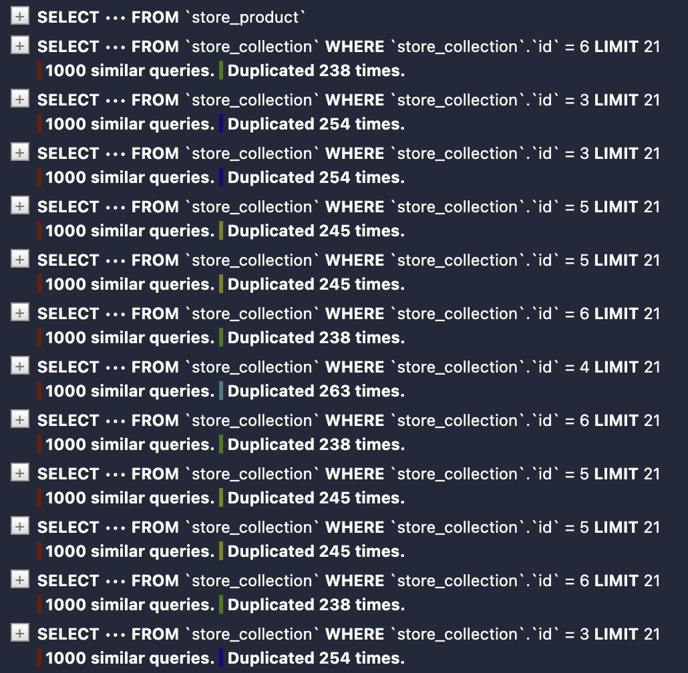
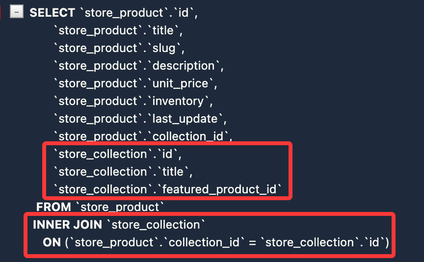
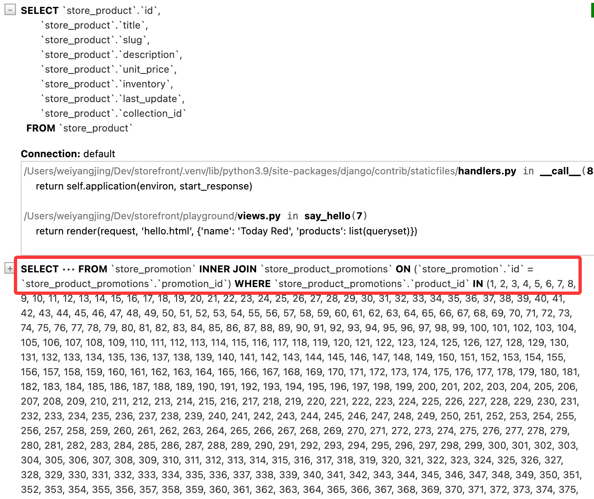
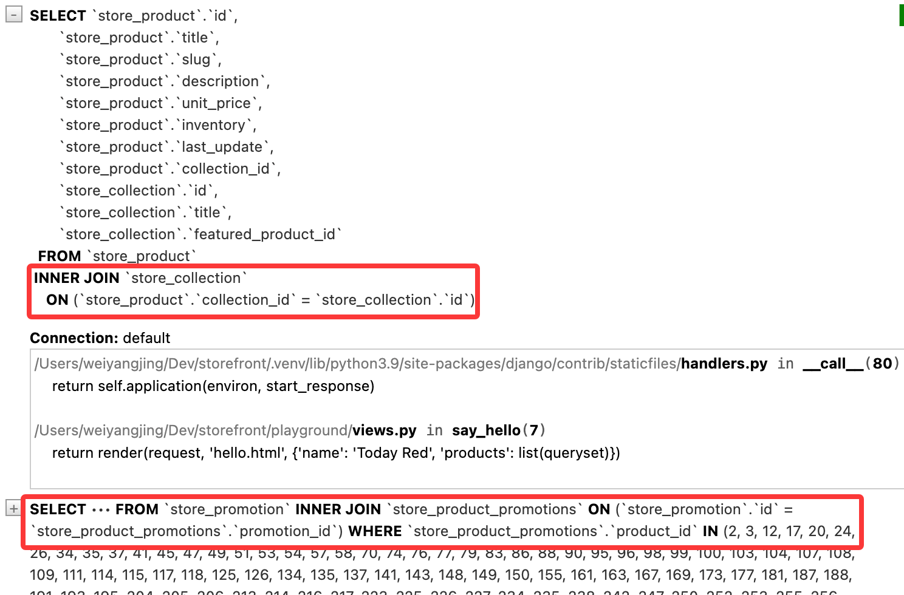
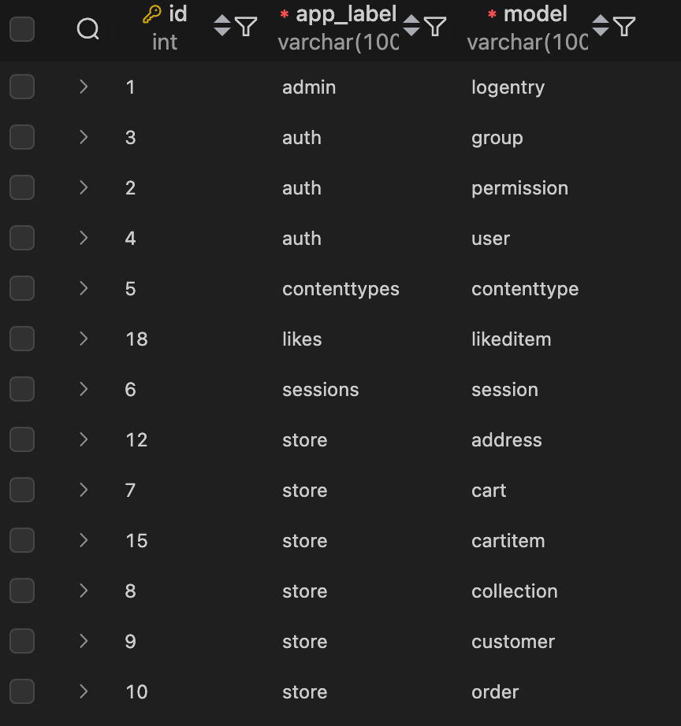
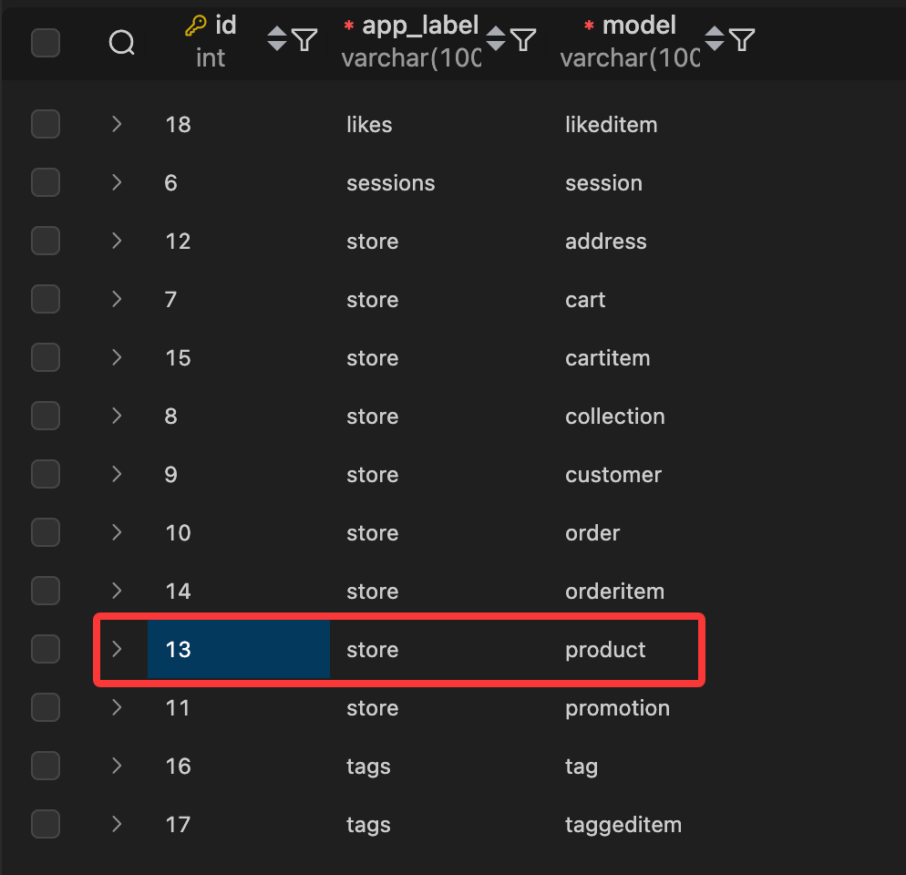
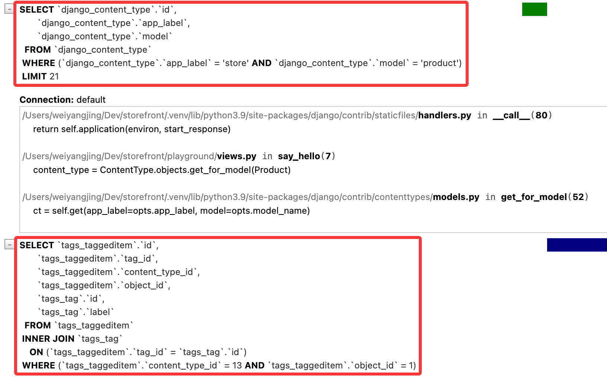
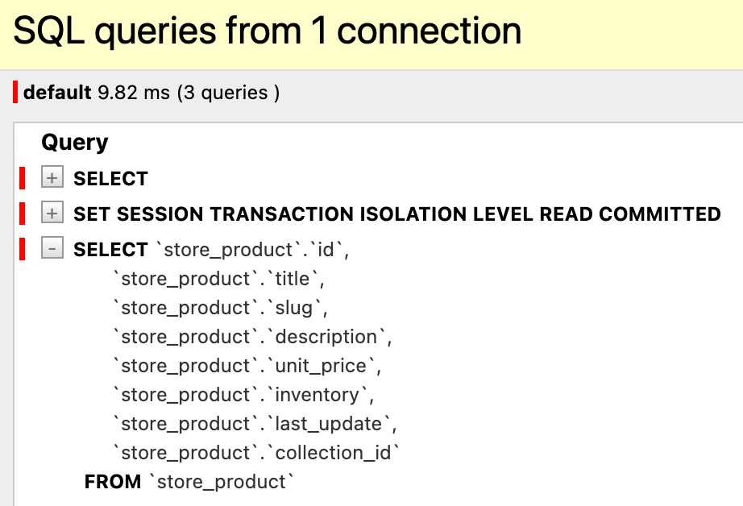
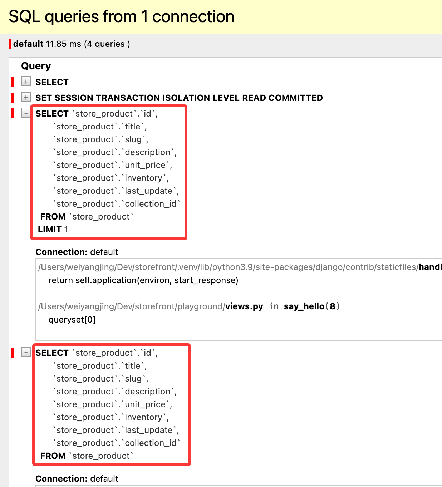

# 关联查询

## 选择关联对象

有时我们需要预先加载一堆对象。修改 `playground/views.py` 代码如下：

```python
def say_hello(request):
    queryset = Product.objects.all()
    return render(request, 'hello.html', {'name': 'Today Red', 'products': list(queryset)})
```

修改 `playground/templates/hello.html` 代码如下：

```html
<html>
    <body>
        
        <h1>Hello {{ name }}</h1>
        
        <h1>Hello, World</h1>
        
        <ul>
            
            <li>{{ product.title }} - {{ product.collection.title }}</li>
            
        </ul>
    </body>
</html>
```

保存并刷新，查看 SQL 执行情况：



由于我们在模板中访问了 `product.collection.title`，Django 会为每个产品执行一个新的查询来获取其所属集合的标题，这可能会导致 N+1 查询问题。为了避免这个问题，我们可以使用 `select_related()` 方法来预加载关联对象：

```python
queryset = Product.objects.select_related('collection').all()
```

保存并刷新，查看 SQL 执行情况：



还有一种方式是使用 `prefetch_related()` 方法来预加载关联对象：

```python
queryset = Product.objects.prefetch_related('promotions').all()
```

修改 `playground/templates/hello.html` 代码如下：

```html
<html>
    <body>
        
        <h1>Hello {{ name }}</h1>
        
        <h1>Hello, World</h1>
        
        <ul>
            
            // git-delete-start
            <li>{{ product.title }} - {{ product.collection.title }}</li>
            // git-delete-end
            // git-add-start
            <li>{{ product.title }}</li>
            // git-add-end
            
        </ul>
    </body>
</html>
```

保存并刷新，查看 SQL 执行情况：



两者的区别在于，`select_related()` 使用 SQL 的 JOIN 来一次性获取相关对象的数据，而 `prefetch_related()` 则会执行两个独立的查询来获取相关对象的数据，并在 Python 代码中进行关联。`select_related()` 适用于多对一或一对一，`prefetch_related()` 适用于多对多或一对多。

如果同时需要获取一对一关系和多对多关系的数据，可以链式使用 `select_related()` 和 `prefetch_related()`，调用的先后顺序不会影响结果获取：

```python
queryset = Product.objects.select_related('collection').prefetch_related('promotions').all()
```

保存并刷新，查看 SQL 执行情况：



> 小练习：获取最近的 5 个订单和订单对应的用户，并获取对应的订单项和相关的产品数据：

```python
queryset = Order.objects.prefetch_related('orderitem_set__product').select_related('customer').order_by('-placed_at')[:5]
```

## 查询泛型关系

我们此前创建了一个 tags 应用，应用中有两个模型 `TaggedItem` 和 `Tag`。由于想要把内容类型与商店应用程序解耦，因此我们使用泛型外键，也就是说 content_type 不知道有 product 等模型，content_type 和 object_id 字段可以指向任何模型的实例。

换句话说，这个tag可以用于标记商品，也可以用户标记博客文章等等。现在让我们来看下 tag 怎么跟 product 模型进行关联的。

首先来到数据库，查看 `django_content_type` 表。这里边的部分条目由 Django 应用自动创建。



查看 `tags_taggeditem` 表，有内容类型ID和标记ID，以便查找给定产品的标签，也就是说，如果要建立 tag 和product 之间的关系，我们需要知道 product 模型在 `django_content_type` 表中的 id。此时返回到 `django_content_type` 表，查看 product 模型的 id：



在当前数据库中，对应的 ID 是13。但是我们不建议直接使用这个ID，因为在不同的数据库中这个ID可能会不同。Django 提供了一个 `ContentType` 模型来帮助我们获取模型对应的 content type ID。

```python
from django.contrib.contenttypes.models import ContentType
from store.models import Product
from tags.models import TaggedItem

def say_hello(request):
    content_type = ContentType.objects.get_for_model(Product)
    queryset = TaggedItem.objects \ 
        .select_related('tag') \ 
        .filter(
            content_type=content_type, 
            object_id=1
        )

    return render(request, 'hello.html', {'name': 'Today Red', 'tags': list(queryset)})
```

content_type 的管理器有一个名为 `get_for_model()` 的方法，它接受一个模型类作为参数，并返回该模型对应的 content type 对象。也就是说`content_type = ContentType.objects.get_for_model(Product)` 实际上对象对应这一行


由于 `TaggedItem` 模型中的tag_id字段是一个外键指向 `Tag` 模型，所以实际标签存储在 `Tag` 模型中。因此需要使用 select_related 预加载，否则会导致 N+1 查询问题。

保存代码并刷新，查看 SQL 执行情况：



可以看到第一个查询是为产品获取 content type ID 的查询，第二个查询是获取标签数据的查询。

## 自定义 Manager

我们继续查询泛型关系的例子来讲，如果想要获取查询某个 Product 拥有的标签，可以通过代码实现：

```python
def say_hello(request):
    content_type = ContentType.objects.get_for_model(Product)
    queryset = TaggedItem.objects. \
    .select_related('tag') \
    .filter(
        content_type=content_type, 
        object_id=1
    )

    return render(request, 'hello.html', {'name': 'Today Red', 'tags': list(queryset)})
```

但实际代码会显得比较冗长，尤其是当我们需要频繁查询某个模型的标签时。为了解决这个问题，我们可以在 `TaggedItem` 模型中定义一个自定义 Manager 来封装这个查询逻辑。例如，将这段逻辑封装成：

```python
TaggedItem.objects.get_tags_for(Product, 1)
```

要比前面编写的代码好且简洁。接下来介绍如何实现自定义 Manager。此时找到 `tags/models.py` 文件，创建一个 `TaggedItemManager` 类，继承自 `models.Manager`，并在其中定义一个 `get_tags_for()` 方法：

```python
class TaggedItemManager(models.Manager):
    def get_tags_for(self, obj_type, obj_id):
        content_type = ContentType.objects.get_for_model(obj_type)
        return TaggedItem.objects \
            .select_related('tag') \
            .filter(
                content_type=content_type,
                object_id=obj_id
            )
```

然后在 `TaggedItem` 模型中使用这个自定义 Manager：

```python
class TaggedItem(models.Model):
    # git-add-start
    objects = TaggedItemManager()
    # git-add-end
    tag = models.ForeignKey(Tag, on_delete=models.CASCADE)
    content_type = models.ForeignKey(ContentType, on_delete=models.CASCADE)
    object_id = models.PositiveIntegerField()
    content_object = GenericForeignKey('content_type', 'object_id')
```

现在回到 `playground/views.py` 文件中，使用自定义 Manager 来获取标签：

```python
def say_hello(request):
    queryset = TaggedItem.objects.get_tags_for(Product, 1)
    return render(request, 'hello.html', {'name': 'Today Red', 'tags': list(queryset)})
```

## 了解查询集缓存

Django 的查询集具有缓存机制，当我们第一次访问查询集时，Django 会执行数据库查询并将结果缓存起来。之后对同一个查询集的访问将直接使用缓存中的数据，而不会再次执行数据库查询。

举个例子，我们要获取全部产品数据：

```python
queryset = Product.objects.all()
list(queryset)  
```

此时 Django 会计算这个数据集，然后从数据库中获取结果，并将结果缓存。如果进行第二次查询：

```python
list(queryset)  
```

此时 Django 会直接使用缓存中的数据，而不会再次执行数据库查询。



需要注意的是，只有第一次计算完整查询集时才会发生缓存，也就是说，如果按照如下代码顺序执行：

```python
queryset = Product.objects.all()
queryset[0]
list(queryset)  
```

此时会得到对数据库的两个查询



但如果执行顺序调换：

```python
queryset = Product.objects.all()
list(queryset)
queryset[0]
```

由于第一次访问查询集时已经计算了完整查询集并缓存了结果，因此第二次访问查询集时直接使用缓存中的数据，而不会再次执行数据库查询。

尽管缓存机制可以提高性能，如果代码结构不正确，可能会导致意外的数据库查询，从而影响性能。

## 视频参考

- [Selecting Related Objects](https://www.bilibili.com/video/BV1eX4y1f7Pz/?p=30)
- [Querying Generic Relationships](https://www.bilibili.com/video/BV1eX4y1f7Pz/?p=36)
- [Customer Managers](https://www.bilibili.com/video/BV1eX4y1f7Pz/?p=37)
- [Understanding Queryset Cache](https://www.bilibili.com/video/BV1eX4y1f7Pz/?p=38)