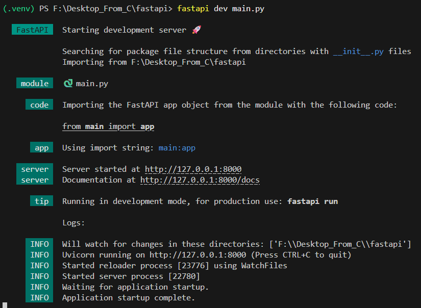

# 快速搭建一个 FastAPI 项目

> **建议配置好 Python 虚拟环境后搭建 FastAPI 项目**

## 安装 FastAPI 库

在终端中输入以下命令来安装 FastAPI：

```bash
pip install fastapi[standard]
```

## 创建项目文件

在当前项目下创建一个 `main.py` 文件，并输入以下代码：

```python
from fastapi import FastAPI

app = FastAPI()

@app.get("/")
def read_root():
    return {"Hello": "World"}
```

## 运行项目

在终端中输入以下命令来运行 FastAPI 项目：

```bash
fastapi dev main.py
```

dev 命令会自动监视文件变化并重新加载服务器，非常适合开发阶段使用。

此时可以看到如下输出：



打开浏览器，访问 `http://localhost:8000`，能看到如下页面：


恭喜你，你已经成功搭建了一个 FastAPI 项目！
