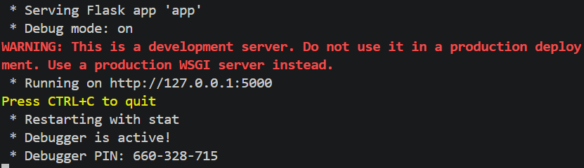
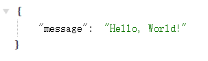

# 快速搭建一个 Flask 项目

> **建议配置好 Python 虚拟环境后搭建 Flask 项目**

## 安装 Flask 库

在终端中输入以下命令来安装 Flask：

```bash
pip install flask
```

## 创建项目文件

在当前项目下创建一个 `app.py` 文件，并输入以下代码：

```python
from flask import Flask, jsonify

app = Flask(__name__)

@app.route("/")
def hello_world():
    return jsonify({"message": "Hello, World!"})

if __name__ == "__main__":
    app.run(debug=True)
```

## 运行项目

在终端中输入以下命令来运行 Flask 开发服务器：

```bash
python app.py
```

`debug=True` 会启用调试模式，文件变化会自动重新加载服务器，非常适合开发阶段使用。

此时可以看到如下输出：



打开浏览器，访问 `http://localhost:5000`，能看到如下页面：



恭喜你，你已经成功搭建了一个 Flask 项目！
