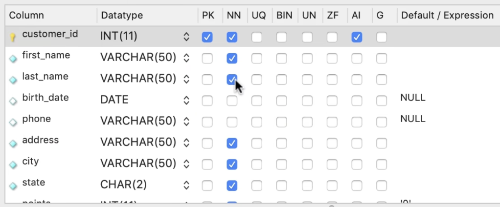
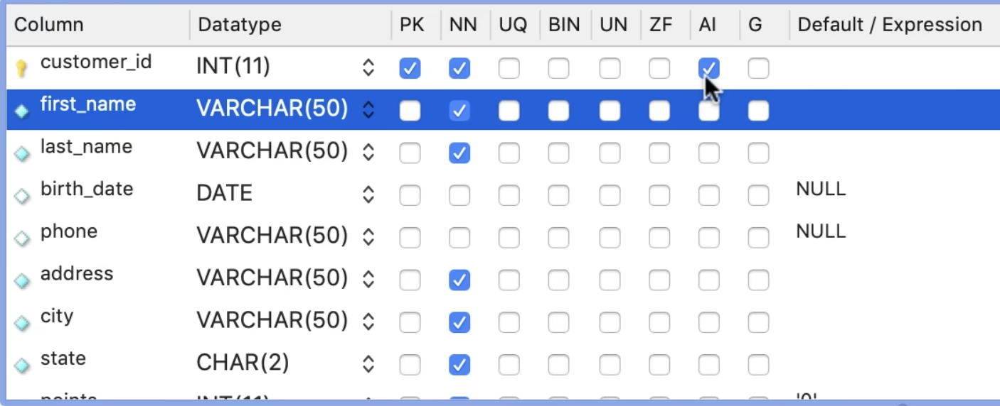
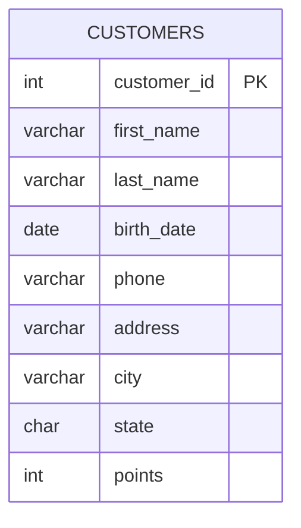
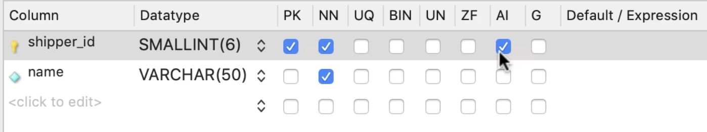
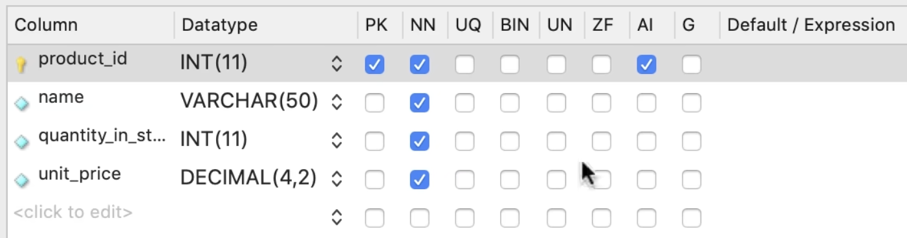
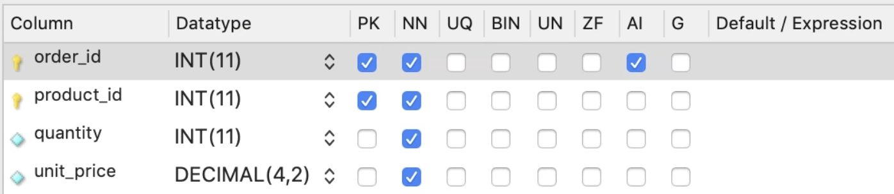
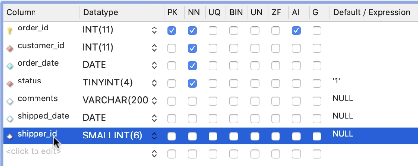
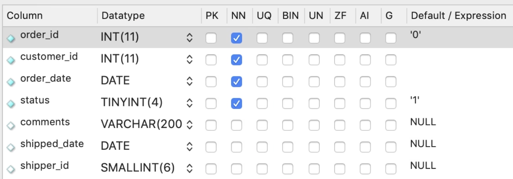
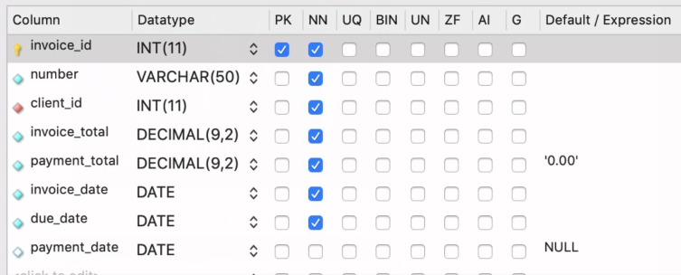

# CRUD 操作

## 列属性



图中各列属性说明如下：

| 名称 | 全称 | 说明 |
| --- | --- | --- |
| `Column` | / | 列名称 |
| `DataType` | / | 对应的数据类型 |
| `PK` | Primary Key | 主键 |
| `NN` | Not Null | 非空 |
| `UQ` | Unique | 唯一 |
| `BIN` | Binary | 二进制存储，字符串比较时区分大小写（启用后以二进制方式存储和比较数据） |
| `UN` | Unsigned | 无符号，仅适用于数值类型，使该列只能存储非负数，取值范围从 0 开始，上限翻倍 |
| `ZF` | Zero Fill | 零填充，数值不足指定显示宽度时，在左侧自动补零（例如 `INT(5) ZEROFILL`，存储 42 时显示为 `00042`） |
| `AI` | Auto Increment | 自动递增，一般用于主键 |
| `G` | Generated | 生成列，该列的值由 MySQL 根据指定的表达式自动计算得出，不能手动插入或更新。分为两种模式：`VIRTUAL`（查询时实时计算，不占存储）和 `STORED`（写入时计算并持久化存储） |
| `Default/Expression` | Default / Expression | 列的默认值或默认表达式。若插入数据时未提供该列的值，MySQL 会使用此处定义的默认值或表达式（如 `0`、`'unknown'`、`CURRENT_TIMESTAMP` 等）填充 |

其中，`DataType` 有以下常用类型：

- `INT` 表示整数
- `VARCHAR` 表示可变字符串，括号内数字代表最大字符数，如果内容未到最大字符数，不做任何操作
- `Data` 表示日期
- `Char` 表示字符串，括号内代表最大字符数，如果内容为达到最大字符数，MySQL 为其自动填充空格（很浪费空间）

## INSERT

### 插入单行

插入单行语句书写方式如下：

```sql
INSERT INTO <table>(columns) VALUES (...)
```

假设对于如下表格，我们需要插入一行数据：





可以编写如下代码：

```sql
INSERT INTO customers
VALUES (
    DEFAULT,
    'John',
    'Smith',
    '1990-01-01',
    NULL,
    'address',
    'city',
    'CA',
    DEFAULT
)
```

但这种写法要求提供每个字段对应的值，并且必须严格按照表结构中的字段顺序填写。当表结构发生变化时，SQL 语句也需要同步调整，可维护性较差。

更推荐显式指定需要插入的字段：

```sql
INSERT INTO customers (
    first_name,
    last_name, 
    birth_date,
    address, 
    city, 
    state
)
VALUES (
    'John',
    'Smith',
    '1990-01-01',
    'address',
    'city',
    'CA'
)
```

这种写法只需为指定字段提供数据，未列出的字段会使用默认值或 `NULL`。字段顺序无需与表结构一致，只需与对应数据保持一致即可。即使表结构发生变化，通常也不会影响现有语句，因此更推荐使用。

执行成功后，会返回如下结果：

`1 row(s) affected`

### 插入多行

插入多行语句书写方式如下：

```sql
INSERT INTO <table>(columns) VALUES (...), (...) ...
```

假设对于如下表格，我们要操作插入多行数据：



可以编写如下语句实现：

```sql
INSERT INTO shippers (name) 
VALUES  ('shippers 1'),
        ('shippers 2'),
        ('shippers 3')
```

小练习：插入三行数据到产品表



<details>
<summary>答案</summary>

```sql
INSERT INTO products (name, unit_price)
VALUES  ('product1', 10, 10.1),
        ('product2', 10, 10.2),
        ('product3', 10, 10.3)
```
</details>

### 多表插入

一个订单通常包含多个订单项，因此在数据库设计中，订单表（orders）与订单项表（order_items）通常是一对多关系。




假设需要通过 SQL 一次创建一个订单，并同时插入多个订单项数据。由于订单项表依赖订单主键 order_id，因此通常需要先插入订单数据，再插入对应的订单项数据。

首先插入订单记录：

```sql
INSERT INTO orders (customer_id, order_date, status) 
VALUES (1, '2020-01-01', 1)
```

订单插入成功后，order_id 会由数据库自动生成。而在插入订单项时，需要使用该订单 ID 作为外键进行关联。

MySQL 提供了内置函数 LAST_INSERT_ID()，用于获取当前连接中最近一次自动生成的主键值，因此可以直接在后续插入语句中使用：

```sql
INSERT INTO orders (customer_id, order_date, status) 
VALUES (1, '2020-01-01', 1);

-- git-add-start
INSERT INTO order_items
VALUES  (LAST_INSERT_ID(), 1, 1, 1.1)
        (LAST_INSERT_ID(), 1, 2, 10.1)
        (LAST_INSERT_ID(), 1, 3, 100.1)
--git-add-end
```

这样，所有订单项都会自动关联到刚刚创建的订单记录，无需手动查询或填写 order_id。

> LAST_INSERT_ID() 返回的是当前数据库连接中最近一次执行 INSERT 语句所生成的自增主键值，因此在高并发场景下也不会获取到其他连接生成的 ID。

### 创建表的副本

假如我们需要创建订单表的副本做归档：



你可以通过 GUI 界面直接操作复制，也可以通过如下代码实现：

```sql
CREATE TABLE orders_archived AS
SELECT * FROM orders
```

执行后的表的列名称和数据是一样的，但打开表的设计模式，发现与原表格不同：



此时 order_archived 表的 order_id 不是主键，也没有自增操作。如果在这个表中添加数据，需要显式写数据。

如果我们只需要一部分数据存入到归档中，假设只归档 2020 年以前的订单数据，此时可以通过字句实现。先 TRUNCATE order_archived 表，然后执行：

```sql
INSERT INTO order_archived
SELECT * FROM orders
WHERE order_date < '2020-01-01'
```

小练习：创建发票归档表（invoice_archived），归档发票数据，并把客户 id 列换成客户名列



<details>
<summary>答案</summary>

```sql
CREATE TABLE invoice_archived AS
SELECT 
    i.invoice_id,
    i.number,
    c.name AS client
    i.invoice_total
    i.payment_total
    i.invoice_date
    i.due_date
FROM invoices i
JOIN clients c 
    USING (client_id)
WHERE i.payment_date IS NOT NULL
```
</details>

## UPDATE

### 更新单行

更新语句的基本写法如下：

```sql
UPDATE <table>
SET <attr1>=..., <attr2>=...
WHERE <condition>
```

假设记录发票信息的系统出现异常，导致发票表中发票 1 中的 payment_total 和 payment_date 应有值却丢失。现在需要手动恢复这张发票的记录：


```sql
UPDATE invoices
SET payment_total = 10, payment_date = '2020-01-01'
WHERE invoice_id = 1
```

如果发现修改有误，实际需要更新的是发票 3，可以通过以下语句将发票 1 恢复为默认值：

```sql
UPDATE invoices
SET payment_total = DEFAULT, payment_date = NULL
WHERE invoice_id = 1
```

再对发票 3 执行正确的更新：

```sql
UPDATE invoices
SET 
    payment_total = invoice_total * 0.5, 
    payment_date = due_date
WHERE invoice_id = 3
```

### 更新多行

更新多行与更新单行的语法结构相同，区别仅在于 WHERE 条件的匹配范围更广。例如，在发票表中，客户 3 可能对应多张发票，我们可以通过一条语句更新该客户的所有发票记录：


```sql
UPDATE invoices
SET 
    payment_total = invoice_total * 0.5, 
    payment_date = due_date
WHERE client_id = 3
```

如果需要同时更新多个客户的发票，可以使用 IN 操作符：

```sql
UPDATE invoices
SET 
    payment_total = invoice_total * 0.5, 
    payment_date = due_date
WHERE client_id IN (3, 4)
```

小练习：给每个在 1990 年之前出生的客户增加 50 点积分

<details>
<summary>答案</summary>

```sql
UPDATE customers
SET points = points + 50
WHERE birth_date < '1990-01-01'
```
</details>

### 使用子查询

本节介绍如何在 UPDATE 语句中结合子查询进行条件匹配。以下面的例子为例：

```sql
UPDATE invoices
SET 
    payment_total = invoice_total * 0.5, 
    payment_date = due_date
WHERE client_id = 3
```

如果不知道客户的 ID，只清楚客户的名称，就需要先通过名称查询对应的客户 ID：

```sql
SELECT client_id
FROM clients
WHERE name = "Myworks"
```

再将查询到的 ID 作为条件用于更新语句：

```sql
UPDATE invoices
SET 
    payment_total = invoice_total * 0.5, 
    payment_date = due_date
WHERE client_id IN (
    SELECT client_id
    FROM clients
    WHERE name = "Myworks"
)
```

> **建议**：在执行此类更新前，先单独运行子查询确认返回结果是否正确，避免误更新数据。

小练习：编写一条 SQL 语句，为积分超过 3000 分的顾客更新订单备注。


<details>
<summary>答案</summary>

```sql
UPDATE orders
SET 
    comments = "Gold customer"
WHERE customer_id IN (
    SELECT customer_id
    FROM customers
    WHERE points > 3000
)
```
</details>

## DELETE

删除行数据的基本语句为：

```sql
DELETE FROM <table>
WHERE condition
```

> **注意**：执行删除操作时务必仔细确认 WHERE 条件，避免误删数据。

假设我们要删除发票 1 的数据，可以执行如下内容：

```sql
DELETE FROM invoices
WHERE invoice_id = 1
```

这里同样可以使用子查询。假设我们想删除名字叫 Myworks 的客户的所有发票，先查询该客户的信息：

```sql
SELECT * 
FROM clients
WHERE name = 'Myworks'
```

再将子查询嵌入 DELETE 语句中执行删除：

```sql
DELETE FROM invoices
WHERE client_id = (
    SELECT client_id 
    FROM clients
    WHERE name = 'Myworks'
)
```

> **提示**：建议在执行 DELETE 前先用 SELECT 验证子查询的结果范围，确认无误后再执行删除操作。
