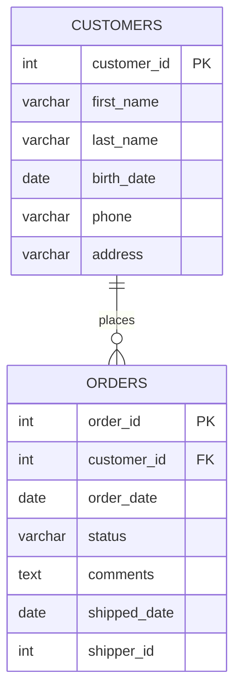
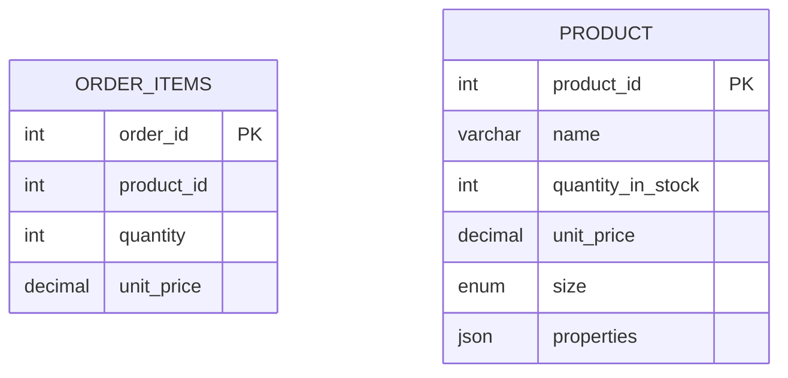
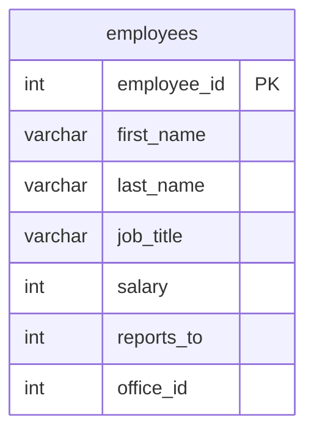

# 连接（JOIN）

## 内连接 (Inner Join)

### 案例说明

假设我们有两张表：`customers`（客户）和 `orders`（订单），它们通过 `customer_id` 关联。



现在我们需要查询所有订单，并同时显示每个订单对应的客户姓名（`first_name`、`last_name`）。可以通过如下 SQL 实现：

```sql
SELECT * 
FROM orders 
JOIN customers ON orders.customer_id = customers.customer_id 
```

- 通过 `INNER JOIN` 关键字实现内连接，只返回两个表中连接条件匹配的记录。`JOIN` 是 `INNER JOIN` 的简写形式，两者效果完全一致。
- 返回的结果会同时包含 `orders` 和 `customers` 两张表的所有字段。
- `ON` 后面接两个表格连接的条件：只将 `orders` 表中的 `customer_id` 与 `customers` 表中的 `customer_id` 值相等的行组合在一起。

<div className="alert alert--info"> 
    <span>内连接（INNER JOIN）就是根据连接条件，从两张表中找出能够匹配的记录，并将这些记录横向拼接成结果集；无法匹配的记录会被直接丢弃。</span> 
</div>
<br/>

我们可以通过返回指定字段简化表格返回内容：

```sql
SELECT order_id, first_name, last_name
FROM orders
JOIN customers ON orders.customer_id = customers.customer_id 
```

如果字段名在参与查询的两张表中没有重复，SQL 就能唯一确定它的来源。

但若直接使用 `customer_id` 这个字段，此时 `customer_id` 同时存在于两张表中，字段来源产生歧义（Ambiguous Column），MySQL 无法确定应该使用哪一个字段，因此查询会失败。

```sql
-- 错误示范
-- error-start
SELECT order_id, customer_id, first_name, last_name
-- error-end
FROM orders
JOIN customers ON orders.customer_id = customers.customer_id 
```

正确写法如下：

```sql
-- correct-start
SELECT order_id, c.customer_id, first_name, last_name
-- correct-end
FROM orders o
JOIN customers c ON o.customer_id = c.customer_id
```

在表名后面直接指定一个简短的别名（如这里的 c 代表 `customers` 表，o 代表 `orders` 表），然后在查询中通过 `别名.字段名` 的方式明确指定字段来源，从而避免歧义。

### 使用场景

内连接（INNER JOIN）只保留两张表中能够成功匹配的数据，可以理解为取两张表的**交集**。

```text
客户表                    订单表

┌─────────┐             ┌─────────┐
│ 客户A   │◄──────────► │ 订单1   │
│ 客户B   │◄──────────► │ 订单2   │
│ 客户C   │             │ 订单3   │
└─────────┘             └─────────┘

INNER JOIN 后

┌──────────────────┐
│ 客户A + 订单1     │
│ 客户B + 订单2     │
└──────────────────┘

客户C（无订单）      ✗
订单3（无客户）      ✗
```

适用于：

| 需求        | 原因         |
| --------- | ---------- |
| 查询订单及客户姓名 | 无客户的订单无需显示 |
| 查询员工所属部门  | 无部门的员工无需显示 |
| 查询已下单的客户  | 未下单客户无需显示  |
| 查询有成绩的学生  | 无成绩学生无需显示  |

也可以按照下列思路做快速判断：

```text
关联数据不存在时，
当前记录还需要显示吗？

        │
        ▼

    ┌───────┐
    │ 需要吗 │
    └───────┘
      │   │
   否 │   │ 是
      ▼   ▼

INNER   其他连接
 JOIN   （LEFT JOIN 等）
```

### 不适用场景

如果业务要求保留某张表中的全部数据，即使找不到关联记录，也不应该使用内连接。

例如：

```text
客户表                    订单表

┌─────────┐             ┌─────────┐
│ 客户A   │◄──────────► │ 订单1   │
│ 客户B   │             └─────────┘
│ 客户C   │
└─────────┘
```

需求：

```text
查询所有客户及其订单
```

期望结果：

```text
客户A + 订单1
客户B + NULL
客户C + NULL
```

此时：

```text
INNER JOIN  ❌

客户B、客户C 会被过滤掉
```

应该使用其他连接方式（如 LEFT JOIN），后续章节将详细介绍。

### 小练习



返回每个订单项对应的id、产品 id、数量和单价

<details>
<summary>答案</summary>

```sql
SELECT oi.product_id, name, quantity, oi.unit_price
FROM order_items oi
JOIN products p ON p.product_id = oi.product_id
```
</details>

## 跨数据库连接

现实生活中会经常用到多个数据库，本节内容将介绍如何将分散在多个数据库中的表中的列合并起来。

假设我们想要数据库 1 的 order_items 表和数据库 2 的 products 表连接到一起：

```sql
SELECT * FROM database_1.order_items oi
JOIN database_2.products p
    ON oi.product_id = p.product_id
```

## 自连接（Self Joins）

SQL 允许一张表与自身进行连接，这种操作称为自连接。例如，我们想要查询所有员工及其对应的管理人员：



```sql
SELECT 
    e.employee_id, 
    e.first_name,
    e.last_name,
    m.employee_id as manager_id,
    m.first_name as manager
FROM employees e
JOIN employees m
    ON e.reports_to = m.employee_id
```

可以看出，自连接的写法与普通连接基本一致，唯一的区别在于：**必须为同一张表使用不同的别名**（如上述示例中的 e 和 m），以便区分员工表和管理者表。同时，在 SELECT 子句中引用列时也需要通过别名加以区分。