# 连接（JOIN）

## 内连接 (Inner Join)

### 案例说明

假设我们有两张表：`customers`（客户）和 `orders`（订单），它们通过 `customer_id` 关联。

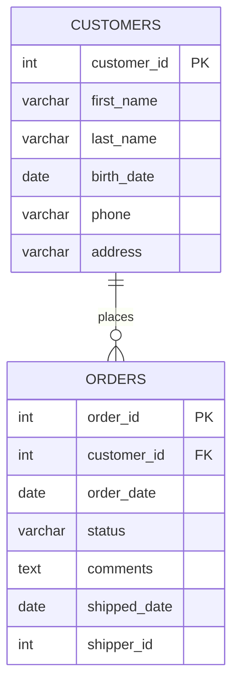

现在我们需要查询所有订单，并同时显示每个订单对应的客户姓名（`first_name`、`last_name`）。可以通过如下 SQL 实现：

```sql
SELECT * 
FROM orders 
JOIN customers ON orders.customer_id = customers.customer_id 
```

- 通过 `INNER JOIN` 关键字实现内连接，只返回两个表中连接条件匹配的记录。`JOIN` 是 `INNER JOIN` 的简写形式，两者效果完全一致。
- 返回的结果会同时包含 `orders` 和 `customers` 两张表的所有字段。
- `ON` 后面接两个表格连接的条件：只将 `orders` 表中的 `customer_id` 与 `customers` 表中的 `customer_id` 值相等的行组合在一起。

<div className="alert alert--info"> 
    <span>内连接（INNER JOIN）就是根据连接条件，从两张表中找出能够匹配的记录，并将这些记录横向拼接成结果集；无法匹配的记录会被直接丢弃。</span> 
</div>
<br/>

我们可以通过返回指定字段简化表格返回内容：

```sql
SELECT order_id, first_name, last_name
FROM orders
JOIN customers ON orders.customer_id = customers.customer_id 
```

如果字段名在参与查询的两张表中没有重复，SQL 就能唯一确定它的来源。

但若直接使用 `customer_id` 这个字段，此时 `customer_id` 同时存在于两张表中，字段来源产生歧义（Ambiguous Column），MySQL 无法确定应该使用哪一个字段，因此查询会失败。

```sql
-- 错误示范
-- error-start
SELECT order_id, customer_id, first_name, last_name
-- error-end
FROM orders
JOIN customers ON orders.customer_id = customers.customer_id 
```

正确写法如下：

```sql
-- correct-start
SELECT order_id, c.customer_id, first_name, last_name
-- correct-end
FROM orders o
JOIN customers c ON o.customer_id = c.customer_id
```

在表名后面直接指定一个简短的别名（如这里的 c 代表 `customers` 表，o 代表 `orders` 表），然后在查询中通过 `别名.字段名` 的方式明确指定字段来源，从而避免歧义。

### 使用场景

内连接（INNER JOIN）只保留两张表中能够成功匹配的数据，可以理解为取两张表的**交集**。

```text
客户表                    订单表

┌─────────┐             ┌─────────┐
│ 客户A   │◄──────────► │ 订单1   │
│ 客户B   │◄──────────► │ 订单2   │
│ 客户C   │             │ 订单3   │
└─────────┘             └─────────┘

INNER JOIN 后

┌──────────────────┐
│ 客户A + 订单1     │
│ 客户B + 订单2     │
└──────────────────┘

客户C（无订单）      ✗
订单3（无客户）      ✗
```

适用于：

| 需求        | 原因         |
| --------- | ---------- |
| 查询订单及客户姓名 | 无客户的订单无需显示 |
| 查询员工所属部门  | 无部门的员工无需显示 |
| 查询已下单的客户  | 未下单客户无需显示  |
| 查询有成绩的学生  | 无成绩学生无需显示  |

也可以按照下列思路做快速判断：

```text
关联数据不存在时，
当前记录还需要显示吗？

        │
        ▼

    ┌───────┐
    │ 需要吗 │
    └───────┘
      │   │
   否 │   │ 是
      ▼   ▼

INNER   其他连接
 JOIN   （LEFT JOIN 等）
```

### 不适用场景

如果业务要求保留某张表中的全部数据，即使找不到关联记录，也不应该使用内连接。

例如：

```text
客户表                    订单表

┌─────────┐             ┌─────────┐
│ 客户A   │◄──────────► │ 订单1   │
│ 客户B   │             └─────────┘
│ 客户C   │
└─────────┘
```

需求：

```text
查询所有客户及其订单
```

期望结果：

```text
客户A + 订单1
客户B + NULL
客户C + NULL
```

此时：

```text
INNER JOIN  ❌

客户B、客户C 会被过滤掉
```

应该使用其他连接方式（如 LEFT JOIN），后续章节将详细介绍。

### 小练习

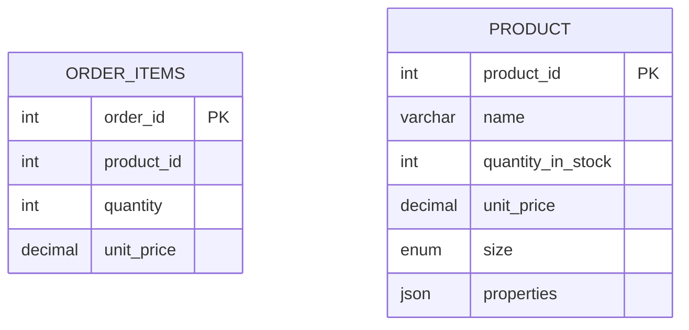

返回每个订单项对应的id、产品 id、数量和单价

<details>
<summary>答案</summary>

```sql
SELECT oi.product_id, name, quantity, oi.unit_price
FROM order_items oi
JOIN products p ON p.product_id = oi.product_id
```
</details>

## 跨数据库连接

现实生活中会经常用到多个数据库，本节内容将介绍如何将分散在多个数据库中的表中的列合并起来。

假设我们想要数据库 1 的 order_items 表和数据库 2 的 products 表连接到一起：

```sql
SELECT * FROM database_1.order_items oi
JOIN database_2.products p
    ON oi.product_id = p.product_id
```

## 自连接（Self Joins）

SQL 允许一张表与自身进行连接，这种操作称为自连接。例如，我们想要查询所有员工及其对应的管理人员：

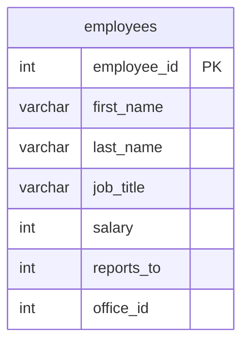

```sql
SELECT 
    e.employee_id, 
    e.first_name,
    e.last_name,
    m.employee_id as manager_id,
    m.first_name as manager
FROM employees e
JOIN employees m
    ON e.reports_to = m.employee_id
```

可以看出，自连接的写法与普通连接基本一致，唯一的区别在于：**必须为同一张表使用不同的别名**（如上述示例中的 e 和 m），以便区分员工表和管理者表。同时，在 SELECT 子句中引用列时也需要通过别名加以区分。

## 多表连接

本节内容将介绍怎么连接两张以上的表格。

在 orders 表中，可以通过 customer_id 字段关联 customers 表，从而同时显示订单信息和用户姓名。然而，订单状态字段仅存储了状态 ID，无法直接看到对应的状态名称。


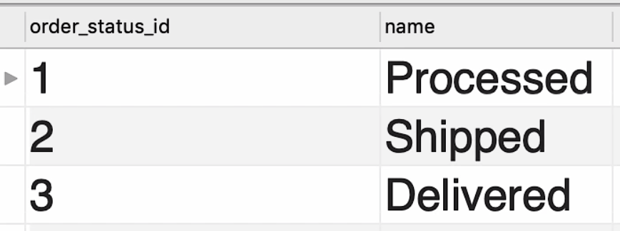

为了同时显示订单信息、用户姓名以及可读的订单状态，可以编写如下 SQL 语句：

```sql
SELECT 
    o.order_id, 
    o.order_date,
    c.first_name,
    c.last_name,
    os.name as status
FROM orders o
JOIN customers c
    ON o.customer_id = c.customer_id
JOIN order_statuses os
    ON os.order_status_id = o.status
```

查询结果如下图所示：

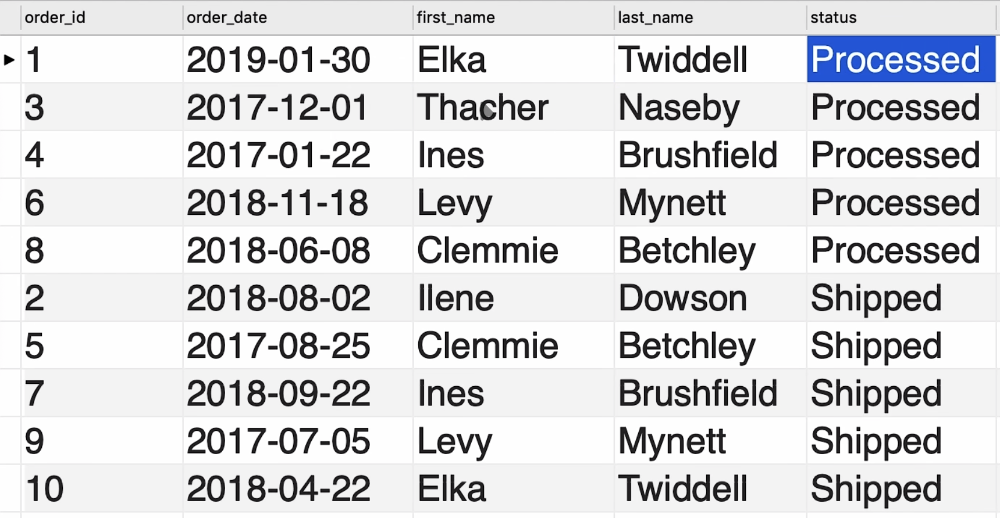

### 小练习

编写一段 SQL 查询，连接：

- payment 表
- payment_methods 表
- clients 表

生成一份报告，展示付款记录及相关详细信息。

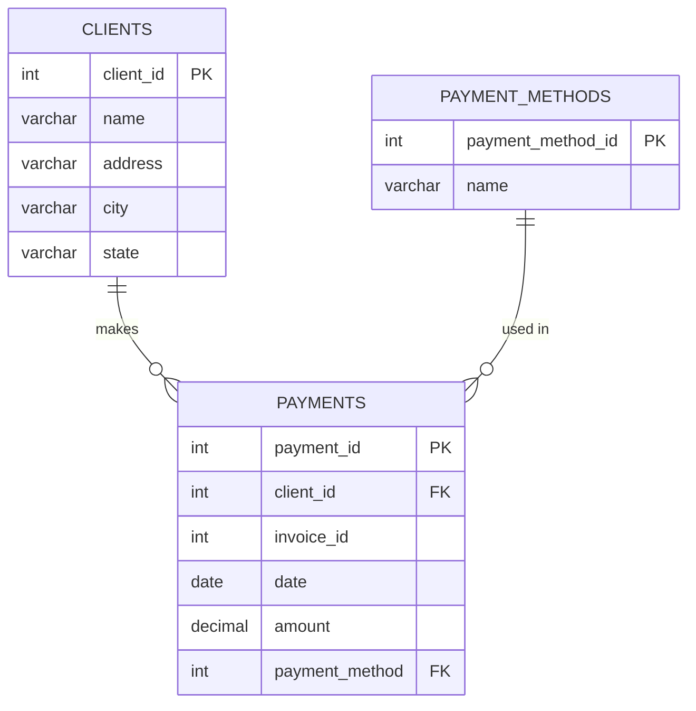

<details>
<summary>答案</summary>

```sql
SELECT 
    p.date
    p.invoice_id,
    p.amount,
    c.name,
    pm.name as payment_method
FROM payments p
JOIN clients c
    ON p.client_id = c.client_id
JOIN payment_methods pm
    ON p.payment_method = pm.payment_method_id
```
</details>

## 复合连接条件

截至目前，我们所介绍的连接都只使用了单一条件。但在实际开发中，单一列往往无法唯一识别某张表中的记录。

以 order_items 表为例：

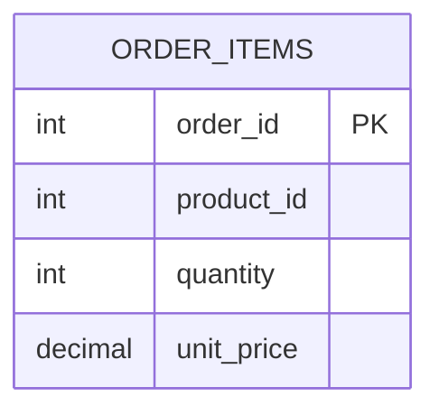

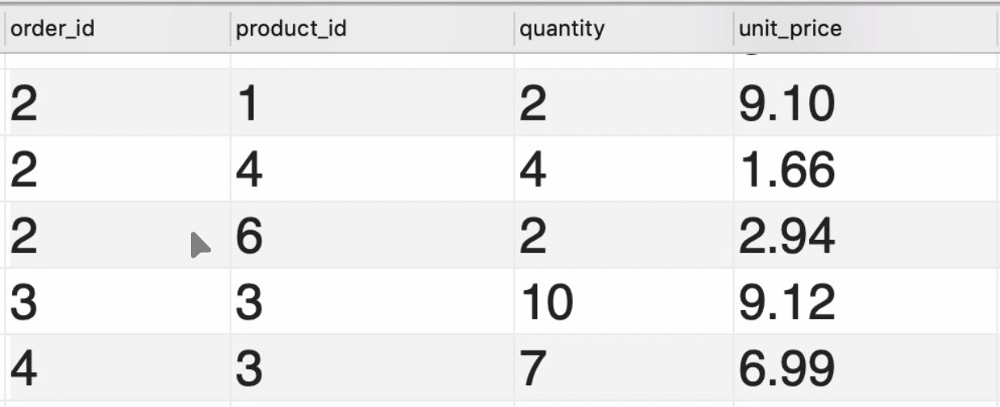

order_id 无法唯一确定一条 order_item 记录，product_id 也同样如此。该表必须同时使用 order_id 和 product_id 才能唯一确定某条 order_item。

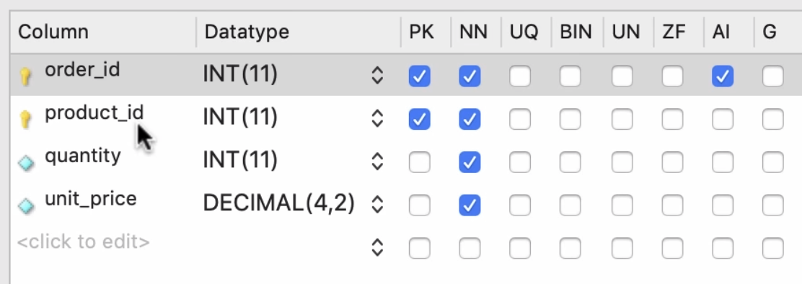

这里我们将 order_id 和 product_id 都设为主键，此时这两个字段共同构成了联合主键。

需要注意的是，拥有联合主键的表在进行连接时应特别留意连接条件的写法。假设我们有 order_item_notes 表：

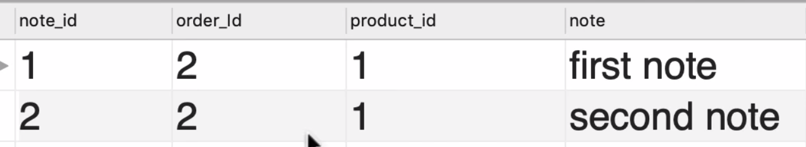

在这张表中，order_id 和 product_id 仍然无法唯一确定记录，而需要同时使用 order_id、product_id 和 note_id。现在我们将该表与 order_items 表进行连接：

```sql
SELECT *
FROM order_items oi
JOIN order_item_notes oin
    ON oi.order_id = oin.order_id
    AND oi.product_id = oin.product_id
```

## 隐式连接语法（Implicit Join Syntax）

先看一个基础的显式连接写法：

```sql
SELECT *
FROM orders o
JOIN customers c
    ON o.customer_id = c.customer_id
```

上述查询还可以使用隐式连接语法实现相同的效果：

```sql
SELECT * 
FROM orders o, customers c
WHERE o.customer_id = c.customer_id
```

虽然 MySQL 支持这种写法，但实际开发中不建议使用。原因如下：

如果在隐式连接中不小心遗漏 `WHERE` 条件，就会产生**笛卡尔积**——即两个表的所有行进行两两组合，结果集的行数等于左表行数 × 右表行数，这通常不是我们想要的结果。

相比之下，显式连接（`JOIN ... ON ...`）语法结构更清晰，连接条件与过滤条件分离，更不容易出错，也更具可读性。

## 外连接（Outer Join）

我们先从一段使用内连接的查询开始，然后将其转换为外连接。

```sql
SELECT 
    c.customer_id
    c.first_name
    o.order_id
FROM customers c
JOIN orders o
    ON c.customer_id = o.customer_id
ORDER BY c.customer_id
```

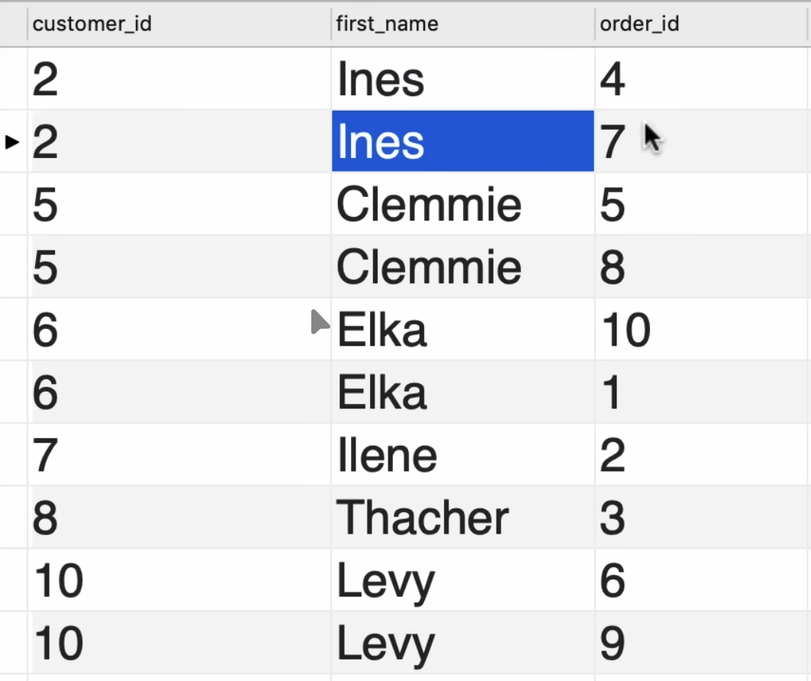

如上图所示，结果中只包含了曾经下过单的用户。如果希望返回所有用户，无论是否下过单，就需要使用外连接。

SQL 支持两种外连接：左连接与右连接。

- 左连接（LEFT JOIN）：返回左表中的全部记录，即使右表中没有匹配的记录。
- 右连接（RIGHT JOIN）：返回右表中的全部记录，即使左表中没有匹配的记录。

将前面的查询改为左连接：

```sql
SELECT 
    c.customer_id
    c.first_name
    o.order_id
FROM customers c
LEFT JOIN orders o
    ON c.customer_id = o.customer_id
ORDER BY c.customer_id
```

小练习：编写一条 SQL 语句，查看每个产品被订购的次数。


<details>
<summary>答案</summary>

```sql
SELECT 
    p.product_id,
    p.name,
    oi.quantity
FROM products p
LEFT JOIN order_items oi
    ON oi.product_id = p.product_id
```
</details>

## 多表外连接

与内连接相似，我们也可以在多表之间使用外连接。以下是一个基础查询示例：

```sql
SELECT 
    c.customer_id
    c.first_name
    o.order_id
FROM customers c
LEFT JOIN orders o
    ON c.customer_id = o.customer_id
ORDER BY c.customer_id
```

由于 orders 表还有发货相关的信息：


假设我们还想获取发货人的姓名，可以编写如下 SQL：

```sql
SELECT 
    c.customer_id
    c.first_name
    o.order_id,
    sh.name AS shipper
FROM customers c
LEFT JOIN orders o
    ON c.customer_id = o.customer_id
LEFT JOIN shippers sh
    ON o.shipper_id = sh.shipper_id
ORDER BY c.customer_id
```

虽然 SQL 中同时支持左连接和右连接，但在实际开发中，为了代码的可读性和一致性，通常更推荐使用左连接，右连接使用较少。

小练习：写一段 SQL，获取订单日期、订单id、顾客名字、发货人和发货状态

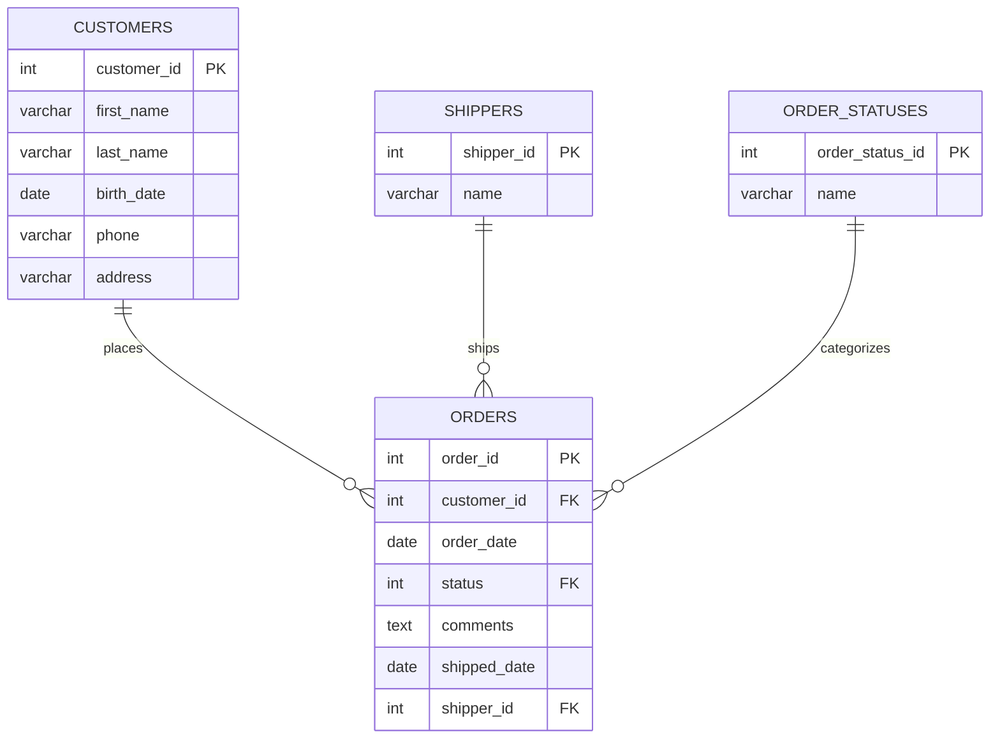

```sql
SELECT 
    o.order_date,
    o.order_id,
    c.first_name AS customer,
    sh.name AS shipper,
    os.name AS status
FROM order o
JOIN customer c
    ON o.customer_id = c.customer_id
LEFT JOIN shippers sh
    ON o.shipper_id = sh.shipper_id
JOIN order_statuses os
    ON os.order_status_id = o.status
```

## 如何确定 FROM/JOIN 的表

在多表连接中，`FROM` 和 `JOIN` 的选择往往让初学者感到困惑。实际上，两者在逻辑上是对等的——`FROM A JOIN B` 与 `FROM B JOIN A` 在内连接中产生的结果集完全相同，只是列的顺序可能不同。

真正影响结果的是**连接类型**（如 LEFT JOIN），而不是表出现的先后顺序。

尽管如此，在实际编写 SQL 时，仍有一些经验可以帮助你做出清晰、可读的选择：

**思路一：从"核心业务数据"出发**

把你最关心的、最主要的数据表放在 `FROM` 后面，把用来补充信息的表放在 `JOIN` 后面。

```text
我需要查询"订单"，顺便获取客户姓名和订单状态名称

→ FROM orders          （核心：订单）
→ JOIN customers       （补充：客户姓名）
→ JOIN order_statuses  （补充：状态名称）
```

**思路二：顺着外键关系走**

通常，持有外键（FK）的表放在 `FROM`，被引用的主表放在 `JOIN`。

```text
orders.customer_id  →  customers.customer_id
orders.status       →  order_statuses.order_status_id

→ FROM orders（持有外键）
→ JOIN customers、order_statuses（被引用的主表）
```

**思路三：结合 LEFT JOIN 的语义**

当需要使用 LEFT JOIN 时，`FROM` 后的表是"必须保留全部记录"的那张表：

```text
查询所有客户（包括没有订单的客户）

→ FROM customers     （需要保留全部）
→ LEFT JOIN orders   （可以为空）
```

**小结**

| 情形 | 建议放 FROM | 建议放 JOIN |
|------|------------|------------|
| INNER JOIN | 核心业务表 / 持有外键的表 | 补充信息表 / 被引用的主表 |
| LEFT JOIN | 需要保留全部记录的表 | 允许为 NULL 的关联表 |
| RIGHT JOIN | 允许为 NULL 的关联表 | 需要保留全部记录的表 |
